# Discord feature gallery and improvement inventory

This inventory makes the bot's current appearance reviewable before the next
design pass. It contains **21 genuine Discord screenshots**: 19 new renderer
captures and two references to the earlier public-panel runtime acceptance.
The application implementation is unchanged by this documentation increment.

- Current source: `1ad09ddb454c440ac3f8eae85b3aef914c6660bf`.
- Earlier live-panel runtime source: `fc5eb8696942adedbd5009d3e47ccca98e98b868`.
- All displayed players, events, scores, application answers and incidents are
  synthetic. The authorized test bot posted only in Dorfmada's test channel.
- [Machine-readable manifest](gallery.json): screenshot hashes, source hashes,
  normal audiences, origin and test-message links.
- [Verification record](verification.json): image/source hash checks, 99 local
  documentation links and inline-gallery content validation; browser selection
  and image loading were also checked for match, application and modal views.
- [Complete command reference](../../v0.10/discord-reference.md): arguments,
  permissions and runtime boundaries for all six slash commands.
- [Public panel acceptance](../2026-10-03-public-panels/README.md): actual refresh,
  restart recovery, result correction and private pagination proof.

## What already existed, and what PR #158 adds

| Area | Existing bot behavior | Added or extended in this PR |
| --- | --- | --- |
| Events | Match/training announcements, registration, group choice, reserves, refusal, personal assignment, roster image/link | Shared durable message ownership/recovery; paired website event commands and synchronization |
| Coordination | Event forums, briefings, Discord scheduled events, calendar, squad voice channels, temporary event roles | Recovery and destination handling improvements; no new slash command for these workflows |
| Attendance | Signup/attendance reminders, acknowledgement, late/absence forms, voice-based attendance | Reliability fixes; scoped published roster/attendance reads for the website |
| Membership | Recruitment panels, application questions, restricted staff threads and outcomes | Current-actor managed-role queue, retries, ownership, hierarchy checks and audit; freshness-aware membership observations |
| Support | Configurable ticket categories/questions, restricted threads and staff closure | Shared message lifecycle and channel validation |
| Players | Public `/player`, claimed platform-ID `/link`, personal match recaps | Explicit identity and recap consent handling; verified Steam identity is a separate dashboard flow |
| Game servers | No equivalent automatic public game-server panel in the original bot | Private `/server-status`; public stored-data server/score panels, optional leaders, private Wardogs player pages, reviewed-result publication |
| Operations | Superadmin-selected Logi service health messages | Kept separate from game-server status |
| Website/data | Existing dashboard/backend | HLL CRCON and Warcon readers, public Wardogs League parser, central SSO and scoped APIs for events, members, roles, rosters, attendance and verified player facts |

The five existing slash commands are `/player`, `/link`, `/notice`,
`/close_ticket` and `/close_application`. `/server-status` is new. Buttons,
scheduled work and authenticated dashboard/API workflows account for most of the
remaining capabilities; they are not additional slash commands.

Important limits: the private live-player list currently covers Wardogs, not HLL.
Public live leaders are opt-in and rank currently connected players; `cash` is the
current balance, not cumulative earnings. The old `/player` response has no game
selector and is not evidence of unified HLL/Warcon statistics. Website news remain
owned by the website. Website rosters/attendance are read-only; management remains
in Logi/Discord. Hosted activation and production SSO are not established by this
visual inventory.

## Screenshot index

The audience column describes normal product delivery. For this gallery, private
responses, staff-thread messages and DM renderers were deliberately posted as
synthetic samples in the authorized test channel. No real DM was sent.

| Screenshot | Normal audience | Suggested next change |
| --- | --- | --- |
| [Live server and leaders](../2026-10-03-public-panels/discord-scoreboard.jpg) | Configured channel | Localized labels, row density, explicit cash meaning |
| [Private live player details](../2026-10-03-public-panels/discord-private-players.jpg) | Ephemeral | Improve metric alignment and game-specific terminology |
| [Match and signups](match.jpg) | Event channel | Compact schedule, stronger registration state |
| [Training](training.jpg) | Event channel | Consistent actions and natural translated copy |
| [Published roster](roster.jpg) | Event channel | Clear squad/role/confirmation hierarchy |
| [Forum briefing](briefing.jpg) | Event forum | Separate practical match information and tactical links |
| [Calendar](calendar.jpg) | Calendar channel | Emphasize the next event and consistent game labels |
| [Recruitment panel](recruitment.jpg) | Recruitment channel | Game branding, concise requirements and next step |
| [Application and closure](application.jpg) | Restricted application thread | Show decision, reason and role-operation state separately |
| [Ticket panel](tickets.jpg) | Ticket channel | Consistent categories and privacy explanation |
| [Ticket and closure](ticket-thread.jpg) | Restricted ticket thread | Clear lifecycle and resolution |
| [Player profile](player.jpg) | Public slash response | Separate HLL/Wardogs metrics and show data origin |
| [Platform linking entry](link.jpg) | Ephemeral | Localize copy and distinguish claimed from verified identity |
| [Platform selection](platform.jpg) | Ephemeral | Consistent labels and verification state |
| [Attendance reminder](attendance.jpg) | Personal DM | Compact time/assignment card with two clear actions |
| [Personal recap](recap.jpg) | Personal DM | Clear metric source, game and trend |
| [Recap preference](recap-consent.jpg) | Ephemeral | Explain the account-global preference |
| [Stored HLL/WDG status](status.jpg) | Ephemeral for managers | Align diagnostics with the public card |
| [Reviewed result](results.jpg) | Results channel | Strong winner/team hierarchy, date and match link |
| [Service health](service.jpg) | Superadmin-selected channel | Concise incident/recovery language |
| [Late-arrival modal](notice.jpg) | Own-account modal | Identify the event and standardize copy |

### Server panels and results

The first two images reuse the previous, functionally exercised runtime capture.
The private image includes an old-control rejection and a successful current page.

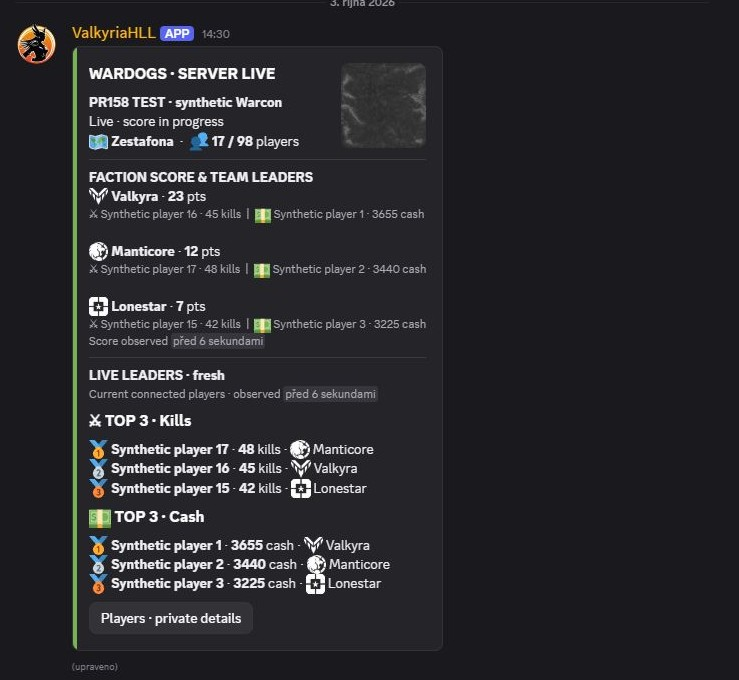

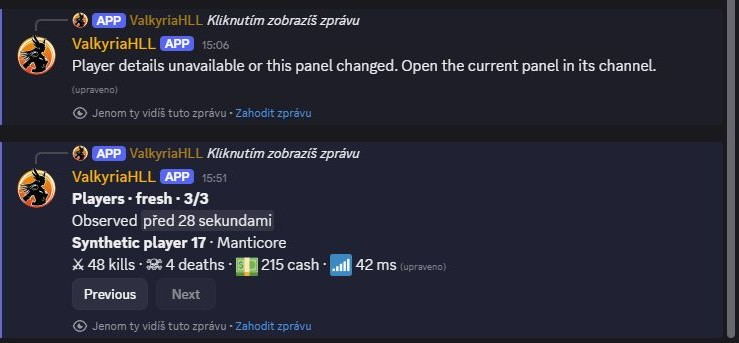

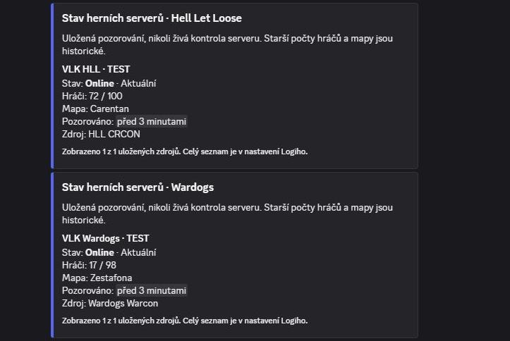

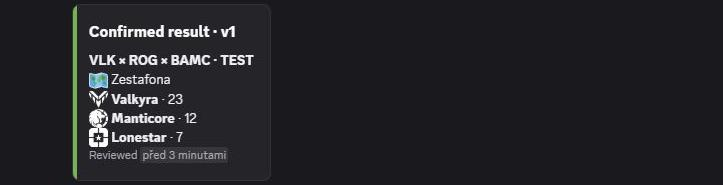

### Events, rosters and attendance

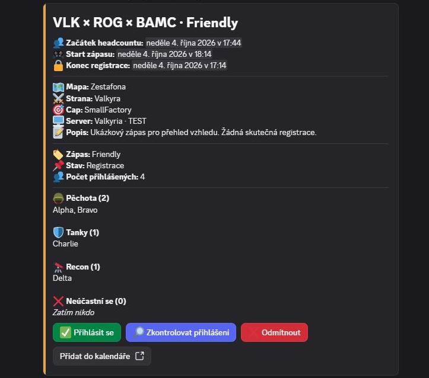

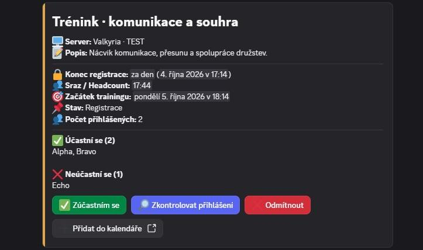

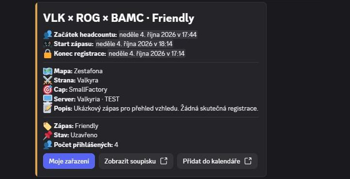

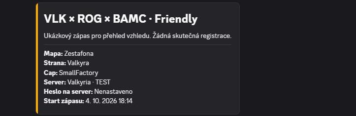

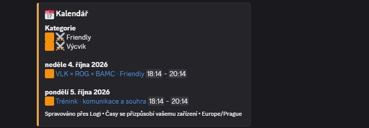

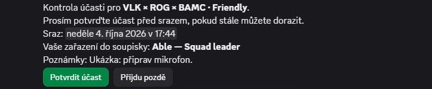

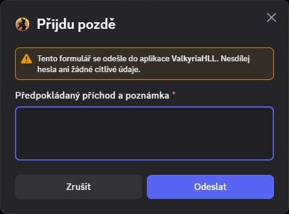

### Recruitment and support

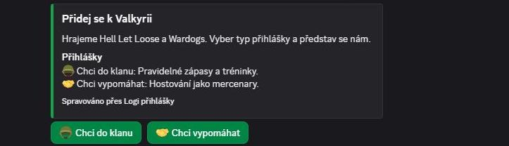

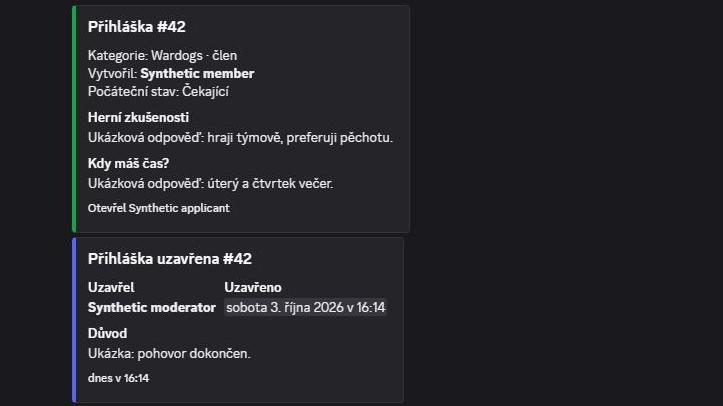

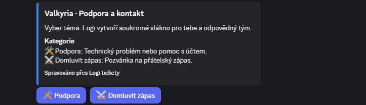

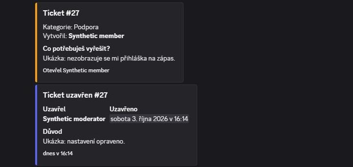

### Player identity, profile and notifications

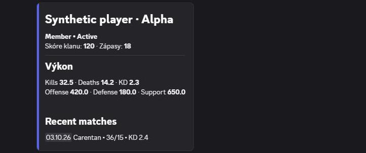

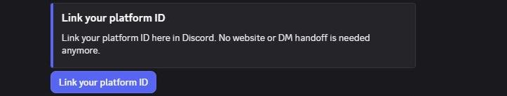

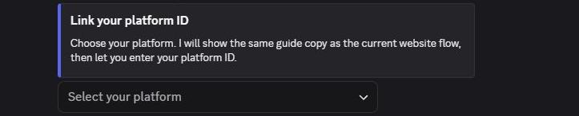

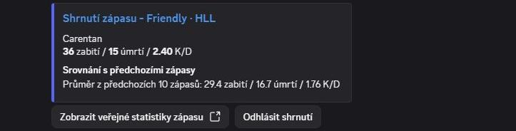

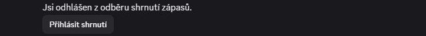

### Operations

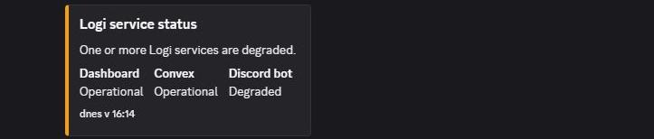

## Concrete findings for the next implementation pass

1. **Application outcome disappears when a reason is supplied.**
   `buildMembershipApplicationCloseEmbed` selects the supplied reason instead of
   the outcome description. The accepted synthetic application therefore shows
   its reason without a clear decision. Keep outcome, reason and role-delivery
   state distinct. This is an observed copy/rendering gap, not repaired here.
2. **Localization is inconsistent.** The `/link` flow uses English strings even
   with the Czech gallery configuration. `/player`, results and service health
   also expose mixed or English labels. Establish shared CS/EN terminology and
   deliberate fallbacks before adding more decoration.
3. **Player surfaces need explicit game/data provenance.** The public legacy
   profile, personal recap and live Warcon list represent different datasets.
   Show the game, sample/observation time and meaningful metrics; do not present
   cash as total earnings or HLL-oriented aggregates as Wardogs live statistics.
4. **Match cards repeat long timestamps.** Group registration deadline, meeting
   and start in a compact schedule, with a stronger status and action hierarchy.
5. **Visual conventions vary.** Existing embeds, plain reminders and Components
   V2 cards use different spacing, icons and labels. Unify the hierarchy while
   preserving privacy, permissions, durable message identity and refresh rules.

Recommended design order: match/roster and attendance, player profile/linking,
recruitment/decisions, then tickets/calendar/results. The new live card provides
a useful visual baseline; every workflow still needs its own information density.

## Evidence method and exclusions

The capture harness invoked the actual checked-out production builders with
synthetic inputs. Non-exported profile, closure and service-status builders were
exported only from an external private source copy; repository code was untouched.
The recap producer ran against a fake send sink before its resulting message was
posted to the test channel. Offline generation disabled network requests.

An isolated sender then used the authorized test application and exact test
guild/channel, disabled mentions, and replaced action IDs with a gallery-only
prefix. Controls do not execute real registration, role, ticket or preference
mutations. The late-arrival button displayed the actual handler-built modal; it
was cancelled without entering data. Sample links use synthetic event identities
and are not evidence of working destinations.

Roster and recap OG images require private data/image endpoints and were omitted.
The plain-body attendance and preference messages are intentional current output.
The synthetic service degradation is not a report of a real outage.

Screenshots were captured in the logged-in Discord web client and rectangularly
cropped to remove unrelated sidebar/account UI. They were not generated, redrawn,
stitched or recolored. The manifest contains SHA-256 hashes of every committed
crop. Raw full-window screenshots and credentials remain outside the repository.

This pass verifies **actual Discord rendering**, not all underlying workflows.
It does not retest DM delivery, every slash command, native scheduled events,
voice channels, live role grants, mobile layout, real provider freshness or
production SSO. The earlier runtime acceptance linked above retains its original
scope and revision. No production database, provider configuration or bot was
changed. This documentation-only increment verifies links, source paths, image
hashes and gallery interaction; it does not claim a fresh application test suite.
