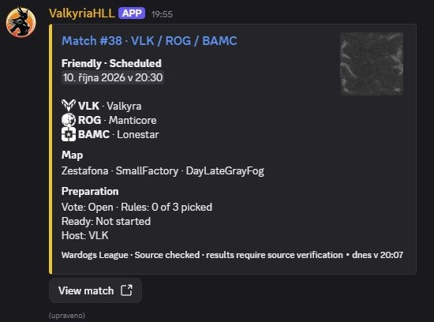
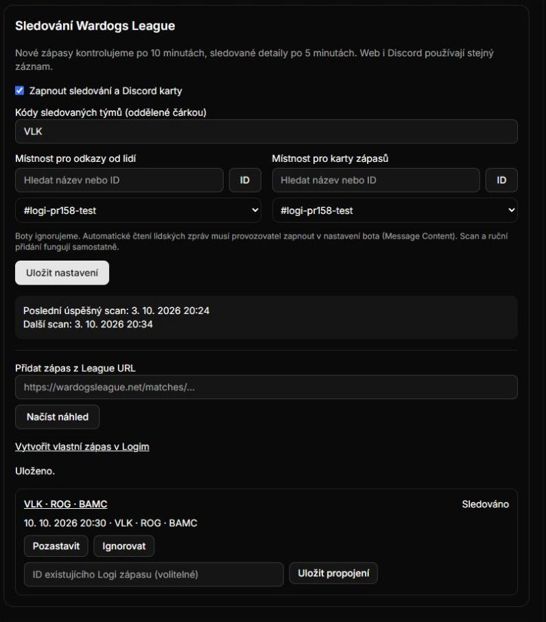

# Wardogs League discovery — acceptance evidence

Date: **2026-10-03**. Implementation: `ad0951ac01a2c2c2f12086eaf79c05fd35bc43dc`.
Reviewed repairs and final tested code: **`2ae44f5c000f0fbc5eb6ef446dbae767208c3c51`**.
Later proof/documentation commits do not change the tested application code.

## Delivered

- Scan both public League indexes every ten minutes; watch exact `VLK` by default, with additional team codes configurable.
- Admin URL preview/pin, pause, resume/one-shot archived refresh, ignore, and optional one-to-one native Wardogs match link.
- Human-only URL intake in a selected Discord room, with edit/delete reconciliation and independent tracking reasons.
- Separate input/output room pickers with category/search and pasted IDs. One compact managed card per tracked fixture, with map artwork, faction emojis, preparation, source freshness and source link.
- A scoped read collection, transactional changes and sync-record tombstones for website consumers. Native events, roster and attendance ownership are unchanged.

See the [operator/API contract](../../league-discovery.md), [public wiki](../../../../../content/configuration/league-tracking.mdx) and [review findings and repairs](review.md).

## What actually ran

| Check | Result and evidence | Boundary |
| --- | --- | --- |
| Full repository tests | **831 passed, 0 failed**, `npm test`; [full output](tests.log) | Offline fixtures; not 831 live Discord interactions |
| TypeScript | `npm run typecheck`, exit 0 | Final application/test tree |
| Next.js production build | `next build --webpack`, exit 0, 82.234 seconds | Credential-free isolated source copy; synthetic bot token |
| Contract generation | OpenAPI + offline Convex inventory, followed by `git diff --exit-code`, exit 0 | No hosted Convex generation/deployment implied |
| Formatting/diff | Changed TypeScript Prettier check and `git diff --check`, exit 0 | Generated Convex declarations use their own canonical formatter |
| Convex deployment | Exit 0 against **127.0.0.1:32290** | User-authorized isolated local database; never production |
| Concurrent admissions | Two concurrent real Convex mutations using admin/index admission resolve to one stored identity; [race.json](race.json) | Guarded local-only helper, synthetic rows removed afterward |
| Actual HTTP collection | 200 scoped; 401 missing/revoked; 403 legacy grant/wrong game; foreign guild denied; [api.json](api.json) | Next on loopback port 30164, isolated database; test keys revoked |
| Actual HTTP changes/sync | Pause emits change; Ignore produces removal/null data; [sync.json](sync.json) | Explicit `league-fixtures` grant, local runtime |
| Ignore/resume | Ignore survives collection; Resume reuses identity and restores stored snapshot; [reconcile.json](reconcile.json) | Real local Convex handlers |
| Actual Discord restart | Same managed message **1556001818398687323** before/after worker restart; [first](discord-first.json), [restart](discord-restart.json) | Authorized Dorfmada test room; live Discord + local data |
| Actual human link/edit | Browser-authored message **1556002882975956995** became a reference, then editing it removed that reference; [create](human-create.json), [edit](human-edit.json) | Logged-in user browser, running test bot |
| Actual edit after room move | Existing reference disappears while its pin/automatic reasons remain; [before](edit-before-move.json), [after](edit-after-move.json) | Input temporarily cleared, original settings restored; output unchanged |
| Live public source | At 19:18:12 UTC: 19 fixture links, 18 result links; reference fixture Scheduled, correct VLK/Valkyra, ROG/Manticore, BAMC/Lonestar assignments; [latest observation](live-source-final.json) | Anonymous provider GETs; not complete historic coverage |

An earlier [source observation](live-source.json) had 20 fixture links and 17 result links. Counts changed during testing; they are observations, not constants. The reference kickoff remained `2026-10-10T18:30:00.000Z`. Reading result-index links does **not** implement results: detail `results` remains null.

Published logs redact the local repository path, trim trailing whitespace and normalize line endings; assertions and results are unchanged.

[verification.json](verification.json) records the tested revision, commands, successful exits and evidence hashes. The final code changed no dependencies. Credentials remain in private ignored environment files; changed-source/evidence scanning found no known credential values. No production settings, roles or deployment were changed.

## Regression proof

Independent review found three Important items; one was a Medium security issue. The sealed Codex Security report targets the implementation commit before repairs. See [review.md](review.md) for scope and limitations; it is not a claim of zero findings.

- [review-red.log](review-red.log): 8 failures / 8 passes before capacity, cleanup, archive and index repairs.
- [intake-edit-red.log](intake-edit-red.log): old-room human edit failed before the worker-policy repair.
- [resume-red.log](resume-red.log): one failing stored-snapshot Resume regression discovered by repeated HTTP acceptance.
- [resume-green.log](resume-green.log): all 12 actual-handler regression tests pass after repairs. The final full suite also passes all index/worker-policy regressions.

The capacity proof used synthetic IDs and a simulated clock against actual handlers, never spam against Discord or a production database. Parser coverage includes the saved Scheduled page, absent sections, URL/transport failures, older/regressed snapshots, source staleness and unsupported pagination controls. Finished-match placements, no-show, dispute and cancellation semantics have not been accepted.

## Actual screenshots

These are real application/Discord captures from the authorized test setup. They show live public source content stored in the isolated database. Only rectangular cropping was used to exclude unrelated sidebars; [provenance](screenshot-provenance.json) contains original hashes and crop bounds. They were captured during implementation acceptance before the review fixes; the displayed successful card/settings design is unchanged.

### Discord card

### Dashboard controls

## Activation and remaining work

Deploy the reviewed Logi/Convex/bot code, configure the same explicit internal secret in all three runtimes, then save the production team and input/output rooms in Wardogs → System → Imports. Human intake additionally requires Message Content Intent and `LOGI_LEAGUE_MESSAGE_CONTENT=true`; scanning and admin registration work without it. Grant a website key the explicit Wardogs `league-fixtures` resource.

Production activation was **not performed**. Valkyria www still needs a consumer/UI for this new collection; existing native-event sync does not automatically consume external fixtures. HLL-specific live panels and private Report Player tickets remain separate follow-ups. Gateway outage backfill, real Discord bulk deletion, privacy acceptance for reports, and completed-result parsing are not claimed.

The supported scan interval is nominal: shared provider cooldowns and bounded batches can delay refresh. Unknown pagination is flagged rather than traversed. Retained history/explicit intent are not evicted at capacity. Decisions, costs and review coverage are listed in [review.md](review.md#decisions-and-limitations).
