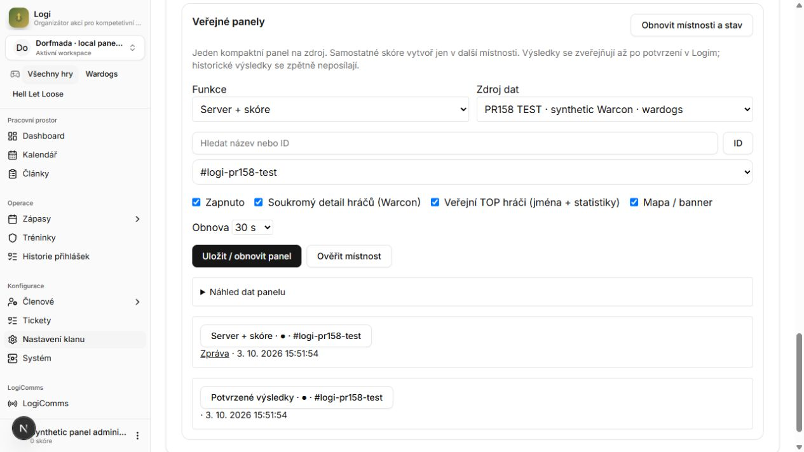

# Public Discord panels: acceptance and review

This is the public-panel increment of PR #158. It does not replace the
[earlier integration review](../../v0.14/evidence/2026-10-03-pr-review/README.md)
or turn its production/SSO limitations into passed checks.

- Baseline: `c42ea770c307793494ae159a924f86e3c6ced50d`.
- Initial implementation reviewed: `154704af916dca5c4b6ca24439c449460bd029db`.
- General review repairs / sealed security scan head: `e281495acf6f680ed1fc5ebdf23ceb49758f4a7e`.
- Final layout and security repair: **`fc5eb8696942adedbd5009d3e47ccca98e98b868`**.
- Tests and runtime acceptance exercised the source bytes subsequently committed
  at that final revision; later commits add documentation/evidence only.
- Database: isolated loopback Convex, `http://127.0.0.1:32290`.
- External acceptance: the authorized test application in Dorfmada's
  `#logi-pr158-test`, with **synthetic game/player/result data**.
- Production Convex, production bot configuration and real provider settings
  were not changed. Credentials and fixture-only login/seed routes remain outside
  the repository and the clean production build.

## Delivered behavior

The [operator guide](../../discord-public-panels.md) covers configuration and
recovery; the [public wiki](../../../../../content/configuration/public-panels.mdx)
covers the user flow.

| Surface | Delivered |
| --- | --- |
| Dashboard | Source/game, server + score, separate scoreboard, confirmed results; categorized/searchable channel picker or pasted ID; verify, preview, save, pause, 30/60/300-second refresh and delivery health/message link |
| Public live card | Clickable map thumbnail, count/capacity, faction scores with semantic application emoji, independent observation age and stale labels |
| Optional public leaders | Overall TOP 3 kills and cash; best killer and cash holder per known faction; separate `showLeaders` opt-in defaults false for new and historical panels |
| Private player details | Independent `showPlayers` setting; eight Warcon players per page, names/faction/kills/deaths/cash/ping, bounded private failure reply, no platform IDs |
| Results | Reviewed event results only; correction edits the same message; withdrawal/disable removes owned results; no automatic historical backfill |
| Recovery | Persisted binding and pre-send marker, fenced lease, exact bot-authored recovery, fresh message fetch, conservative handling of uncertain sends and destination moves |
| Existing messages | Shared lifecycle for event announcements/info, calendar, recruitment and tickets; per-game recruitment message identity remains separate |
| Artwork | Fixed local map/game catalog; content-addressed attachment reuse across refresh/restart; explicit application emoji provisioning reuses the three installed faction icons |

Live leaders rank **currently connected players**. Cash means the provider's
current balance, not cumulative earnings. A live scoreboard is not a reviewed
clan result. Missing metrics stay unknown; tied values sort deterministically.
Unknown factions can appear in overall rankings without fabricated team mapping.

The private `/server-status` and other existing slash commands keep their audience
and semantics. Website bearer read keys do not gain Discord publishing authority.
HLL uses available snapshot fields; this increment does not add an HLL player list.

## Verification

[acceptance.json](acceptance.json) records real assertions, source revisions,
screenshot hashes and private-log digests. [verification.txt](verification.txt)
contains command references and the captured test summary.

| Check | Result and scope |
| --- | --- |
| `npm run test` | **800 passed, 0 failed, 0 skipped**, 8.674 s; synthetic CI environment from `.github/workflows/verify.yml` |
| `npm run typecheck` | Passed |
| Clean production build, `next build --webpack` | Passed, 32.112 s; clean copy excludes private fixtures/login route; existing system-log/Nextra warnings retained |
| OpenAPI + Convex type inventory regeneration | Passed, 82 Convex modules; no generated diff |
| Changed TypeScript Prettier / `git diff --check` | Passed |
| ESLint on changed TypeScript | **0 errors, 5 existing warnings** in the event form |
| Full repository lint | **Not green**. At e281495: 142 errors/143 warnings versus baseline 143/141; excluding three ignored local-helper warnings: 142/140, with no introduced tracked diagnostic. Not rerun across the whole repository after fc5eb86; final changed files passed. See [lint-comparison.json](lint-comparison.json) |
| Final Convex deployment | Schema/functions deployed successfully to isolated loopback only, 1.700 s |
| Dashboard HTTP | Anonymous management denied; cross-origin write denied; current-actor save with actual Discord channel verification accepted |
| Dashboard UI | Category/search, pasted ID, verification, preview, save and read-back exercised; final saved state shows separate private/public player switches and artwork |
| Discord delivery/restart | **13/13 current-delivery checks and 15/15 restart checks**; same message ID `1555919877573705860`, same attachment ID `1555938699022442626` |
| Discord known deletion | **12/12**, at initial 154704a: exact owned test message removed and replaced with a new ID |
| Discord results | **13/13** on final source: confirmed v1, corrected v2 retaining original ID, then provisional withdrawal and exact owned-message removal |
| Discord web controls | Old retained control rejected privately; current **1/3 → 2/3 → 3/3 → 2/3** passed with 17 synthetic players; REST read-back verified private flag, freshness and no platform IDs |
| Application emoji | Three faction assets installed in the test application; rerun reused IDs; real icons visible in Discord web |
| Map attachment | Genuine thumbnail visibly loaded; fresh REST read-back and restart verified nested component attachment retention |
| Failure/concurrency cases | Automated tests cover ambiguous send, rejected send, failed move, revoked actor/source, stale lease, invalid channel type, permission/rate/timeout classification and failed private replies |

The runtime harness loaded the approved test token and loopback-only environment,
seeded synthetic data, ran the actual worker, and performed fresh Discord REST
read-back. Discord was not mocked. The owner-authorized logged-in Discord web
session was operated by the assistant; these were genuine user-session component
interactions, not fabricated interaction payloads. Fixture credentials and temporary
login/seed routes are deliberately private; offline regression tests ship in the repo.

The known-deletion run predates later review fixes and is not relabeled as a
final-revision run. Current delivery/restart, results and final pagination do
cover the final source.

## Review findings and fixes

A fresh-context general reviewer inspected all 41 initial changed paths and ran
18 focused tests. Verdict: **ready with fixes**, with no Critical findings and
three Important findings, all repaired with regression tests:

1. A recruitment game override without a stored message could inherit another
   game's message ID. Each game now owns its message identity even when unset.
2. Private ticket/application thread parents could select announcement channels.
   Picker purpose and backend guild/type validation now require text channels.
3. First migration of a legacy event announcement could search for its old message
   in the new destination. Migration uses the saved old channel; failed removal
   blocks the move.

The reported loading failure was reproduced: both disabled buttons on a one-page
list shared a component ID. Discord rejected the reply with
`50035 / COMPONENT_CUSTOM_ID_DUPLICATED`. Distinct IDs and a bounded private fallback
repair this; real single-page and multi-page interactions passed.

A separate regression proved Discord.js cached message reads could preserve a
deleted message. Ownership/existence reads now force REST; only `10008` means missing.

Actual Components V2 attachment testing exposed another protocol detail: consumed
uploads can be absent from `message.attachments`. Reuse now reads the owned component's
attachment identity and retains **both ID and filename**. Sending only ID caused
`UNFURLED_MEDIA_ITEM_REFERENCED_ATTACHMENT_NOT_FOUND`; the repaired real update/restart
retains the original upload.

The initial general reviewer was not rerun after repairs. Final verification
includes regressions, build, actual runtime acceptance and separate security work;
do not describe the initial review as approval of the final SHA.

## Security review

[security-summary.json](security-summary.json) records the immutable scan,
all 46 source paths, its original coverage artifact, finding, usage, exclusions
and separate verification of the repair.

- Completed Codex Security scan `8bd8ac60-6646-4d27-8bf4-22e4fc3a5cf4`
  covers **c42ea770 → e281495**, not all of PR #158 or the final SHA.
- **One Low finding:** retained private player controls could read current data
  after a panel moved to a restricted channel. An offline execution of the actual
  vulnerable handler reproduced one provider read and current data disclosure.
  No real credentials, providers or two-account Discord attack were used.
- **Fixed in fc5eb86:** controls bind guild, channel and revision. Fresh guild,
  channel, member and role permission checks run before and after loading.
  Old/reconfigured controls fail closed without issuing the provider read.
- Independent focused follow-up read all **14 changed/new TypeScript files**,
  passed **19/19 tests**, and found no new security candidate. A combined maximum
  rendering case used 3,528 of 4,000 allowed text characters. Public names remain
  off by default; artwork paths remain catalog-only.
- Real web acceptance additionally rejected an old control and accepted current
  pagination. Moved-channel, revoked-access and mid-read changes are covered
  offline; no real two-account permission-move acceptance is claimed.

The original native finding remains recorded as open/idle; this repair verification
does not rewrite the sealed scan. Its coverage file retains a stale `partial`/
deferred-candidate entry, despite all 46 source worklist rows being closed and
that candidate being promoted to the canonical finding. This reporting limitation
is preserved explicitly, not represented as a clean final-head scan.

## Screenshots

Genuine screenshots of the final source. Discord images are rectangular crops of
the actual test-channel web view, excluding unrelated channels and account UI.
They were not redrawn, composited or generated. The private image shows rejection
of an old control followed by the current working last page.

## Remaining activation work and explicit limits

- Logi PR #158 is not merged or deployed to production. Production application,
  roles, provider settings and environment values require authorized activation.
- These screenshots prove Discord **web**, with synthetic data and real Discord
  transport. Native desktop/mobile clients, real provider outages and actual
  Discord 429 delivery were not exercised; injected errors do not prove them.
- Recovery searches 100 recent messages. An uncertain send outside that window
  needs operator reconciliation; no reconciliation UI/CLI was added. Legacy
  ticket/recruitment records with lost destination metadata also need reconciliation.
  Discord and Convex do not provide a shared atomic transaction.
- An in-flight Discord request cannot be canceled atomically by a settings change;
  the next pass reconciles it. Configuration/claim fences protect stored acknowledgements.
- Public website deep links need verified per-workspace server/event URL mapping.
  Current controls expose private details and the dashboard's Discord message link.
- Map artwork is an existing tactical thumbnail, not a new promotional banner.
  Faction icons are application emoji; metric symbols use Unicode.
- Public bot text intentionally uses English; dashboard controls cover English/Czech.
  HLL private player details are outside the snapshot contract.

Execution rulings: reused the dedicated PR branch; treated the approved P1–P6 table
as the implementation plan; kept required deployment local because production was
excluded; retained interactive-only publishing management and deferred unverified
website URL mappings. No general-review Minor finding was deferred. P1–P5 are
implemented; P6 passed only the explicitly recorded local/test-guild checks,
with production/client/rate-limit gates above open.
