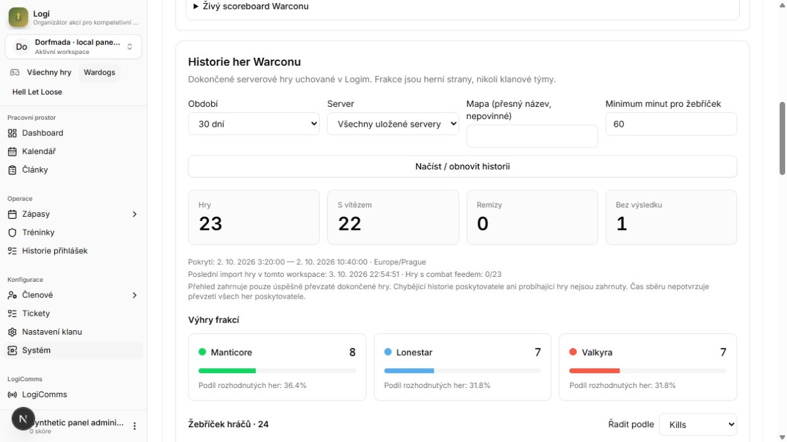
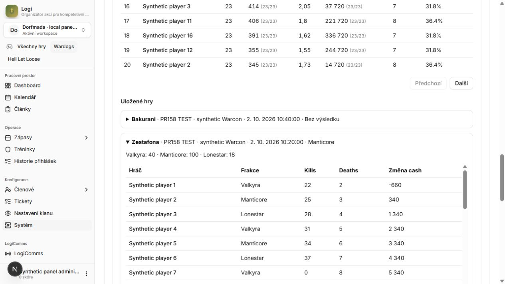
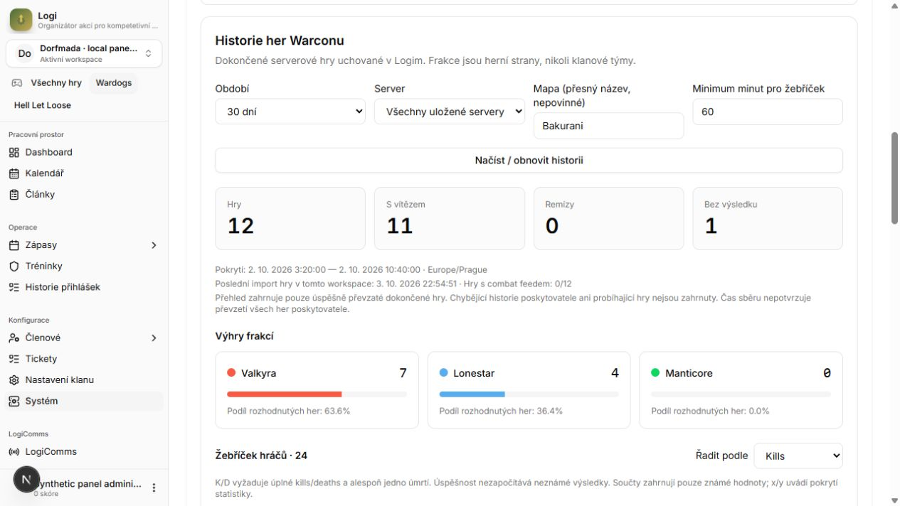

# Warcon retained-history acceptance — 2026-10-03

Scope: the retained-history increment after `af5a52a08b79b23e0ee491ee627887114424610d`, on Logi PR #158. Implementation: `051457a4afe744e0b8d991348f2d00e02bf3e64e`; review fix: `424e118b24e106ecc0b038d1f7698a24ac942d3f`. Production Convex and provider writes were not used.

## Actual provider → collector → local storage → HTTP

The normal `gameDataCollector` actions read the authorized Warcon server through the existing protected HTTP adapter and saved its completed sessions to `serverGameHistory` in the isolated loopback database. A separate local-only workspace contains these real facts; public evidence contains aggregates only.

[Live evidence](live-acceptance.json): 5 completed games, 4 decided, 1 without a result; Manticore 2 wins, Lonestar 1, Valkyra 1. The archive contains 322 distinct player IDs across these completed games; 196 meet the 60-minute completed-game floor. Those counts are not a claim of parity with Warcon's session-based leaderboard (197 eligible in the earlier live research snapshot). In-progress sessions and provider session playtime use different coverage.

[HTTP evidence](http-acceptance.json), repeated after the correction: actual Next API pagination returned 20 + 3 synthetic records. Repeated reads did not create games/revisions. A corrected game replaced its earlier win contribution; a previously issued cursor then returned 410. A cursor used by another caller returned 400, a revoked key returned 401, and a disabled live collector's retained facts remained readable with 200. Synthetic corrections and key revocation were restored after verification. The live test collector was disabled after acceptance.

## Automated checks

- Full suite: **844 passed, 0 failed, 0 skipped** after the review correction, with the synthetic offline environment variables from `.github/workflows/verify.yml`. [Full test output](tests.txt).
- TypeScript: passed.
- Next.js webpack production build: passed in a credential-free private source copy. Existing `system-logs.ts` `createRequire` bundler warnings remain.
- Changed-source ESLint: **0 errors**, one pre-existing unused `_genericSuccessResponse` warning in the OpenAPI module.
- Generated contract parity: passed after regenerating the Convex declarations with the repository's offline CI generator in `902266798ad052b5ea0de08957b8efd653c3a6a8`. The official CLI had produced different import ordering/comments; the module inventory and exported types are unchanged. TypeScript was checked again after generation.
- Parser/provider mapping, HLL compatibility, duplicate/corrected history, credential/source identity, cross-workspace reads, revocation, explicit grants, bounded pages, revision conflicts, cursor bindings, cancellation, metric coverage and OpenAPI permission parity are exercised.

The first broad test attempt omitted the repository's synthetic JWT environment and failed existing HTTP tests. Re-running with the documented test environment passed after fixing the new endpoint's permission metadata. A real HTTP 403 exposed the new route's initially inconsistent `gameId` query; the endpoint now uses the existing API's canonical `game=wardogs`, with a regression test.

## Browser evidence

The actual dashboard uses the authorized local synthetic administrator and **23 synthetic games / 24 synthetic players**. Counts exceed the 20-game backend page size. The overview shows 22 winners plus one result-less game, and real DOM interaction changed the player order from kills to cash. Expanding a game showed its final three-faction score and player table. Applying the exact `Bakurani` map filter returned 12 games, 11 decisions and one result-less game (Valkyra 7 wins, Lonestar 4, Manticore 0); clearing the filter restored all 23 games.

These are application screenshots, not design mockups. They do not show real player identities. The inherited synthetic live-server fixture deliberately has no history capability; its displayed live connection status is separate from the seeded retained-history dataset.

## Boundaries

No production activation, hosted SSO acceptance, website deployment, team-directory implementation, new Discord command or official clan result is claimed. The website can consume the new explicit history read contract; its public presentation remains a separate consumer task. The local test harness, secrets, raw Warcon responses and local fixture-only auth/seed endpoints are outside the repository and are not shipped.

See the [review disposition](review.md), [sealed original-head security report](security-review.md) and [machine-readable verification](checks.json). The security scan covers this increment, not a fresh rescan of the entire accumulated PR. Its original head intentionally excludes the later regression-driven correction; the final tests and local HTTP replay cover that correction.
