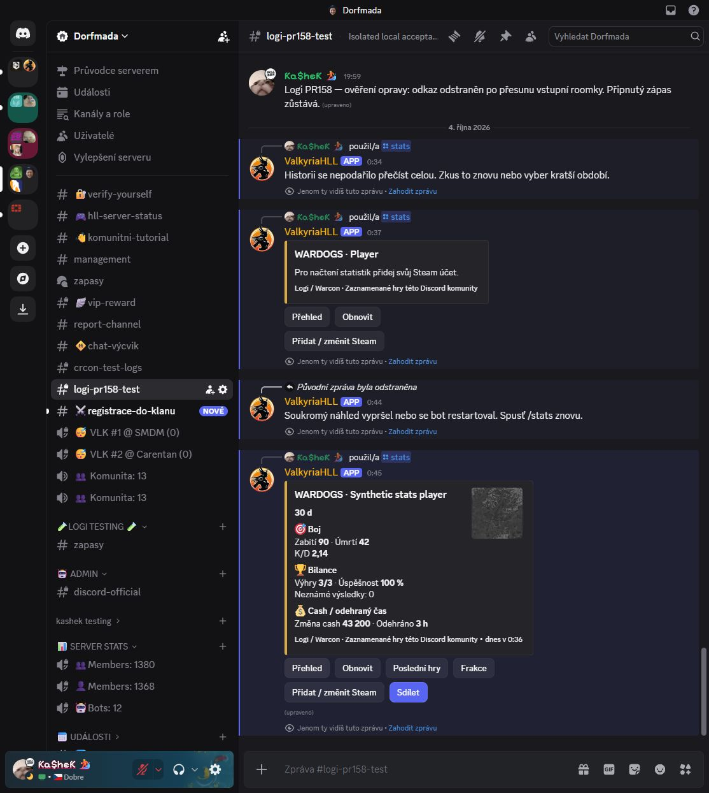
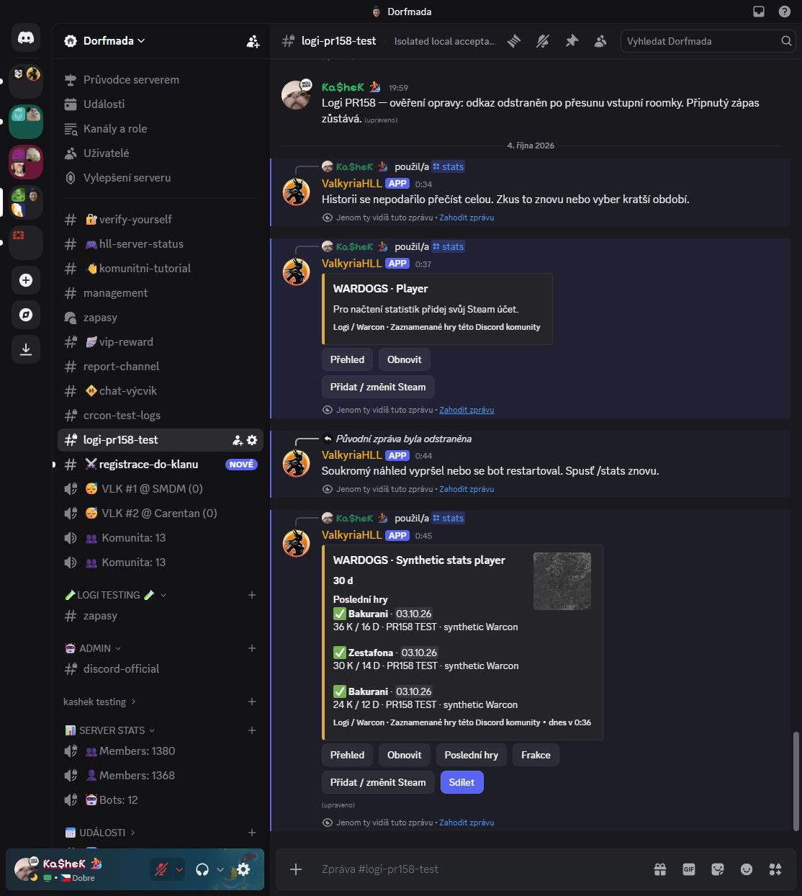
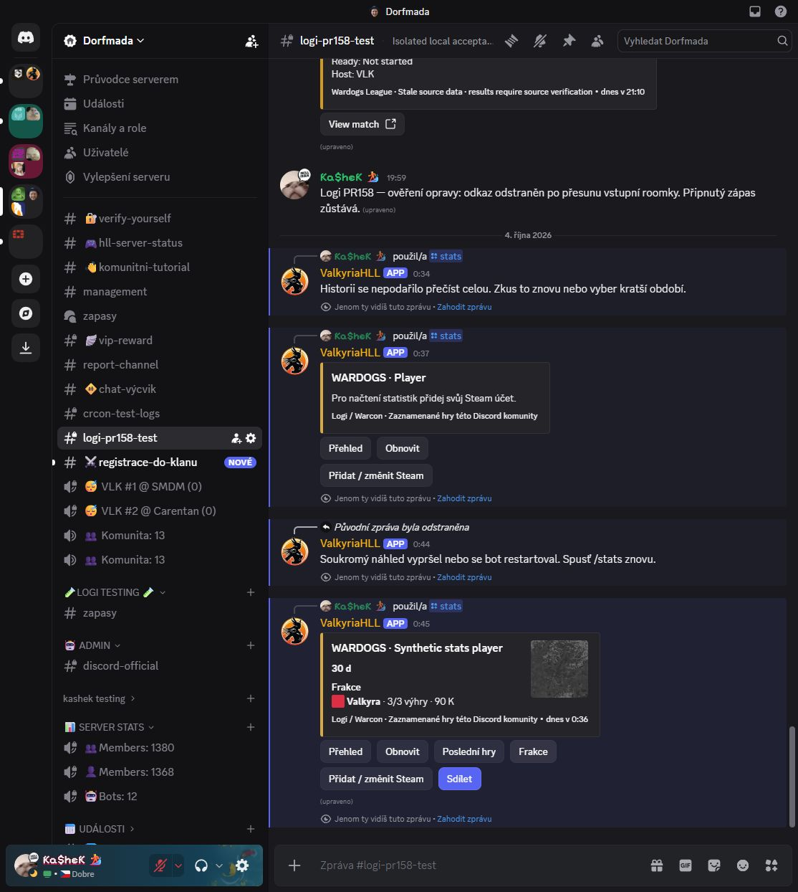
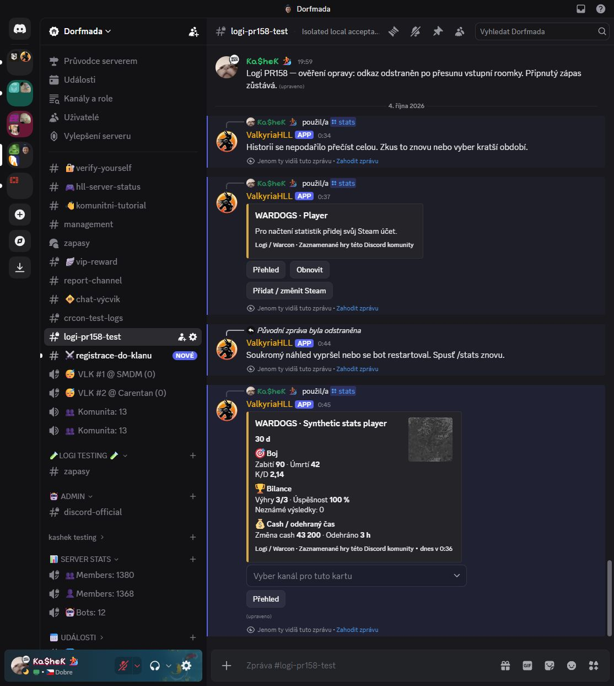
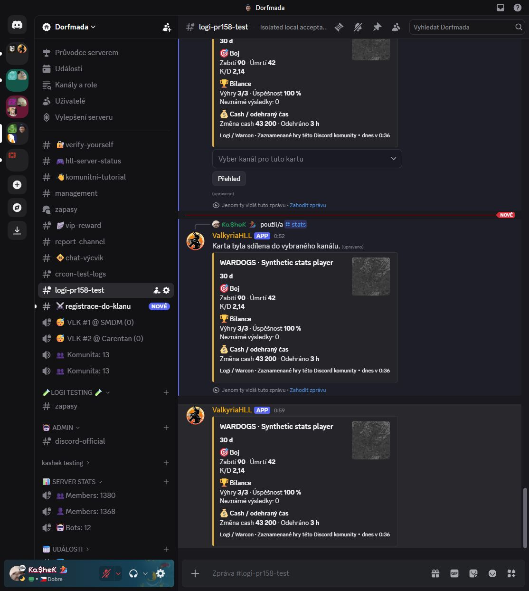
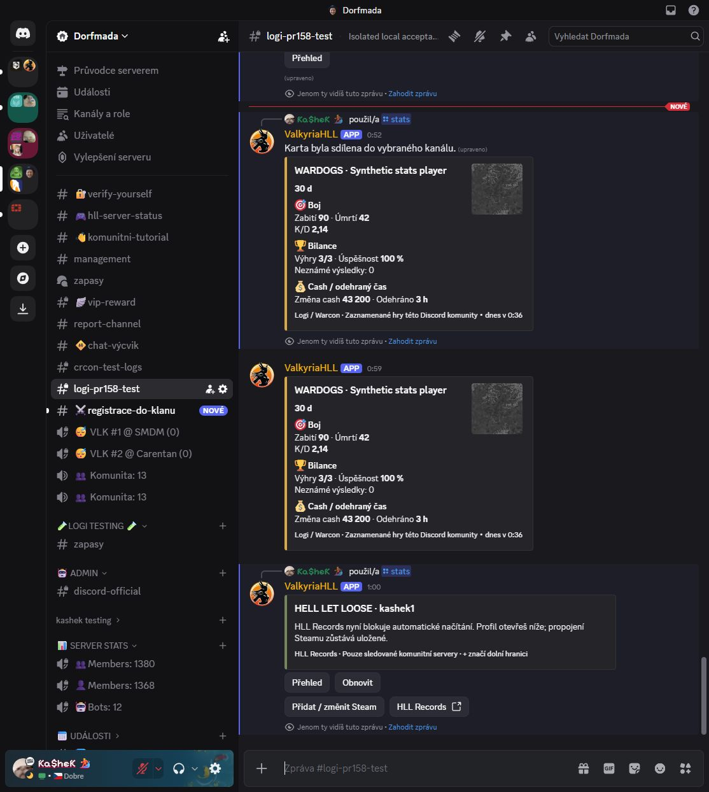

# Player statistics acceptance — 2026-10-04

This evidence covers the `/stats` addition after `72946e3915af2216f97f8c167ea02ea20308555c`.
Tested implementation: `8b07862a077a6d25a4005e69dbc8ca9bdeaa88f6`. The follow-up
delivery changes add security evidence and clarify one gateway comment; they do
not change executable behavior.

## Boundary

Real Discord interactions ran with the authorized replacement test bot in Dorfmada
→ `#logi-pr158-test`. The real handler, registration, modal, component dispatch and
Convex gateway were used. Persistence was exclusively the isolated loopback Convex
instance. Wardogs records were **three synthetic completed games**, not production
Warcon acceptance. No production Convex deployment or data write was performed.
The temporary stats-only Discord process was stopped after acceptance.

## Observed behavior

| Check | Result |
| --- | --- |
| Register `/stats` with game and five optional filters | Passed in real Discord |
| First invocation without a Steam link | Private card offered the self-only Steam modal |
| Save an existing user-provided Steam64 ID | Local binding persisted; statistics loaded immediately without a clan application |
| Restart the test bot | Old private controls expired; a fresh command reused the persisted Steam binding |
| Wardogs overview | 90 kills, 42 deaths, K/D 2.14, 3/3 wins, cash delta 43,200, playtime 3 hours |
| Recent games / factions | In-place private updates; three games and Valkyra 3/3 wins |
| Share without a preset channel | Native Discord channel picker appeared |
| Choose the authorized test channel | One public snapshot appeared; private confirmation removed sharing controls |
| HLL command for the linked account | Real provider HTTP 403 produced an honest blocked-source message and profile link; Steam binding stayed intact |

The share test's public message ID is `1556078388048039957`. The HLL private
interaction completed at `2026-10-03T23:01:01.836Z` (2026-10-04 in Europe/Prague).
The public and private copies visible together in the screenshot are intentional:
the original private preview and its explicitly shared public snapshot.

## Reproducible automated validation

- `npm test`: **875 passed, 0 failed, 0 skipped**, including the stats domain,
  use-case, parser/fetcher, gateway, interaction, runtime and publication cases.
  [Full test output](tests.txt).
- `npm run typecheck`: passed.
- Scoped ESLint over changed TypeScript: **0 errors**, three existing unused-helper
  warnings in `discord-bot/src/interactions.ts`. [Lint output](lint.txt).
- `npm run build` in a credential-free source copy: passed, exit 0, 62.3 seconds.
  [Build output](build.txt). Existing `system-logs.ts` bundler warnings and the
  source-copy Nextra Git-metadata warning remain visible.
- Convex CLI `deploy --yes --env-file <isolated-local-config>` from the guarded
  source copy: passed, including generated bindings, TypeScript and schema
  validation. Target was exactly `http://127.0.0.1:32290`.
- `git diff --check`: passed.

Stored logs replace machine-specific source paths with `<repo>` / `<private-work>` and normalize trailing whitespace.
No credentials, raw provider player lists, browser cookies or private environment
files are included. [Machine-readable summary](proof.json).

Security regressions include exact Discord identity binding, guild isolation,
stale membership proof rejection, duplicate/self-only linking, immutable history
revision handling, finite read budgets, forbidden destinations and permissions,
concurrent share clicks, expired controls, provider redirects, response limits,
HTTP 403/429 backoff and retention of the last successful profile.

## Security review

Codex Security diff scan `a16d07a2-3311-49a8-ae1a-a5a02bfc4cb3` completed for
`72946e3915af2216f97f8c167ea02ea20308555c..8b07862a077a6d25a4005e69dbc8ca9bdeaa88f6`.
All **23 authoritative changed source paths**, the synthetic HTML fixture and
supporting authorization/history/artwork consumers were reviewed. There were
**0 reportable findings**. An independent architecture pass preceded the parent's
complete source review. This covers the new stats increment, not a repeated audit
of all preceding PR #158 changes.

[Generated review report](security-review.md) · [SARIF](security-results.sarif) ·
[Exact scan receipt](security-receipt.json).

Editorial correction to the immutable generated report: its phrase "ten changed
test files" is a counting typo. The exact 23-path inventory contains **nine test
files**; all were reviewed. This does not change the source coverage or outcome.

The review clarified a source comment: bot membership evidence may be reused for
less than five seconds and Convex accepts observations up to ten seconds old.
Pre/post statistics reads still reauthorize. The follow-up comment correction
does not change this behavior. HLL's transport deadline is not a separate CPU
sandbox for synchronous HTML parsing; provider input is capped at 2 MiB.

Workbench rollout accounting reports 7,660,074 total tokens, including 7,337,344
cached input tokens and 29,503 output tokens across three threads. This is the
tool's rollout telemetry, not a price estimate or a count of unique source tokens.

## Screenshots

### Wardogs overview

### Recent games

### Faction breakdown

### Channel selection

### Published snapshot

### Actual HLL provider limitation

## Not claimed

HLL's unauthenticated backend request is blocked by BunnyShield. The successful
browser profile view does not establish unattended backend access. HLL numerical
cards, maps and weapons are parser/renderer fixture-tested; a successful live HLL
backend fetch is **not** verified. No challenge bypass or browser cookies were
used. Production rollout and real Wardogs history acceptance for this command
remain separate from the local synthetic test.

See the [capability and activation guide](../../discord-player-stats.md).
