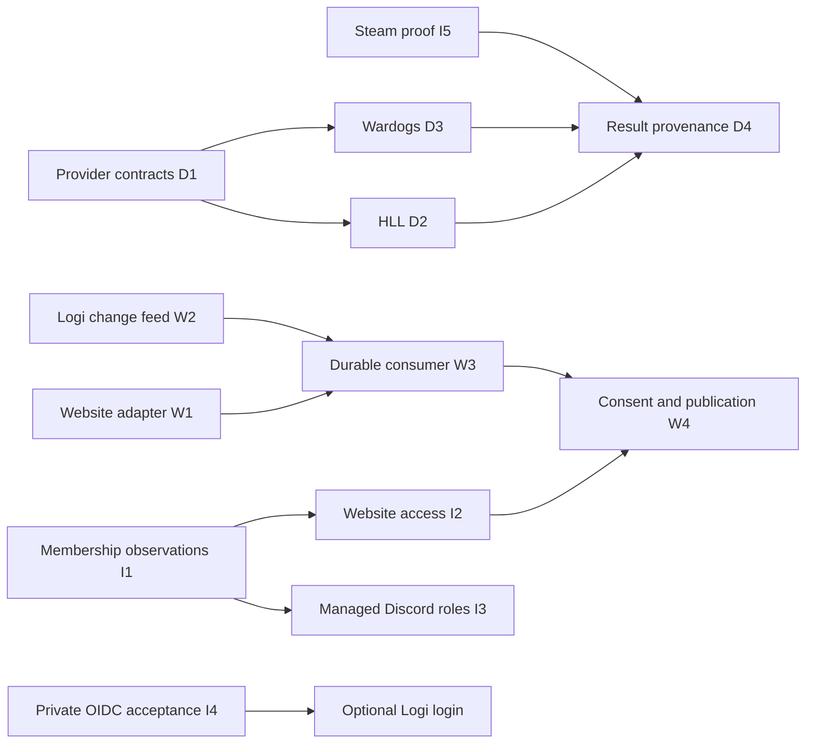

# Data, website and identity integration roadmap

**Status: Proposed design and implementation backlog, 2026-09-28.** This is not a
deployed capability announcement. The current delivered contract remains
[handoff 0.4.0](../v0.4/README.md). Task IDs below are local plan references,
not GitHub issue numbers. Upstream Issues remain disabled.

Logi is the operational data backend for HLL and Wardogs. The website keeps its
own backend for sessions, permissions, CMS, publication, consent and derived read
models. Extend the existing Logi dashboard, Convex backend and Discord bot.

## Read in this order

1. [Research and verified baseline](./research.md): source revisions, capabilities,
   provider evidence and what remains unverified.
2. [Proposed architecture and contracts](./design.md): ownership, data flow,
   identity boundaries, failure handling and acceptance targets.
3. Implementation plans, each independently reviewable:
    - [D1–D4: provider data collection and results](../../../superpowers/plans/2026-09-28-logi-data-collection.md)
    - [W1–W4: website integration and durable synchronization](../../../superpowers/plans/2026-09-28-logi-website-sync.md)
    - [I1–I5: Discord membership, authorization and OAuth/OIDC/Steam linking](../../../superpowers/plans/2026-09-28-logi-identity-membership.md)

## Prioritized delivery

| Order | Tasks          | Reviewable outcome                                                                                    | Owner / dependency                                                           |
| ----- | -------------- | ----------------------------------------------------------------------------------------------------- | ---------------------------------------------------------------------------- |
| 1     | W1, D1         | Website consumes existing safe summaries; Logi has configured provider contracts and snapshot storage | Website team / Logi team; fixtures first                                     |
| 2     | W2, I1         | Reliable invalidation/change records and trustworthy membership observations                          | Logi team; independent of game-provider access                               |
| 3     | D2, D3, I2, I5 | HLL and WDG data adapters; website membership refresh; optional verified Steam link                   | D1; I2 needs I1; I5 uses existing Logi login; live checks deferred           |
| 4     | W3, W4, D4     | Crash-safe synchronization, withdrawal handling and confirmed/corrected results                       | W1 + W2; D4 needs ingestion contracts and I5 for verified player attribution |
| 5     | I3, I4         | Audited managed Discord roles; separately accepted optional Logi SSO                                  | I1; private provider acceptance for I4                                       |

W1 is the first useful website slice: approved HLL/WDG event and match cards from
Logi, with unknown/provisional results and stale-state handling. Existing Discord
OAuth remains usable according to the website's current configuration. Logi SSO
is not a prerequisite for data ingestion or this slice.

## Explicit boundaries

- This workstream writes only `Ninjonik/logi`. Website file paths in W/I plans
  are handoff instructions for its owner, not permission to edit that checkout.
- No second Logi deployment, Convex replacement, replacement community bot,
  automatic infrastructure provisioning or automatic migration of live keys.
- Initial website integration stays read-only. Match registration, roster edits,
  Discord moderation, bans, kicks and game-server controls from the website are
  a later actor-authorized command milestone, not a broader service-key grant.
- Real credentials, tenant IDs and test-guild setup remain deferred. Use synthetic
  fixtures; keep unavailable provider capabilities explicitly unavailable.
- SSO findings/remediation stay in authorized private coordination. Public plans
  contain standards-based acceptance criteria only.

## Definition of completion

Each task supplies production code, a failing-then-passing behavioral test,
applicable persistence/HTTP tests, documentation/OpenAPI parity and an exact tested
revision. Changed presentation needs actual captioned screenshots, with simulation
labels where applicable. Publishing or merging a PR does not establish deployment.

Before hosted activation, separately verify the deployed contract, per-game
credentials, provider/network reachability, role hierarchy/intents, key rotation,
withdrawal/revocation and rollback on an authorized test tenant. Keep at least
one synthetic negative case in that acceptance run. No merge, deployment or live
Discord action is authorized by the act of checking a plan box.

Future command work must bind the human actor, session, guild, game, action,
target and idempotency key; recheck authority at execution and audit the outcome.
Until that contract is reviewed, the website links to Logi operational workflows.

## Plan verification

This planning-only revision checks 45 relative documentation links across nine
files, 13 unique task IDs, 52 unchecked steps, required plan sections and balanced
code fences. The six new documents pass the existing Prettier formatter; the
complete patch passes `git diff --check`. Diagrams were source-reviewed, not
rendered. No application tests or live provider flows were rerun for this
documentation change. Runtime validation remains pinned to `cd69579` in handoff
0.4; the checkboxes above are future acceptance work, not passed test claims.
