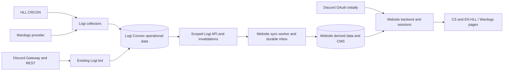

# Proposed integration architecture

**Status: Proposed. Date: 2026-09-28.** Owner reviews: Logi maintainer for producer
contracts; website owner for consumption, consent and access policy. Evidence is
in [research](./research.md); execution units are in the [roadmap](./README.md).
New names/routes/types below are proposals, not existing APIs.

## Decision and alternatives

Keep collection and operational authority in the existing Logi/Convex deployment.
The website backend consumes scoped projections into its own derived tables.
Reuse the Logi bot for Discord workflows. Start with website Discord OAuth;
enable Logi OIDC only after independent provider acceptance.

| Alternative                                                    | Assessment                                                                                                              |
| -------------------------------------------------------------- | ----------------------------------------------------------------------------------------------------------------------- |
| Website calls CRCON/WDRCON/Discord directly for all data       | Duplicates collectors, provider secrets, reconciliation and operational ownership; reject as target                     |
| Logi collectors and scoped API; website-owned read models      | Chosen: coherent ownership and reduced website credentials; requires observable queues and producer freshness contracts |
| Replace website backend with Logi or share its Convex database | Loses CMS/session/consent boundary and couples storage; reject                                                          |
| Require Logi SSO before any data work                          | Adds an unrelated critical dependency; defer SSO activation while preserving current Discord login                      |
| Add a new all-purpose bot or RCON panel                        | Rebuilds existing workflows; add an adapter to an existing provider instead                                             |

## Global constraints

- Logi owns operational events, signups, rosters, results and provider observations.
- The website owns CMS, translations, publication consent, sessions, site grants and derived caches.
- Website writes are out of scope until a per-actor command contract is accepted.
- Never send Logi's global bot token, internal Convex secret or provider credentials to the website/browser.
- Preserve opaque identity `(sourceInstanceId, guildId, gameId, resourceKind, externalId)`; never join people by nickname.
- Map route `hll` to website `hell-let-loose` to Logi `hell_let_loose`; map `wardogs` explicitly. Never use `game=all` for a scoped consumer.
- Unknown data is nullable; timeout is not offline, absence is not zero, and telemetry is not a confirmed result.
- No live credentials, deployment, hosted settings changes or Discord actions are part of offline implementation.
- Preserve existing toolchains and inward domain/application dependencies; update API, wiki and locale parity with each feature.

## 1. Collection and provider contracts

Use four provider kinds: `hll_crcon`, `wardogs_rcon`, optional `wardogs_warcon`
and optional `wardogs_public_directory`. Capabilities are discovered/configured
per connection: `server_snapshot`, `live_players`, `match_history`. Unknown or
unsupported capabilities are not represented as empty successful datasets.

Proposed Logi tables:

| Table                  | Purpose / key                                                                                                                                    |
| ---------------------- | ------------------------------------------------------------------------------------------------------------------------------------------------ |
| `gameDataConnections`  | Guild/game/provider/server configuration, enabled flag, configuration generation, approved origin and secret reference; no arbitrary browser URL |
| `gameDataRuns`         | Per-connection lease/fence, page checkpoint, attempts, next retry, completion and sanitized error                                                |
| `gameServerSnapshots`  | Latest allowlisted status per connection; observation/provider timestamps and nullable values                                                    |
| `gameSessions`         | Opaque external session identity, source digest, private normalized player facts, completion/provisional state                                   |
| `eventSessionLinks`    | Explicit event/round to external-session mapping, actor/time and mapping version                                                                 |
| `eventResultRevisions` | Immutable provisional/confirmed/corrected result provenance, superseded revision and actor/time                                                  |

Connection identity is distinct from ephemeral game-server process IDs. Changing
guild, game, provider or server creates a new identity rather than retagging old
history. Disabling a connection increments its generation, stops new claims and
rejects late commits from older runs. Secret resolution stays inside Logi through
an operator-managed secret reference; dashboard/API responses never return it.

Provider calls run in bounded Convex actions; claims, upserts and completion are
transactional mutations. One current lease per connection, 60-second lease with
renewal, 10-second HTTP attempt timeout, at most three attempts per run and a
30-second action work budget are initial design values. Each HTTP deadline is
the smaller of ten seconds and the remaining work budget. Persist continuation
instead of occupying one invocation indefinitely. Respect `Retry-After` without
sleeping beyond the work budget; 401/403 disables retries until configuration is
reviewed. An expired worker cannot overwrite a newer generation/fence.

Restrict origin, scheme, port and methods from operator configuration. Disallow
credentials in URLs, cross-origin redirects and public plaintext secret transport;
validate resolved destinations against the approved network policy. Do not build
an arbitrary URL proxy. Public WDG fallback requires an explicit provider switch
and provenance; it never silently replaces authoritative player/result data.

`ServerSnapshot` adds only safe name/ID, game, `online | offline | unknown`,
nullable map/players/capacity, provider identity, `observedAt`, `lastSuccessAt`
and `fresh | stale | unavailable`. An authenticated game response can prove
reachability; an HTTP timeout or directory omission cannot prove offline.
Initial polling is 60 seconds, stale after 180 seconds and unavailable after
15 minutes without a valid observation. These are targets, not measured SLOs.
Respect a slower provider refresh interval. Preserve a stale last-known value
with its timestamp; never refresh its observation time just because it was read.

Poll completed HLL sessions every five minutes using overlapping pages, provider
session IDs and idempotent updates; live-session records may change until ended.
Use explicitly verified platform links for player attribution. Unlinked IDs remain
private unresolved facts. Do not call name/nickname matching in unattended jobs.
Manual link/merge remains a reviewed Logi operation with provenance. Existing
submitted platform IDs are classified as claimed, not automatically upgraded to
proof of account control. I5 introduces `platformIdentityLinks` with provider,
subject, Logi user, verification method/time and revocation, plus expiring
single-use `platformLinkChallenges`. Steam OpenID 2.0 can prove SteamID control;
other platform IDs remain claimed until their own proof contract is implemented.

Treat game scores as participants/factions with opaque IDs and nullable metrics.
An event result requires an explicit session mapping and authorized confirmation;
a correction creates a new revision, never overwrites audit history. Do not force
a multi-faction WDG session into two HLL scores. Raw logs/kill streams are opt-in
follow-ups, not necessary for the initial status/results slice.

## 2. Proposed API additions and compatibility

| New read resource / route                                                          | Contract                                                                                                                 |
| ---------------------------------------------------------------------------------- | ------------------------------------------------------------------------------------------------------------------------ |
| `server-snapshots` / `GET /clan/server-snapshots[/{id}]`                           | Minimized persisted snapshots; no provider calls/secrets/player list                                                     |
| `integration-health` / `GET /clan/integration-health`                              | Per-game capabilities, last success/attempt, age, queue lag and sanitized error category                                 |
| `membership-summaries` / `GET /clan/membership-summaries/{discordUserId}?game=...` | Server-only identity/membership observation and configured role-ID allowlist; no admin boolean or public profile         |
| `result-summaries` / `GET /clan/result-summaries[/{eventId}]`                      | Versioned participant results, explicit provenance and confirmation/correction state                                     |
| `GET /clan/changes`                                                                | Cursor-bound invalidations/tombstones only for resources/games already granted to the key                                |
| `GET /clan/sync-records/{resource}/{id}?game=...`                                  | Atomic `{ revision, data }` wrapper for an explicitly granted safe projection; matching scoped tombstone when applicable |

Paths are below `/api/v1`. Do not add these grants to existing keys by default.
`changes` and `sync-records` inherit each underlying resource's permission; they
must not bypass the allowlist or disclose ungranted IDs. Bind cursors to tenant,
game, selected resources and key policy. Keys remain unable to manage credentials.
Membership roles are restricted by an administrator-configured
`membershipIntegrationPolicies` record: `apiKeyId`, `guildId`,
`roleIdsByGame`, `enabled` and `policyVersion`. The key's resource/game grants
and this role allowlist must both permit the response. Missing/disabled policy
denies membership access. This credential is separate from the website's public-data reader.
Limit membership reads per key/subject and record sanitized access metrics.

Keep existing strict 0.4 summary DTOs unchanged. New result states and N-participant
results use `result-summaries` rather than widening an old closed schema silently.
Each implemented addition gets a versioned handoff, runtime Zod schemas, negative
scope tests, OpenAPI entries and matching wiki/admin UI. Release version numbers
are assigned to implemented bundles, not reserved by this proposed plan.

## 3. Durable website synchronization

Store consumer state in the existing website PostgreSQL database: scoped source
configuration, external-reference uniqueness, derived projections, sync runs,
durable inbox and per-resource revision. Use a small worker/CLI with DB leases;
do not introduce another broker for this initial scale.

W1 can consume current 0.4 collection pages. Hold `updatedSince`, game, sort and
all filters fixed across a sweep; continue empty pages with a cursor. Commit each
page's upserts and continuation together. Advance the completed watermark only
after the entire sweep, using the sweep's start boundary with overlap, not a
page's maximum record timestamp. Invalid cursors restart a full bounded sweep.
Periodic full sweeps remain necessary; page completion is not snapshot isolation.

W2 stamps a monotonic per-guild change revision in the same Convex mutation as
the authoritative write and outbox entry. Store only IDs, scope, kind and revision
in the change stream. Encode revisions as canonical decimal strings and compare
them losslessly as integers, never lexicographically or through JavaScript Number.
Initialize existing records to revision zero before enabling the feed; later
changes and removals use positive revisions. Cover dashboard, bot, imports and API entrypoints for each
advertised resource. Existing unsupported deletions remain unsupported; record
tombstones only for actual supported removals/visibility transitions. A scope move
must invalidate the old scope as well as expose the new one. Keep tombstones seven
days initially (two days from 6 October 2026; since 7 October Logi keeps no change log or tombstones and every cursor returns reset-required); an expired cursor returns explicit reset-required, never success
with a silent gap. No promise of a sequence from the old custom Valkyria bot.

For bootstrap, obtain a filtered current feed cursor before the baseline sweep,
finish the sweep, then replay from that boundary. Serialize commits per scope and
use the atomic revision wrapper on authoritative refetch. Deletion handling uses
explicit tombstones or individual authoritative absence checks; a missing row in
a partially completed or non-snapshot sweep never authorizes deletion. Preserve
editorial/consent records when hiding a derived operational projection.

Webhook ingress verifies exact raw-body HMAC, timestamp within 300 seconds,
configured source/guild, event/header agreement and body limits before parsing
into the durable inbox. Unique key is `(sourceInstanceId, guildId, deliveryId)`;
acknowledge only after insert/enqueue commits. Duplicates return success. Webhooks
invalidate/refetch; their bodies are never directly published. Replay events and
late fetches cannot undo a newer tombstone or consent withdrawal.

Producer dispatch drains up to 25 claimed deliveries with concurrency 4 per run,
10-second request deadlines and a 30-second work budget; schedule continuation
when due work remains. Retain the minute cron as recovery. Respect retry timing,
leases and a tenant-fair queue; do not assume Convex retries network actions.
Test a 100-delivery synthetic burst against these bounds. Website polling every
five minutes and daily complete reconciliation backstop webhook gaps.

## 4. Identity, membership and authorization

Keep four concepts separate: OAuth identity, Discord guild presence/roles,
game-specific Logi assignments and website grants. Public profile consent is a
fifth independent decision. A Discord member can be an HLL recruit and a WDG
mercenary without becoming either game's website editor.

Use existing bot Gateway observations plus REST reconciliation. Proposed
`MembershipObservation` contains guild, subject, `present | left | unknown`,
allowlisted role IDs, game assignment state, provider observation time, ingestion
time, observation epoch/revision and completeness. Do not claim that persistence
`updatedAt` is the time Discord was observed. A failed guild fetch is not a full
empty membership snapshot.

Serialize ingress per guild; use fenced reconciliation generations and per-member
compare-and-set. A slow full snapshot/REST response must not resurrect a departure
or role removal received after it started. Retain departure tombstones. Raw
Discord Gateway sequence numbers are session-scoped and are not a global durable
revision. Handle role deletion/permission changes and reconnect reconciliation,
not only member updates. Keep assignment changes separate from observed presence.

The membership GET serves fresh cached observations or performs a bounded Logi-side
REST refresh before returning. Return `unknown`/unavailable on a failed refresh;
do not refresh timestamps on stale cached data. Preserve the website's 60-second
write and 5-minute private-read limits and its commit-time authority checks.
Map grants using explicit role IDs and configured guild/game; never trust posted
roles, `member/guest`, a service key or a Discord Administrator bit as site authority.
Multiple configured guilds must not implicitly union cross-game admin rights.

Managed roles have one authority per role: Logi for explicitly configured
recruitment/assignment outcome roles; Discord for externally managed roles.
Group-role import filters stay filters. Extend existing recruitment flows with
durable desired/applied operations, retry/audit and reconciliation; preserve all
unmanaged roles. Check actor authority, bot hierarchy and target eligibility again
when executing a delayed operation. Legacy assignment imports do not silently
become a new role-grant channel.

## 5. OAuth/OIDC and account linking

Retain the existing website Discord authorization-code login and host-only session.
It requests `identify`, maps immutable Discord IDs, and does not retain OAuth
tokens. Moving operational data to Logi does not require replacing this identity
provider. Replace membership transport separately after I1/I2 acceptance.

Logi OIDC is an optional second stage. Before activation, privately verify issuer,
client authentication/issuance, exact HTTPS redirects, state/nonce, RFC S256,
single-use code consumption including concurrency, expiry, signature algorithm/
audience, userinfo subject agreement, logout and session/token revocation. Use a
maintained OIDC client; do not loosen validation for compatibility. Distinct
registrations and callback URLs for development, staging and production.

Steam linking is a separate optional flow inside the authenticated Logi account,
using OpenID 2.0 rather than the OIDC adapter. Bind its challenge to the initiating
Logi session, validate the fixed Steam provider/claimed ID and exact return URL,
consume once, and reject an ID already verified to another account. No automatic
account merge, role grant or game-ownership claim follows from the link.

Account linking requires an authenticated session plus proof of both identities,
or a trusted verified immutable Discord subject claim bound to the accepted
issuer/client. Never link by email, display name or nickname. Do not claim that
Discord OAuth, Logi SSO and website sessions automatically share logout state.
Keep explicit local MFA recovery grants independent and audited. Sensitive
findings and fixes remain private until coordinated resolution.

## 6. Publication, observability and acceptance

Publish only explicit website-approved records. Import creates unreviewed derived
records; CMS translations/publication metadata are not overwritten by reconciliation.
Consent withdrawal immediately blocks all locales, profiles, media, search, feeds
and social previews in the website transaction and invalidation path. Source
departure hides linked public membership until re-reviewed; a new role observation
never silently re-approves publication. Proposed public membership/consent lease:
24 hours maximum, with withdrawal/departure invalidation sooner. Expired eligibility
hides member data during an extended outage; ordinary approved articles remain.

Expose connection health, last provider success, oldest due job, retries, last
completed sweep, inbox lag, membership age and stale-projection counts. Public
health is sanitized, and is not proof of Discord bot or game-server uptime.
Measure actual tenant data volume before tightening cadence. Start with latest
snapshots and bounded checkpoints; opt-in raw evidence retention is at most seven
days, with no default Discord chat/presence collection.

The shared synthetic acceptance pack includes two games, same/different guilds,
identical external IDs across providers, 0 versus null, multi-faction WDG data,
restarts, scope revocation, empty pages, 429, crash after commit/before ACK, stale
workers, delayed departures, consent withdrawal and callback replay. Require real
test persistence for durability claims; mocks prove mapping/policy only. Hosted
activation and rollback are separate evidence gates, not consequences of merge.
