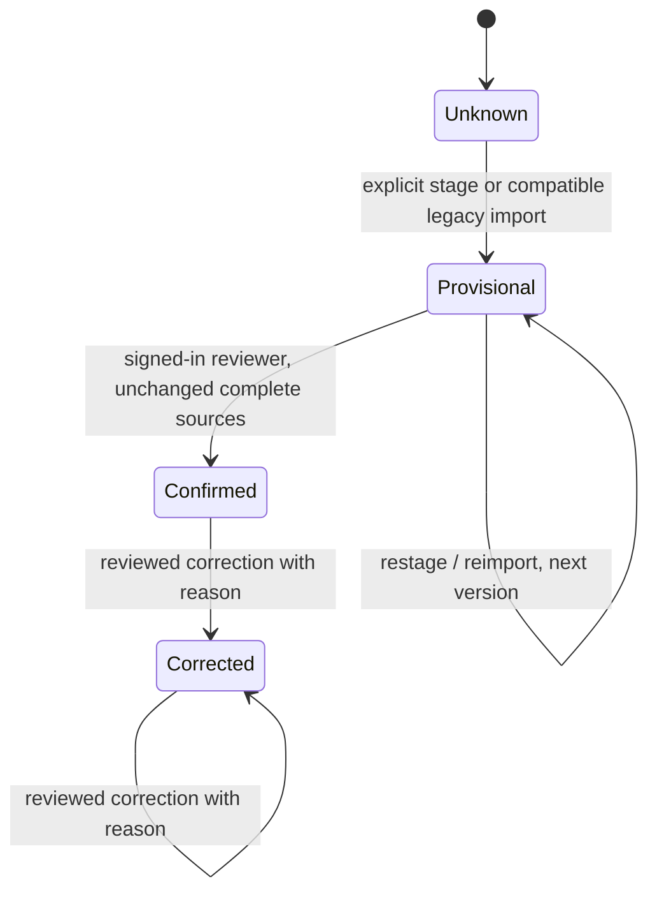

# Website handoff 0.10 — reviewed results

Date: 2026-09-29. D4 follows [verified Steam identity 0.9](../v0.9/README.md)
and [collection 0.5](../v0.5/README.md), in the same
[PR #158](https://github.com/Ninjonik/logi/pull/158). This is implemented source
with offline acceptance evidence, not a deployed integration.

For the whole PR, start with the [delivery handbook](pr-handbook.md),
[web/API catalog](web-capabilities.md), [Discord commands](discord-reference.md)
and [committed verification proof](verification-evidence.md). This page specifies
the reviewed-result contract in detail.

Logi owns collection and the review record. The website keeps its own backend,
sessions, publication decisions and consent. Existing 0.4 `match-summaries` remain
unchanged. The new `result-summaries` resource carries explicit review state.

## Lifecycle and persistence



Every saved revision is a new `eventResultRevisions` row containing the event,
guild, game, version, participant scores, provenance and private player attribution.
`expectedRevision` is a compare-and-set precondition (0 when absent). Appending
the revision and updating the event's minimized head happen in one Convex
transaction; concurrent or stale commands conflict rather than overwrite.

Confirmation records the authenticated reviewer and timestamp. Correction records
its reason and superseded version; earlier rows remain intact. The management UI
shows the latest 20 revisions; this is a read bound, not deletion of old revisions.
No automatic promotion, bulk identity verification, nickname match, destructive
history edit or result-retraction command is included.

An HLL source link is explicit and binds a stored session ID, provider, external
ID, digest, map, time range and completeness to the event's guild/game. Confirmation
re-reads those sources: changed digest or incomplete session requires restaging.
A later provider update cannot change an already confirmed snapshot. Up to four
sessions may be combined with explicit manual scores; Logi does not guess series
aggregation. The current picker selects one source or keeps existing links and
offers the 50 most recently fetched HLL sessions. The API accepts older known IDs.

Participants are 2–16 distinct IDs with display labels and finite numeric or null
scores. `0` is a known score; `null` is unknown. A reviewer may explicitly confirm
an unknown score; confirmation means reviewed, not complete knowledge or game
ownership. Wardogs supports manual N-faction results. Its current adapter has no
verified historical-session capability; this delivery does not invent one.

## Verified player attribution

The private revision deduplicates at most 300 source players. Only an active I5
Steam proof whose stored user record still has the same explicit Discord identity
can supply a Logi user ID. Claimed profile IDs, numeric import IDs, names, revoked
or ambiguous links remain unresolved. Attribution is refreshed at confirmation
and correction; unlinking between stage and confirm therefore removes attribution.

Existing reviewed snapshots describe the evidence at review time and are not
rewritten on later unlink. New reviews use current proof. Public results expose
only verified/unresolved counts, never a Steam ID, Logi player ID or Discord ID.
This is identity evidence, not proof of a game license, team membership or attendance.

## Session-only management

`GET|POST /api/servers/{serverId}/events/{eventId}/results?game={gameId}`

Requires the signed-in Logi account, an explicit single game, a match in the same
workspace and the existing dashboard data-administrator policy. The route derives
guild, event, game and actor from its trusted context and rechecks access; the
Convex handler checks them again. POST also requires the canonical same-origin
`Origin` (`SITE_URL`). Every response is `Cache-Control: no-store`.

This uses Logi's existing data-management administrator policy, including its
stored administrator IDs and access overrides. It is **not** I3's fresh Discord
authority protocol for role grants. It changes reviewed data, not Discord roles.
External website actor delegation is not implemented. Body-supplied actor IDs,
admin booleans and unknown fields are rejected. Clan bearer keys cannot perform
this lifecycle, including legacy full-access keys. This is the deliberate API
parity exclusion: a consumer key cannot impersonate a human reviewer.

Examples (synthetic IDs; send with the account session):

```json
{"action":"stage","expectedRevision":0,"sessionLinks":["stored-session-id"]}
```

```json
{"action":"confirm","expectedRevision":1}
```

```json
{"action":"correct","expectedRevision":2,"sessionLinks":[],"participants":[{"id":"a","label":"Faction A","score":0},{"id":"b","label":"Faction B","score":null},{"id":"c","label":"Faction C","score":7}],"reason":"Reviewed score correction"}
```

Confirmation cannot also edit participants, source links or reason. Review the
displayed saved version first. GET returns `current`, `history`, source candidates
and `hasLegacyImport`. A successful POST returns the revision. Invalid game/body
is 400, failed session/scope/origin is 403, revision conflict is 409. Other source,
validation or backend failures return a generic 503 with no internal detail;
refresh and check access/source changes before retrying. Failed requests do not
represent saved approval. The UI disables confirmation while edits are unsaved.

## Website read contract — OpenAPI 1.6.0

| Route | Meaning |
| --- | --- |
| `GET /api/v1/clan/result-summaries?game=hell_let_loose` | Paginated match-event summaries; standard limit/cursor/updatedSince filters |
| `GET /api/v1/clan/result-summaries/{eventId}` | Event identity, not imported match identity |
| `GET /api/v1/clan/sync-records/result-summaries/{eventId}?game=hell_let_loose` | Atomic projection and decimal synchronization revision |
| `GET /api/v1/clan/changes?game=hell_let_loose&resources=result-summaries&start=now` | Existing signed-cursor change contract; see 0.6 for exact paging |

Restricted keys need their own `result-summaries` grant plus allowed games;
`match-summaries` does not imply it. The key form keeps its earlier two default
summary grants; an administrator selects reviewed results explicitly. Existing
unrestricted keys retain legacy read behavior, but still gain no review command.
Collection requests require explicit game selection for restricted keys; detail
reads enforce the stored record's tenant/game. Responses are non-cacheable.

The closed DTO has `id`, `eventId`, `guildId`, `gameId`, `title`, `updatedAt`,
`resultState` and nullable `result`. A result contains version/status, participants,
minimal source provenance, review timestamp, superseded version and attribution
counts. It excludes source addresses, credentials, hashes, raw telemetry, player
identities, reviewer identities and free-text correction reasons. Private history
is available only through the management route.
Generic `events` responses and their mutation/webhook payloads omit the stored
review head entirely, so an event grant cannot bypass the independent result
grant or expose a previous game's frozen head. The OpenAPI event schema makes
the same exclusion.

Revision appends use the existing transactional W2 event projection. Changes,
refetch and deletion tombstones now include `result-summaries`. A source refresh
alone does not alter frozen reviewed scores. Use resource-qualified keys in the
website's store; result revision numbers and W2 decimal revisions are different
counters. Bootstrap/recovery, retention resets and webhook invalidations follow
[handoff 0.6](../v0.6/README.md); subscriptions do not change automatically.

## Consumer fixtures and mapping

All fixtures are synthetic `{ "data": ... }` detail responses, checked against
the closed production schema by `result-summaries.test.ts`.

| Fixture | Required consumer behavior |
| --- | --- |
| [Unknown](fixtures/unknown.json) | Show no reviewed result, never `0:0` |
| [Provisional](fixtures/provisional.json) | Clearly label unconfirmed; preserve 0 versus null |
| [Confirmed](fixtures/confirmed.json) | Display reviewed version without inferring publication permission |
| [Corrected](fixtures/corrected.json) | Replace the current projection and retain superseded-version reference |
| [Wardogs factions](fixtures/wardogs-factions.json) | Render three participants, not a forced two-team score |

Do not derive a winner from incomplete scores or coerce absent scores to zero.
Treat participant IDs as opaque per-result identities, not user IDs. Publication,
CMS approval, website access and consent remain consumer decisions.

## Compatibility, activation and rollback

- Existing imported match records, score calculations, recap flows and linked
  competition-fixture finalization retain their legacy semantics. Only the new
  review contract has the explicit approval lifecycle; a legacy competition
  `final` flag is not D4 confirmation.
- Future compatible `events.setResult` imports also append a provisional review.
  Missing participant labels remain valid under the old import contract but do
  not manufacture a new approvable review. Old imports are not bulk migrated;
  choose **Load latest import** or enter an explicit result to stage them.
- Reimport cannot overwrite confirmed/corrected history or its new public head.
  The old imported match data can still change independently.
- Add the new table/index and optional event fields with compatible Convex
  functions. Regenerate deployment types through normal tooling. Coordinate
  dashboard and API versions; enable consumer grants only after target acceptance.
- A reviewed event that changes game fails management reads/writes closed; the
  public projection hides the old game's review. Restore the original scope or
  use another event. Do not transfer audited results silently.
- Rollback means stop new review writes and website consumption, retain audit
  rows/fields, and restore compatible versions together. Do not delete history or
  repurpose the 0.4 DTO to emulate confirmation. Existing grants should be handled
  explicitly in the target's authorized rollback procedure.

Target acceptance still needs deployed Convex concurrency/limits, a real Steam
callback with registered origin, real CRCON/WDG capability checks and website
end-to-end consumption. No deployment or live provider action was performed.

## Evidence

- [Validation and commands](validation.md)
- [Actual UI screenshots and reproduction](ui-validation.md)
- [Cumulative review guide](review-guide.md)
- [Decisions, costs and remaining work](delivery-decisions.md)
