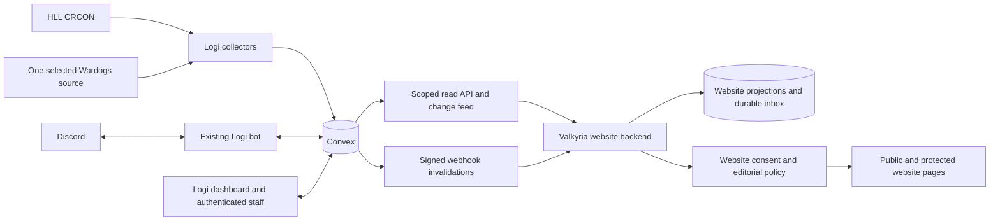
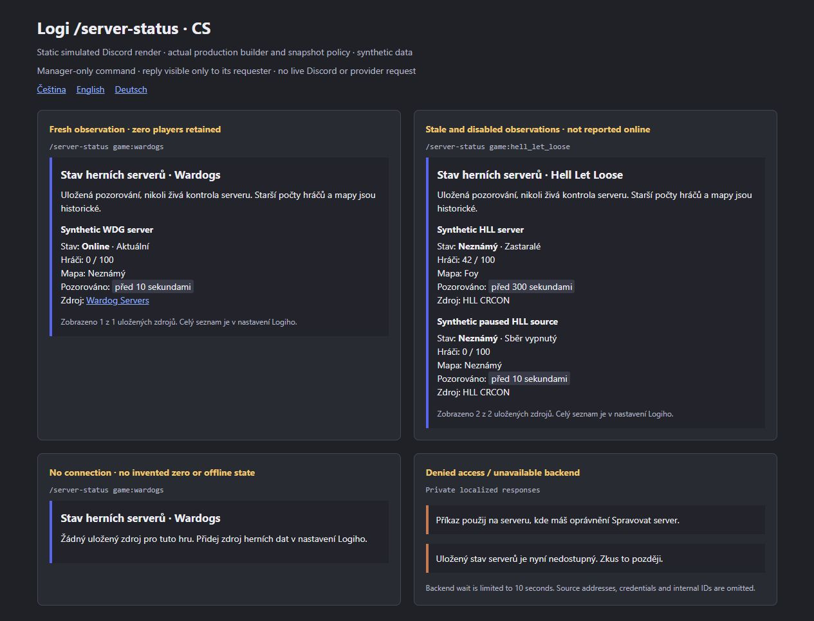
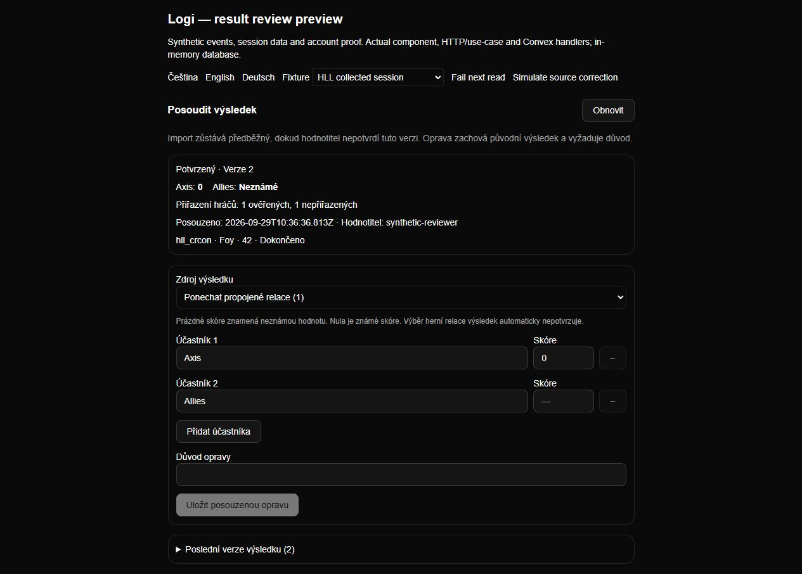

# PR #158 delivery handbook

Logi supplies operational data for Valkyria's Hell Let Loose and Wardogs website.
The website keeps its own backend, sessions, access decisions, CMS, translations,
public-member consent and publication. This PR extends the existing Next.js,
Convex and Discord bot; it does not add another bot or replace Convex.

**Delivery state:** producer features are implemented and verified locally.
Website adoption, target configuration and live acceptance remain open. The PR is
not a deployment or approval to activate optional Logi SSO.

## Read the package

| Question | Entry point |
| --- | --- |
| What can our web backend consume, and what must it implement? | [Web capabilities and API map](web-capabilities.md) |
| What does Discord do, who can use it, and what are the commands? | [Discord reference](discord-reference.md) |
| Which tests actually ran, with what results? | [Verification and stored proof](verification-evidence.md) |
| What ran against a real local database and test Discord guild? | [Local runtime acceptance and remaining gaps](local-runtime-acceptance.md) |
| What did the cumulative review fix, and where is the newest proof? | [Runtime review, current tests and actual browser screenshots](runtime-review.md) |
| Do the supplied real CRCON/Warcon keys work, and what can we consume? | [Live provider read probe and Warcon API map](live-provider-probe.md) |
| Where are the architecture boundaries and review findings? | [Cumulative review guide](review-guide.md), [review record](review.md) |
| How is the feature configured, deployed and recovered? | [Activation sequence below](#activation-and-recovery), versioned contracts below |
| What is still missing, and who owns it? | [Remaining work below](#remaining-work-and-owners) |

Historical milestone documents describe their own checkpoint. This handbook and
the PR body are the current overview; an earlier test count or “missing” row does
not override a later delivered milestone. The exact tested runtime source and
fresh check results are pinned in the [latest evidence manifest](evidence/2026-09-30-review/manifest.json).

The [October 2 live provider probe](live-provider-probe.md) adds actual HLL
transport/parser compatibility and Warcon API read evidence. Warcon panel
ingestion, continuous production collection and the consuming website remain open.

## System and ownership

The browser never receives a service key, Discord bot token, provider credential
or internal Convex secret. Logi events, signups, rosters and operational membership
have one writable owner. An API key identifies a service, not a human reviewer or
role administrator. Reading data does not grant permission to publish it.

## Delivered capability map

| Area | Reused or delivered | Important limit / detailed contract |
| --- | --- | --- |
| Events, training, signups, rosters, attendance | Existing Logi workflows reused; scoped website summaries added | [0.4](../v0.4/README.md); website does not become a second operational writer |
| Read authority | Revocable resource/game grants and dashboard key provisioning | Default two summary grants; further resources require selection |
| HLL collection | CRCON status, bounded session discovery, checkpointed private scoreboards | [0.5](../v0.5/README.md); no automatic event/player link from telemetry |
| Wardogs collection | Capability-aware status or explicitly chosen public directory | One configured server/source initially; no history/player-list/control capability claimed |
| Website synchronization | Durable revisions, scope-bound cursors, atomic refetch, tombstones and retries | [0.6](../v0.6/README.md); website inbox/checkpoints still need implementation |
| Discord membership | Exact Discord-subject observation, freshness and role allowlist | [0.7](../v0.7/README.md); no enumeration or automatic website admin grant |
| Managed membership roles | Actor-backed queue, per-member leases, hierarchy checks, recovery and audit | [0.8](../v0.8/README.md); configured roles only, no general moderation API |
| Steam identity | Session-bound Steam OpenID proof, unlink and invalidation | [0.9](../v0.9/README.md); claimed IDs and `/link` are not verified proof |
| Reviewed results | Provisional/confirmed/corrected immutable revisions with minimized projections | [0.10](README.md); review and website publication are separate decisions |
| Signup presentation | Stable CS/EN/DE ordering and corrected compact layout | [Reliability proof](reliability-follow-up.md) |
| Personal recap delivery | Explicit Discord recipient, correct unsubscribe and fresh consent check | [Recap handoff](recap-delivery-follow-up.md); not exactly-once delivery |
| Discord game status | New private `/server-status` manager command for both games | [Command handoff](server-status-command.md); stored data, no on-demand RCON write |

The [web catalog](web-capabilities.md) distinguishes minimized projections from
legacy operational resources. The [Discord catalog](discord-reference.md) lists
all six registered slash commands, plus button, modal and automatic workflows.

## Proof available in this PR

Latest cumulative review: **564 tests passed, zero failed/skipped; typecheck and
production build passed** against isolated local Convex. Changed-file ESLint has
**0 errors and 17 warnings** across 192 TS/TSX files. `npm run lint` now invokes
ESLint correctly; repository-wide lint still has 140 errors and 142 warnings.
The deterministic gateway crash, stale role evidence and imported-identity feed
defects are fixed. Clean npm/Bun installations, actual Discord membership and
message delivery, manually confirmed `/server-status`, and persistent browser
actions have fresh proof in the [runtime review](runtime-review.md).

The [verification page](verification-evidence.md) links committed output, commands,
file hashes, source revision, test-to-feature mapping and every screenshot family.
Previous independent review findings and fixes remain in [review](review.md);
this documentation pass is an implementer verification, not another independent
review or maintainer approval.

Representative existing captures follow. They use real components/builders with
synthetic fixtures; none proves a delivered Discord message or deployed provider.

## Activation and recovery

This is a later operator runbook, not a record of deployment:

1. Record the target version and back up configuration/data. Confirm the intended
   Discord guild, explicit games, provider identity, role ownership and data
   retention. Keep optional SSO disabled pending its separate qualification.
2. Configure the operator-owned source catalog and secret references in Logi.
   Choose one Wardogs source; do not silently switch providers. Validate CRCON
   endpoints and advertised Wardogs capabilities on the actual server build.
3. Deploy compatible Convex schema/functions and run target-aware codegen.
   New fields/tables do not verify historical identities, confirm results or
   expand existing key grants. Offline type generation is not this step.
4. Coordinate dashboard and bot versions. Stop older immediate role writers and
   the old recap sender before activating their replacements. Recaps require
   delivery protocol 2; unbound legacy queue rows remain withheld.
5. Start the compatible bot, verify privileged member intent, channel permissions
   and role hierarchy. Slash-command registration runs at `ClientReady` for cached
   guilds; restart the bot after a new guild installation when registration is
   needed. There is no separate join-time registration call in this revision.
6. Create restricted website keys with explicit games/resources. Enable a separate
   membership role policy if needed. Configure signed webhook subscriptions
   explicitly; neither grants nor subscriptions expand automatically.
7. Have the website owner implement and prove bootstrap, durable inbox, refetch,
   cursor resets, departures, consent withdrawal and public-cache invalidation.
   The initial website data integration stays read-only.
8. Run target acceptance: real source freshness, disposable role grant/revoke,
   departure/rejoin, key revocation, provider failure/retry, callback identity,
   concurrent Convex mutations, sustained work and crash/restart recovery.

On failed acceptance, disable the affected integration/worker and keep its stored
data, revisions and audit. Preserve website editorial/consent records while
rebuilding projections. Do not restore an unsafe older sender or immediate role
writer as an automatic rollback. Partial Discord role changes require an
authorized operator inspection; Discord and Convex are not one transaction.
Exact compatibility notes live with each versioned contract.

## Remaining work and owners

| Work | Owner | Current acceptance |
| --- | --- | --- |
| W1/W3/W4: Logi adapter, projections, durable inbox/recovery, consent/publication adoption | Website backend | Not implemented by this Logi PR |
| I2: website sessions and fresh game-scoped access decisions | Website identity/backend | Consumer implementation and acceptance remain open |
| I4: optional Logi OIDC provider | Private provider coordination, then website owner | Not qualified for activation; sensitive findings/tests/remediation remain private |
| Source credentials/origins, real CRCON/WDG behavior, Steam callback, Discord permissions | Operators | Deferred; synthetic tests do not establish live compatibility |
| Real Convex contention, scheduling/load, migration and rollback | Operators and maintainers | Unrun on a target deployment |
| Moderation, arbitrary role grants, game-server control, automatic public game-status panels | Later product work | Not delivered; needs explicit actor authority and audit design |
| Formal result retraction and longer/exportable audit browsing | Later result workflow | Not delivered by confirmation/correction |

Logi producer tasks D1–D4, W2, I1/I3/I5 have local implementations. A read-only
website refresh at `d61c38fcd217c36f6a06ca6d273bb4de371afc71` found PR #37 merged
and its Logi adapter module still a reserved README; this is a dated observation,
not a claim that the entire website is missing. No website checkout is edited here.

All non-sensitive source, contracts, fixtures, screenshots, review and verification
outputs are kept in this single PR. Private security details and real credentials
are deliberately outside the public delivery; only their acceptance status belongs
here. The latest pass sent an authorized test event to the isolated Discord
channel and verified a user-triggered private status reply. No production game
server action, hosted-auth probe, merge or production deployment occurred.
