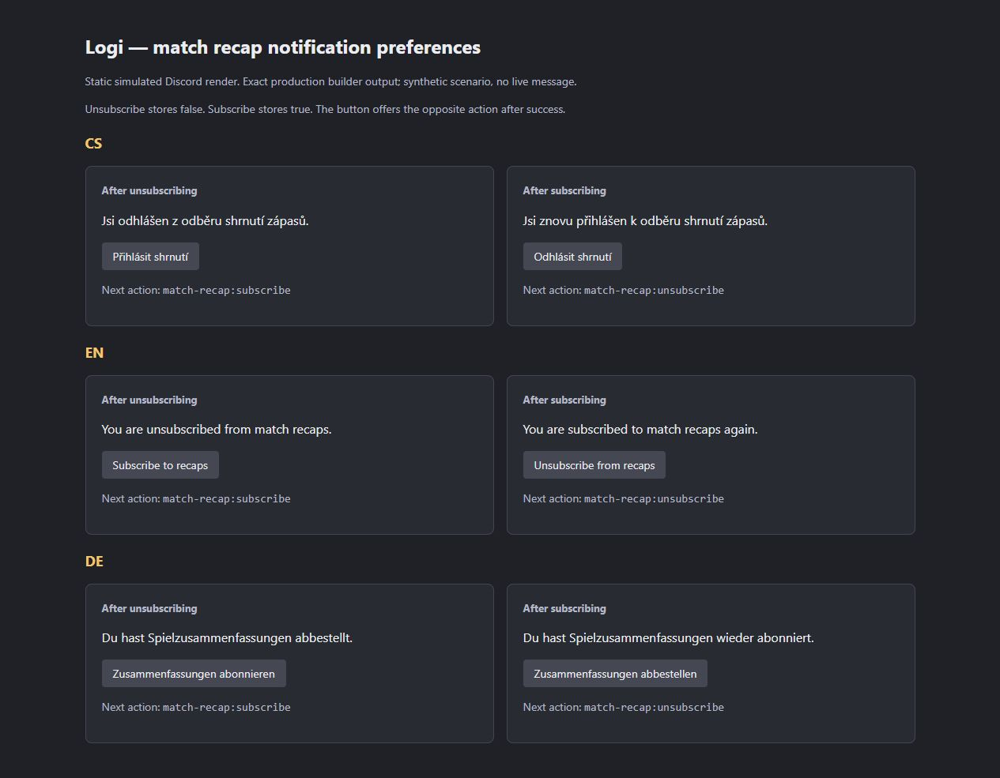

# Match recap delivery: account binding and opt-out

Date: 2026-09-29. Continues [PR #158](https://github.com/Ninjonik/logi/pull/158)
from `ecdb1e89ad592e970897f9ff39fe09e30629e179`. The PR description pins the
tested delivery commit. This is a correction to legacy personal match recaps;
it does not change D4 reviewed results or activate a provider.

## Reproduced defects and resulting behavior

| Trigger | Before | After |
| --- | --- | --- |
| Click `match-recap:unsubscribe` | `endsWith("subscribe")` also matched unsubscribe and stored `true` | Exact control IDs store `false` or `true`; unknown controls cannot mutate |
| A roster/stat row uses an imported player ID | The bot passed that data ID to Discord as the recipient | The queue captures the user record and explicit Discord subject separately |
| An imported numeric ID resembles a Discord ID | An unlinked player could be treated as a Discord recipient | An explicit, valid Discord link is required; numeric appearance is insufficient |
| Opt out while a recap is queued under a Discord alias | Stable-ID-only filtering could miss the preference | Enqueue, listing and fresh delivery preparation read the bound account preference |
| A Discord subject collides with another player's imported ID | The preference mutation could update that unrelated record | Preference writes resolve only the authenticated subject's `discordId` index |
| The account changes during Discord user lookup | The earlier list remained the authority to send | The bot rechecks the current binding and preference after lookup, before sending |

Successful preference responses and their opposite-action button use the clicking
user's Discord locale (CS/EN/DE, English fallback). The original recap continues
to use the workspace's configured language. Preferences remain global and enabled
by default when unset.

## Implementation and authority

- `convex/matchRecaps.ts` captures `userRecordId` and `discordUserId`, while
  retaining `userId` as the data/route identifier. Listing and `prepareDelivery`
  require a pending row, the same existing user record, its same explicit Discord
  link, the current data-identifier mapping, an enabled preference, the event and
  its player statistics. A missing or changed binding withholds the message.
- `discord-bot/src/sync/match-recaps.ts` fetches the explicit Discord account,
  obtains fresh preparation, checks the returned binding and sends. Data IDs are
  URL-encoded in statistics links and image routes. Failed sends do not mark a
  row sent; successful sends mark the exact recap ID and captured recipient.
- `discord-bot/src/interactions/match-recap-preference.ts` is the focused Discord
  adapter; the root interaction handler delegates to it. The existing dashboard
  action supplies `session.sub`, and the Discord handler supplies
  `interaction.user.id`. `players:setMatchRecapNotifications` retains its existing
  argument name but resolves that value exclusively as a Discord subject.
- All persistence functions retain their internal-secret check. No public read
  DTO, API key grant, role operation, verified identity or result confirmation
  lifecycle is added or broadened.

**Deliberate `/api/v1` exclusion:** a consumer key cannot change another person's
notification consent or initiate a DM. Preferences remain the signed-in account's
own dashboard action or its own Discord interaction. Preparation/sent markers
are internal bot operations, with no dashboard-equivalent command for consumers.
The existing read-only result resources remain unchanged. OpenAPI regeneration
produced no diff.

## Compatibility, rollout and rollback

The schema adds two **optional** fields to `matchRecaps`; old records remain
readable. There is no automatic backfill, inferred Discord link, consent repair
or resend. A legacy unbound pending row is withheld even if its player currently
has a Discord account. Existing event/user uniqueness also prevents publication
from silently replacing that row with a newly bound one.

The internal listing requires `deliveryVersion: 2` to return work. An older bot
calling the new backend receives an empty list. A new bot against the old backend
fails argument validation. Neither combination is an accepted deployment.

For an authorized target rollout:

1. Stop the old bot and let its in-flight work end before switching versions.
   A backend change cannot recall a list or Discord request already in memory.
2. Deploy the compatible optional schema and functions, run normal target-aware
   Convex codegen, and deploy the matching bot from the same delivery.
3. Verify a new bound queue entry, the intended recipient, a real opt-out and a
   blocked pending delivery using an explicitly authorized test account/event.
4. Inspect legacy pending rows separately. This change includes no migration or
   operator resend command; do not guess ownership or rewrite consent from old
   button clicks.

If acceptance fails, stop recap delivery and preserve the version gate and stored
bindings. Rolling back to the former sender would restore the reproduced defects.
Do not bulk delete sent/pending history. No rollout, migration, live DM or provider
acceptance was performed for this delivery.

## Verification and implementer review

Use the synthetic variables in [validation](validation.md#reproduce), then:

```powershell
node --import tsx --test src/infrastructure/convex/match-recaps.test.ts discord-bot/src/interactions/match-recap-preference.test.ts discord-bot/src/sync/match-recaps.test.ts
npm run test
npm run typecheck
npm run generate:openapi
node scripts/generate-convex-api-offline.mjs
npm run build
```

- Observed RED: persistence tests reproduced unbound delivery, wrong-account
  preference writes and missed alias opt-out. Real bot/interaction tests also
  reproduced unsubscribe storing `true`, wrong recipient and stale preparation.
  An initial mock setup failure was corrected before counting behavioral evidence.
- GREEN: **21/21** focused tests (12 persistence, three actual interaction handler,
  six bot/copy tests). The full suite passes **536/536**, zero failures/skips.
  Typecheck passes. Test providers are in-memory/mocked; no live account is used.
- Prettier completed for all changed source files. Direct ESLint of this slice
  reports **zero errors / three existing warnings**, the unused helpers in
  `discord-bot/src/interactions.ts`. Cumulative changed TypeScript remains at
  **three existing errors / 17 warnings**; the errors are the unchanged explicit
  `any` uses in `convex/competitions.ts:52,54,58`. Unsupported `next lint` remains.
- Production compilation and TypeScript pass. The full build fails at
  `/en/competitions` prerender with `ECONNREFUSED 127.0.0.1:32199`, the deliberately
  absent synthetic Convex endpoint. This is not a successful full production build.
- Both generators completed with no generated diff. Offline Convex generation
  refreshes only the type inventory and does not replace deployment-aware codegen.
- Implementer review traced both authenticated preference callers, identity
  resolution, enqueue/list/prepare/mark boundaries, mixed-version behavior,
  localization and error paths. No additional blocking defect was found in this
  slice. This is **not an independent review** or renewed approval of the whole PR;
  earlier independent findings remain in [review](review.md).

Known limits: preparation and Discord delivery are separate network operations.
An opt-out cannot atomically cancel an already in-flight send. Concurrent workers
or a crash after send but before marking can still cause a duplicate; no delivery
lease, exactly-once guarantee or durable retry scheduler was added. Current-state
checks can allow a pending bound row again after the same link/preference is
restored. They are not a permanent revocation epoch. Queue creation still scans
stored player statistics; delivery uses the existing user index. Hosted
contention, limits, throughput and recovery remain unverified.

## Presentation proof

With the same synthetic environment, run:

```powershell
node --import tsx scripts/preview-match-recap-preference.mjs
```

Open `http://127.0.0.1:4326/`. The server binds only to loopback; stop with Ctrl+C
or POST `/__fixture/stop`. The capture was inspected in the browser. It uses the
actual production preference builder for CS/EN/DE, with a **static simulated
Discord layout**. The controls in the preview are noninteractive; handler tests
above prove the mutations and reversal. This is not a live Discord screenshot
and does not prove message delivery.


