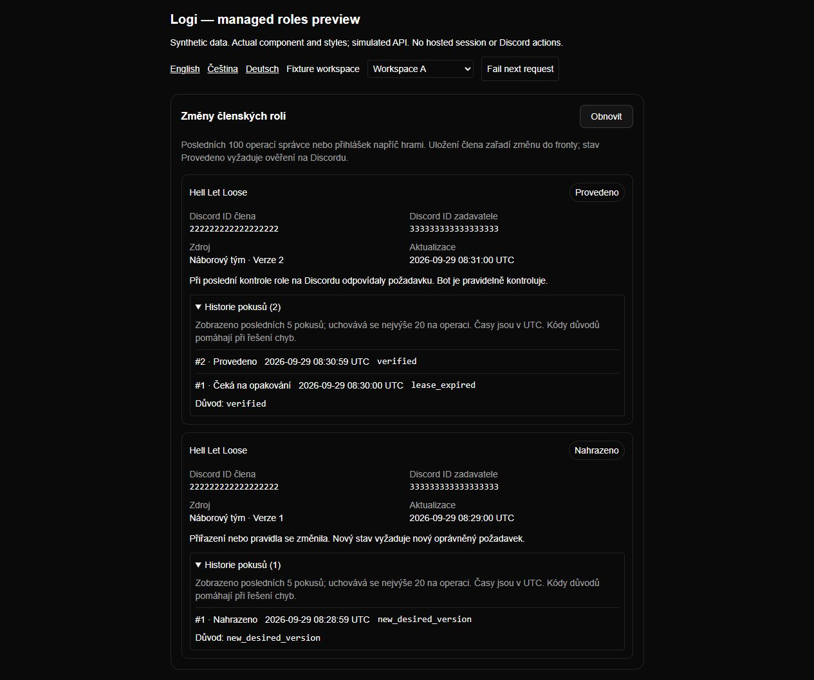
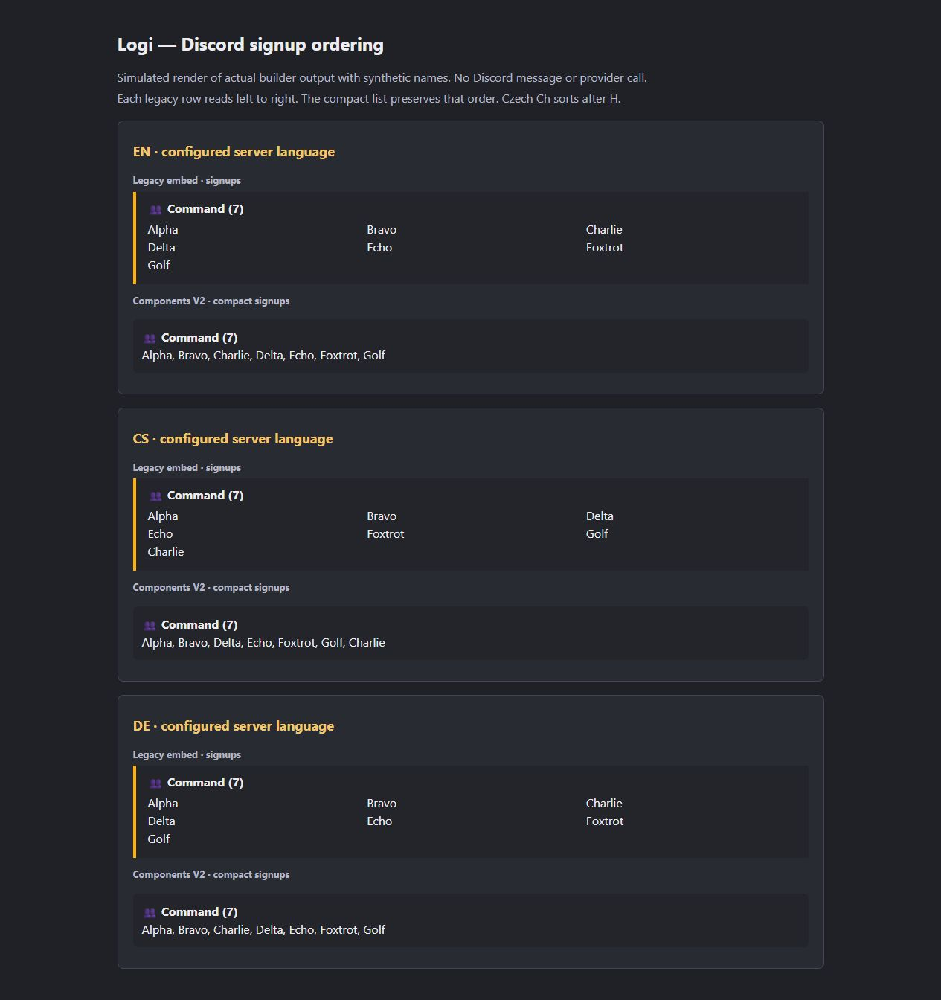

# Reliability follow-up: role history and Discord signup order

Date: 2026-09-29. Continues [PR #158](https://github.com/Ninjonik/logi/pull/158)
from `a0ec5c80cb8cd6a01060ad1846dca251a909a3f8`; the PR description pins the exact
tested delivery commit. This fixes the previously deferred I3 Minor and the
signup-order failure under the original request's embed scope.

## Role attempt history

Previously, replacing a request or reclaiming its expired worker could leave the
old audit row as `running / claimed`. The operation status was correct, but the
history misleadingly suggested a worker was still active.

The matching operation/fence audit now closes in the same Convex mutation:

| Transition | Interrupted attempt outcome / reason |
| --- | --- |
| A newer desired version replaces the request | `superseded / new_desired_version` |
| An expired worker is reclaimed | `retry_scheduled / lease_expired` |
| Six consecutive failed/crashed attempts exhaust recovery | `failed / attempt_limit` |
| An incomplete legacy request is rejected | `denied / target_not_linked` |

Only a `running` audit can change. Earlier verified attempts remain `applied`
even if their operation is later superseded. Supersession does **not** release
the old worker's live Discord lock; a newer request waits for expiry. Old workers
remain unable to finish or overwrite audit state. An expired lease means the
provider outcome is unknown, not that Discord rejected the change.

`at` is still the attempt's start time. A historical retry label describes the
decision at recovery; the operation header is its current state. Closure occurs
when a transition is processed, not through a new timer while the bot is offline.
Existing schema, retention (20 stored / five displayed) and tenant/session-only
DTO remain unchanged. No migration or historical-row backfill runs: already
orphaned pre-fix rows can retain old labels. No bearer role-command/audit endpoint
is introduced; the existing [API exclusion](../v0.8/README.md) still applies.

## Signup order

The builder called `localeCompare` without a locale. The observed host locale
was `cs-CZ`, so **Charlie** followed **Golf**; an existing test used a Czech
configuration but expected English ordering. Tests now explicitly distinguish
EN/CS/DE, and production sorting uses `config.defaultLanguage`.

The legacy three-column layout fills rows left to right. Components V2 previously
flattened those columns top to bottom, losing the ordering. It now reconstructs
the rows. Empty groups and padding keep their existing behavior. No new
configuration, dependency, API resource or stored event field is needed.

## Verification and review

Use the synthetic variables in [validation](validation.md#reproduce), then:

```powershell
node --import tsx --test src/infrastructure/convex/member-role-operations.test.ts src/lib/api/member-role-operations-route.test.ts discord-bot/src/message-builders.test.ts
npm run test
npm run typecheck
npx --no-install eslint convex/memberRoleOperations.ts src/infrastructure/convex/member-role-operations.test.ts src/lib/api/member-role-operations-route.test.ts discord-bot/src/message-builders.ts discord-bot/src/message-builders.test.ts scripts/preview-managed-roles.mjs scripts/preview-discord-signups.mjs
npm run build
```

- Observed RED: four role-history regressions returned `running` instead of the
  expected closed outcomes. The completed-history preservation check already
  passed. GREEN: all 24 persistence tests pass, including stale completion,
  unchanged live lock, six crashed workers, audit bounds and tenant isolation.
- Observed RED: EN/DE columns followed the host's Czech locale; compact output
  read columns instead of rows. GREEN: all 18 message-builder tests pass with
  exact EN/CS/DE order, legacy padding and roster-image behavior.
- Full suite: **517 tests, 517 pass, zero failures/skips**. Typecheck passes.
- Changed-source ESLint: **zero errors / one existing warning**, the unused
  `formatCalendarTime` helper. Cumulative changed TypeScript: **three existing
  explicit-any errors** in `convex/competitions.ts:52,54,58` and **17 warnings**.
  The previously unchanged message-builder file adds its existing warning to
  this cumulative inventory. The repository's unsupported `next lint` script is
  unchanged.
- Production compilation and TypeScript pass. Full build fails during
  `/en/competitions` prerender with `ECONNREFUSED 127.0.0.1:32199`; no synthetic
  Convex server is running there. This is not a successful production build.
- Implementer diff review checked indexed operation/fence lookup, transaction
  ordering, retained locks/completed history, unchanged authority/schema/API
  boundaries, and the actual V2 builder call path. No additional issue was found
  in this follow-up. This is **not** a new independent review of the entire PR;
  previous independent review and dispositions remain [recorded separately](review.md).

No schema/codegen change is needed. Coordinate the normal Convex/bot rollout;
rollback can retain the more accurate audit values because they use existing
states and the existing reason-code schema. Live providers, Discord effects,
real Convex concurrency and website consumer acceptance remain unverified.

## Reproduce the presentation proof

In separate terminals using the same synthetic environment:

```powershell
node --import tsx scripts/preview-managed-roles.mjs --recovery
node --import tsx scripts/preview-discord-signups.mjs
```

Open `http://127.0.0.1:4321/?locale=cs`, expand both attempt histories, and open
`http://127.0.0.1:4325/`. Both servers bind only to loopback. Stop with Ctrl+C or
POST to their `/__fixture/stop` endpoint. The captures below were inspected in the
browser; no live message, account, provider or hosted session was used.

**Actual role-history component and styles, simulated API:** the prior attempt
records `lease_expired`, followed by verified success; the replaced request's
attempt explicitly shows Superseded. Numeric identities are synthetic fixtures.



**Simulated Discord layout using actual message-builder output:** legacy rows
and compact lists agree for all three configured languages. This screenshot is
not the Discord client and does not prove a delivered message.


