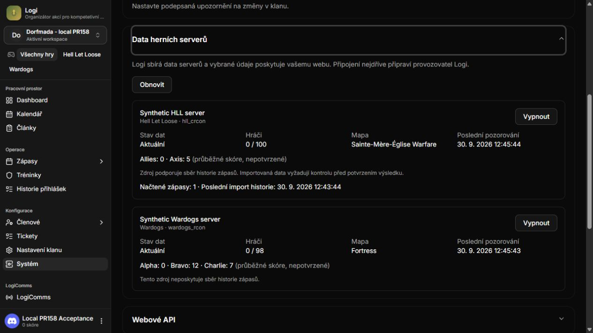
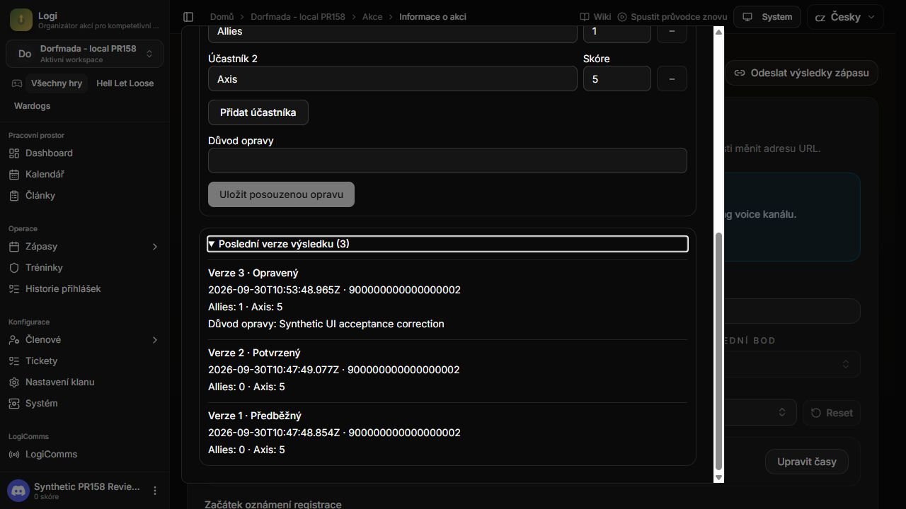

# Cumulative review and runtime acceptance — 2026-09-30

This pass reviews the cumulative PR #158 integration changes, fixes defects found
in that review, and tests the producer against a native local Convex database,
the production Next.js server and the authorized test Discord guild. The website
continues to own its backend, login sessions, authorization and publication.

The [handbook](pr-handbook.md), [web capability catalog](web-capabilities.md) and
[Discord command catalog](discord-reference.md) remain the complete feature map.
This report supersedes the older gateway/lint status in
[the first local acceptance report](local-runtime-acceptance.md).

## Scope and findings

This is an implementer review of the cumulative changed runtime, its contracts,
tests and UI wiring. It covers the existing web/Convex/bot boundaries below.
Independent maintainer approval and hosted security qualification remain separate.

| Area reviewed | Checks and evidence |
| --- | --- |
| API grants and tenant/game scope | HTTP authentication, backend grant checks, resource/detail ownership, revoked keys, strict query parsing, OpenAPI parity and cursor binding |
| HLL / Wardogs collection | Catalog validation, DNS/address pinning, TLS, bounded GET requests, leases/fences, retries, history checkpoints, zero/null semantics and private-data minimization |
| Website synchronization | Transactional invalidations across authoritative writers, deletion/reassignment, retention/reset, empty filtered pages, webhook claims and retries |
| Discord membership | Exact subjects, observation epochs, fenced full sync, targeted refresh, role allowlists, imported identity resolution and managed-role authority |
| Managed role effects | Actor provenance, identity/departure/policy changes, hierarchy, fresh provider evidence, retry fencing, audit and separation from group roles |
| Identity and recaps | Session-bound Steam challenges, replay/relink/unlink behavior, explicit recap recipient and fresh opt-out checks; no hosted SSO probing |
| Results | Collected/manual provenance, immutable revisions, optimistic concurrency, attribution, minimized public projections and reviewer authorization |
| UI and bot adapters | API key scopes, collector controls, membership policy/audit, result review, Steam card, CS/EN/DE dictionaries, six slash commands and event-message wiring |
| Installation and operations | Pinned dependency patch, clean npm/Bun installation, TypeScript, full suite, build, changed-file/repository lint and shutdown cleanup |

### Fixed in this pass

1. **Gateway teardown crash.** The actual installed Discord SDK could detach the
   raw WebSocket error handler during a pending upgrade; a connection reset then
   terminated the bot. A version-pinned patch closes the pending socket, retains
   its error handler until closure and guards re-entrant teardown. Four failing
   interrupted-handshake cases now pass, alongside two ordinary-close controls.
   See [patch maintenance and reproduction](../../../../patches/README.md).
2. **Stale managed-role authorization.** Expired evidence was previously omitted
   from a repeated backend authorization request, allowing an unchecked path.
   The worker now rejects stale, future-dated or non-finite evidence before and
   after authorization. Slow authorization schedules a retry without a role
   write. Both newly failing timing regressions pass after the fix.
3. **Imported identity and membership feed.** Imported stable Logi IDs could hide
   an assignment from the Discord-subject lookup or be emitted as the wrong feed
   subject. Reads now resolve an explicit binding, and assignment/profile writes
   invalidate the old and new Discord subjects. Creation, relinking, unlinking,
   deletion and legacy aliases are covered. A bare imported ID is never proof of
   Discord membership; ambiguous assignment aliases return no assignment.
4. **Query-parser hardening.** Malformed percent encoding no longer throws from
   the integration query parser. The handler regression passes. The native
   Next.js routing boundary still returns plain-text HTTP 500 for malformed
   UTF-8 path bytes before this handler runs; that external HTTP case remains
   a known limitation, rather than a claimed HTTP-400 success.
5. **Verification/install repairs.** `npm run lint` now invokes ESLint instead of
   the removed `next lint` command. The three `any` errors in the changed
   competition helpers have concrete Convex context types. `bun.lock` includes
   the previously missing Steam OpenID dependency and the gateway patch tooling.

The [membership contract update](../v0.7/README.md) explains rebootstrap for
consumers upgrading from earlier PR checkpoints. Old feed entries are not
rewritten. No wire DTO, production deployment or database migration was added.

## Fresh verification

Evidence is under [`evidence/2026-09-30-review/`](evidence/2026-09-30-review/).
The manifest pins source content, check results and SHA-256 hashes. Historical
proof directories are retained unchanged. See the named test output for exact
test cases; no skipped case is counted as a pass.

Live local acceptance ran incrementally during the review; each result retains
its execution time. The final full suite, typecheck and build cover the committed
runtime source. This is not a claim that every live case was rerun after the last
source edit. Later evidence publication changes documentation only.

| Check | Outcome |
| --- | --- |
| Whole unit/application/infrastructure/bot suite | **564 passed, 0 failed, 0 skipped** |
| TypeScript `tsc --noEmit` | Pass |
| Production Next.js build with isolated local Convex | Pass; see final build output |
| Convex functions pushed to native local instance | Pass; production credentials not loaded |
| OpenAPI generation | Pass, generated sources unchanged |
| ESLint over cumulative changed TS/TSX files | **192 files, 0 errors, 17 warnings** |
| Repository-wide ESLint | **140 errors, 142 warnings** across 915 files; remains non-green |
| Clean minimal npm install and npm ci | Pass; postinstall applies the patch; all six gateway cases pass |
| Fresh full-project `bun install --frozen-lockfile` | Pass; 1,038 packages and successful patch application |
| HTTPS collector / result lifecycle acceptance | **13 passing cases** against native Convex and Next.js |
| Actual Discord exact-member read through website API | **3 passing cases**: fresh presence, minimized roles, scope denials |
| Imported identity / change-feed HTTP acceptance | **2 passing cases** plus browser-resume persistence check |
| Browser changes and HTTP readback | Collector disable/resume and result correction/history pass |
| Live Discord bot | Six commands registered, new Components V2 test event delivered without mentions, fresh hierarchy denial recorded with original roles preserved |

The collectors used a loopback HTTPS server with an explicitly scoped local CA
and normal certificate validation. HLL preserved `0:5` and two unlinked player
identities; Wardogs preserved all three factions (`0`, `12`, `7`) and reported
unsupported history as `null`. These are real transport/persistence tests with
synthetic provider data, not live HLL/WDG acceptance.

The membership test called real Discord using only the replacement test bot.
The result UI used a local synthetic reviewer (`900000000000000002`) and signed
test session. Its correction created revision 3, preserved the confirmed zero
score in revision 2, and reached the restricted consumer API as `corrected`.
This session bypasses OAuth login solely in the isolated test harness.

### Failures retained and explained

- The gateway, role-freshness and identity regression logs preserve the expected
  failures observed before fixes. The complete final suite is green.
- A first additional HTTP harness assumed that a membership change appeared on
  the first page. Live collector traffic filled scanned pages with other
  resources. Draining `hasMore`, including empty pages, passed without changing
  the feed implementation.
- An initial Discord harness expected earlier concluded-event messages to remain
  in the test channel. The current bot lifecycle had removed them. A fresh,
  currently scheduled test event was created and its actual delivery verified.
- Malformed path bytes still produce the framework-level 500 described above.
  That limitation is retained in machine-readable acceptance output.
- An early TypeScript run caught an incorrectly typed test context. The test now
  invokes the real typed mutation builder through the existing test harness;
  production types were not weakened.

## Browser screenshots

These are captures of the real production server connected to the isolated
database, not component previews. Visible game data, event records and reviewer
identity are synthetic. No production credentials, full API keys, cookies or
member directory are included.

| Capture | What it demonstrates |
| --- | --- |
| [Collectors](screenshots/runtime-review/collectors-cs.png) | Actual persisted HLL and three-faction Wardogs snapshots, including known zero scores |
| [Disabled](screenshots/runtime-review/collector-disabled-cs.png) / [resumed](screenshots/runtime-review/collector-resumed-cs.png) | Browser controls persisted a collector state change, checked independently over HTTP |
| [Confirmed result](screenshots/runtime-review/result-confirmed-cs.png) | Actual revision 2 with collected provenance and unlinked players |
| [Correction history](screenshots/runtime-review/result-correction-history-cs.png) | Browser-written revision 3 with reason and retained versions 2/1 |
| [API scopes](screenshots/runtime-review/api-scope-form-cs.png) | Real provisioning form, explicit game/resource selection and disabled incomplete submission |

## Remaining acceptance and limits

- **Real role grant/revoke is blocked by hierarchy.** The authorized target's
  highest role is at position 102 and the bot's at 100. The new attempt correctly
  ended `denied / target_not_eligible`; all existing roles remained unchanged.
  An eligible consenting test member or an owner-managed hierarchy change is
  required for positive live grant/revoke acceptance.
- **Configured-source slash interaction passed by human confirmation.** The user
  ran `/server-status game:wardogs` in the test channel and confirmed the private
  response showing `0/98` players and `Alpha 0 / Bravo 12 / Charlie 7`. This adds
  actual Discord interaction acceptance to the earlier unconfigured-source
  response. It still uses local synthetic provider data.
- **Real Discord OAuth and Steam proof are not completed.** No matching test
  OAuth client secret/registered callback or interactive Steam verification was
  supplied. The synthetic dashboard session is not proof of either flow.
- **Live providers and consuming website remain unqualified.** Production HLL
  CRCON/WDG credentials, the Valkyria website adapter/inbox/session/consent flow,
  customer webhook delivery and end-to-end hosted acceptance were not exercised.
- **Remaining operations:** long-duration gateway/host sleep recovery, actual
  worker-thread gateway execution, recap DM delivery, load, backup/restore and
  deployment/rollback need their own authorized acceptance. The specific
  deterministic gateway crash is fixed; this shorter run does not establish a
  long-duration availability guarantee.
- Optional Logi OIDC/SSO remains disabled pending separate private qualification.
  No hosted authentication probing or production mutation was performed.
- Repository-wide lint and the malformed-URL framework response remain open as
  listed above. Changed-file lint passing does not make repository lint green.

## Reproduction and cleanup

Install from this branch with lifecycle scripts enabled. For offline regressions,
use synthetic environment values from [verification instructions](verification-evidence.md#reproduce)
and run `npm test`, `npm run typecheck`, and the gateway test command in
[`patches/README.md`](../../../../patches/README.md). These require no real bot.
The build requires a configured, separate local Convex instance; keep production
environment files out of the process and repository.

For live acceptance, use an explicitly authorized isolated guild/channel and a
separate database. Prepare scoped HLL/WDG read keys, an enabled membership policy,
two fixture provider connections and a concluded synthetic match. Verify the
collector snapshots, stage/confirm/correct the match, refetch through the scoped
API, and test exact-member refresh. Start an exact-subject change cursor before
relinking an imported identity and drain every page afterward. Keep provider
controls, unrelated Discord members and production data outside the test scope.

The runner keeps tokens, the supplied production configuration, local admin keys,
session cookies, raw runtime logs and the SQLite database outside Git. Public
proof contains sanitized outcomes and source/artifact hashes. See cleanup.json
for process shutdown, command-definition restoration and retained test fixtures.
Only command definitions/default permissions can be restored from the available
backup; per-command permission overrides were not captured or verified.
