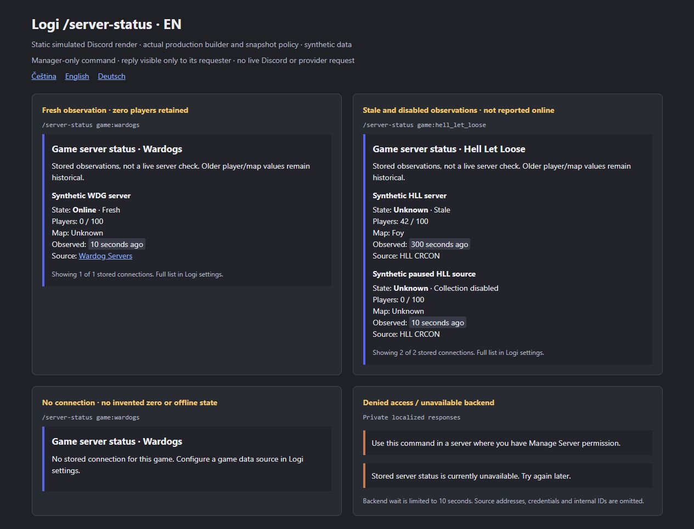
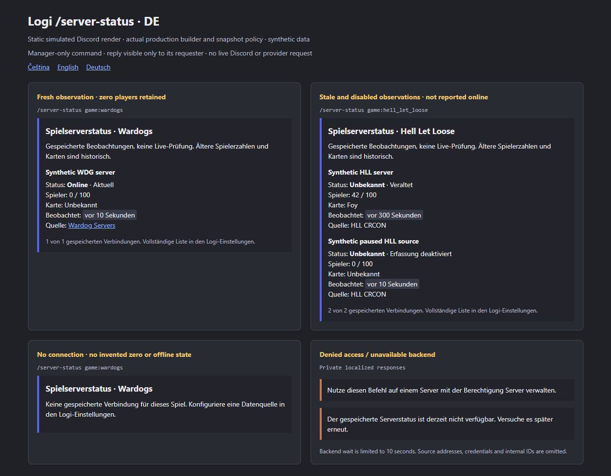

# Discord server-status command

Date: 2026-09-29. Continues [PR #158](https://github.com/Ninjonik/logi/pull/158)
from `6a13a274f66446e85337071b4eab2f5a21b991a6`. The PR description pins the exact
delivery commit. This closes the original request's missing Discord game-server
status view using the existing D1–D3 collector data.

## Behavior

Run `/server-status game:wardogs` or select **Hell Let Loose** for
`game:hell_let_loose`. The command is registered per guild on the existing bot
startup/join path. Its English name stays stable; descriptions and replies
support Czech, English and German, with English fallback.

The caller must have Discord **Manage Server** (`ManageGuild`, including
Administrator) in the invoking guild. The handler checks the permission carried
by the trusted Discord interaction before reading the backend, independently of
command visibility defaults. A Logi-only dashboard role does not grant this
Discord permission. DMs and unknown game values are rejected.

The reply is ephemeral, visible only to its requester. It contains at most five
stored connections for the selected guild/game and reports the displayed/total
count. The full list remains in Logi settings. Names/maps are shortened, control
characters removed, Markdown escaped and mentions disabled.

| Stored data | Display |
| --- | --- |
| Fresh successful observation | Actual online/offline state, observed counts/map and observation time |
| Known zero players | `0`, never replaced by a missing-value placeholder |
| Missing count/map or no observation | `?` / localized unknown, never invented zero/offline |
| Stale, unavailable or disabled observation | Unknown state with freshness/disabled label; any retained counts/map remain historical |
| Public directory source | Explicit Wardog Servers attribution/link |
| No connection for selected game | Configuration guidance |
| Backend failure, invalid response or ten-second wait expiry | Sanitized localized unavailable message |

The query does not poll a game server, restart collection or send a RCON command.
The shared snapshot policy retains its 180-second stale and 15-minute unavailable
thresholds; reading a snapshot does not refresh its observation time. A transient
provider error cannot establish that the server is offline.

## Implementation and API parity

`discord-bot/src/interactions/server-status.ts` owns command metadata, Discord
authorization/acknowledgement and rendering. The root interaction handler only
registers and delegates. The existing `gameData:listConnections` query scopes
the trusted bot read to the invoking Discord guild. The command validates the
closed settings DTO and filters guild/game again before rendering.

The read uses the same `projectSnapshot` semantics as the existing authenticated
[`server-snapshots` resource](../v0.5/README.md#website-api-130). Website consumers
continue using their scoped, revocable key and explicit game filter; no bot token,
internal secret or command permission is delegated to them. This presentation
adds no public resource, API grant, schema field, dependency or migration.
Provider origins, secret references, internal IDs and player lists are omitted
from the reply. No new operational-write endpoint is appropriate for this read.

The ten-second timeout uses the bot's existing timeout helper. It limits the
interaction's wait; it does not cancel the shared Convex client's underlying
request. A late result cannot replace the already returned unavailable response.

## Verification and review

Use the synthetic environment in [validation](validation.md#reproduce):

```powershell
node --import tsx --test discord-bot/src/interactions/server-status.test.ts
npm run test
npm run typecheck
npx --no-install eslint discord-bot/src/interactions/server-status.ts discord-bot/src/interactions/server-status.test.ts discord-bot/src/interactions.ts discord-bot/src/convex.ts src/lib/clan-language.ts scripts/preview-discord-server-status.mjs
npm run build
```

- RED: 13 tests first failed because the actual root command handler did not
  respond/register the new command. Two later tests reproduced an unbounded wait
  and invisible provider labels; both failed before their corrections.
- GREEN: **15/15** targeted tests; **551/551** full suite, zero failures/skips.
  Typecheck passes. The test replaces only external Discord/Convex transport;
  successful reads run the production `gameData:listConnections` handler over
  the isolated database fixture and use the actual snapshot policy and renderer.
- Coverage includes cross-guild/game exclusion, permission/DM denial before any
  query, private acknowledgement before backend work, zero versus unknown,
  stale/disabled/offline states, CS/EN/DE, directory attribution, long/untrusted
  text and Discord embed limits, invalid DTO/network failure and late timeout.
- Changed-source ESLint: **zero errors / three existing warnings** in the root
  interaction module. Cumulative changed TypeScript retains the **three existing
  errors / 17 warnings** documented in [validation](validation.md). The old
  unsupported `next lint` command is unchanged.
- OpenAPI and official-template offline Convex generation completed with no
  generated diff. Target-aware codegen remains part of authorized deployment.
- Production compilation and TypeScript pass; full production build still fails
  at `/en/competitions` prerender because the synthetic Convex endpoint at
  `127.0.0.1:32199` is absent. No successful full build is claimed.
- Implementer review checked permission enforcement independently of Discord's
  visibility configuration, the actual registration/dispatch path, shared
  freshness policy, secret-free rendering, timeout cleanup and payload bounds.
  This is not another independent review of the cumulative PR.

Discord's [command documentation](https://docs.discord.com/developers/interactions/application-commands)
was checked for guild scope, naming/localization and permission defaults; its
[interaction documentation](https://docs.discord.com/developers/interactions/receiving-and-responding)
was checked for private deferred responses. The command follows the repository's
existing guild-registration pattern; no live registration was performed.

## Rollout and remaining work

Deploy only through an explicitly authorized rollout. The target needs the D1–D3
`gameData:listConnections` function and configured/collected data. The matching
bot registers the command through its existing ready/join handler. Before public
acceptance, verify visibility and denial with manager/non-manager test accounts,
private responses, both configured games and a stale/disabled source. None of
those hosted checks has been performed here. Rolling back this bot change has no
database migration; the normal prior registration omits this new command.

This is an on-demand manager view. Automatic public status panels/alerts and
actor-authorized moderation controls remain separate work. It does not complete
website ingestion, optional SSO or real provider acceptance.

Read-only ownership refresh: website [PR #37](https://github.com/ValkyriaWDG/www/pull/37)
is merged. At website main `d61c38fcd217c36f6a06ca6d273bb4de371afc71`, the
[`integrations/logi` module](https://github.com/ValkyriaWDG/www/tree/d61c38fcd217c36f6a06ca6d273bb4de371afc71/apps/web/src/modules/integrations/logi)
still contains only its reserved-boundary README. Website adapter/inbox/recovery
and membership/publication adoption remain website-owned work; this does not mean
the whole website is unimplemented. No website file or deployment was changed.

## Reproduce the visual proof

With the same synthetic variables:

```powershell
node --import tsx scripts/preview-discord-server-status.mjs
```

Open `http://127.0.0.1:4327/?locale=cs`; switch to `en` or `de` using the links.
Stop with Ctrl+C or POST `/__fixture/stop`. The server binds only to loopback.
The captures below use actual production builder/projection output with synthetic
observations in a **static simulated Discord layout**. Relative times are rendered
against the fixed fixture clock. Error cards show the real dictionary strings;
handler tests above exercise the denied/error branches. These are not captures of
a delivered Discord message or live HLL/Wardogs data.





