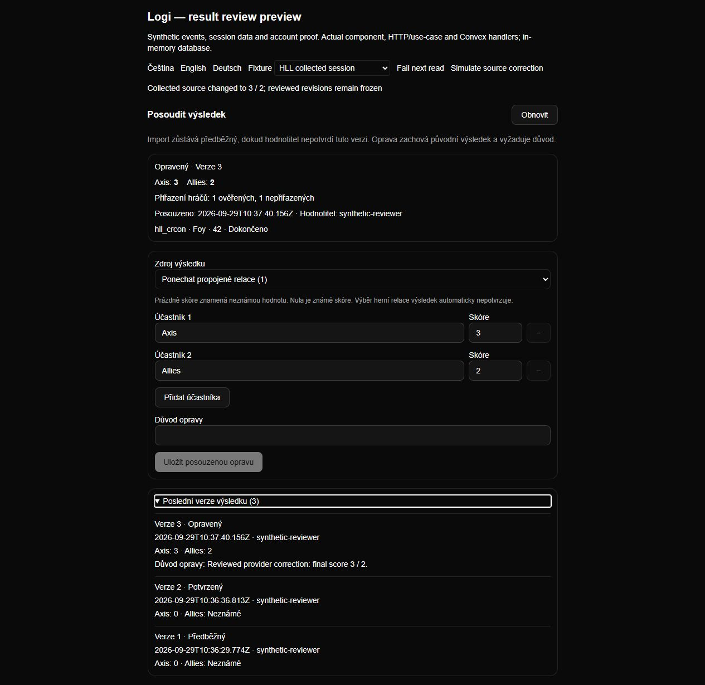

# Result review UI proof

Date: 2026-09-29. All identities, events and scores below are synthetic. The
preview renders the actual `ResultReview` component, CS/EN/DE dictionaries and
application CSS. Its HTTP factory, application workflow and Convex handlers are
real; the session authority and database are isolated test fixtures.

Reproduce from the repository root with
`node --import tsx scripts/preview-results.mjs`, then open
`http://127.0.0.1:4321/?locale=cs`. It binds only loopback and calls no Discord,
Steam, CRCON or Wardogs service. Stop using POST `/__fixture/stop` or Ctrl+C.
The fixture resets on process restart. Real Next.js routing/cookies and deployment
authorization are outside this preview; route/unit tests cover those boundaries.

| Observed interaction | Evidence |
| --- | --- |
| Empty HLL state; selecting a source does not confirm it | [Czech empty](screenshots/result-empty-cs.png) |
| Save provisional with Axis 0, Allies unknown, one verified and one unresolved player | [Czech provisional](screenshots/result-provisional-cs.png) |
| Confirm the displayed saved revision | [Czech confirmed](screenshots/result-confirmed-cs.png) |
| Simulate provider score change to 3/2; refresh retains old confirmed 0/unknown; explicit correction records reason and retains both previous versions | [Czech correction/history](screenshots/result-corrected-history-cs.png) |
| Switch to Wardogs; HLL form state disappears; enter/confirm three factions with 0, unknown, 7 | [English factions](screenshots/result-wardogs-en.png) |
| Fail next read; error replaces private data; Refresh recovers the existing revision | [German error](screenshots/result-error-de.png) |
| Switch to another workspace; previous scores/history disappear and read is denied | [German forbidden](screenshots/result-forbidden-de.png) |
| German Wardogs state at a requested 390×844 viewport; measured content/scroll widths both 375 (scrollbar-adjusted) | [Mobile viewport](screenshots/result-mobile-de.png) |

Action buttons and history disclosure were exercised from the keyboard. Score
inputs have explicit labels. Correction cannot submit without a reason. The
mobile screenshot uses viewport capture: full-page capture in the embedded
browser changed wrapping, so it was replaced with a visually checked viewport.
The preview-only tabs/process were closed and viewport override reset afterward.

Steam callback, link/unlink history, claimed-versus-verified separation and failure
states have separate [I5 UI proof](../v0.9/ui-validation.md). Neither preview proves
live identity ownership, real provider connectivity or the complete hosted product.
