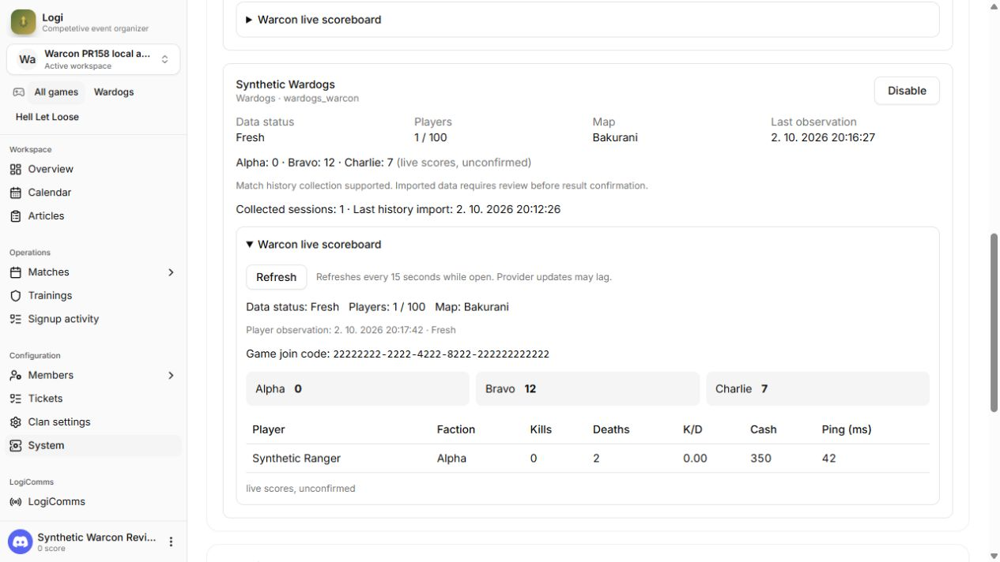
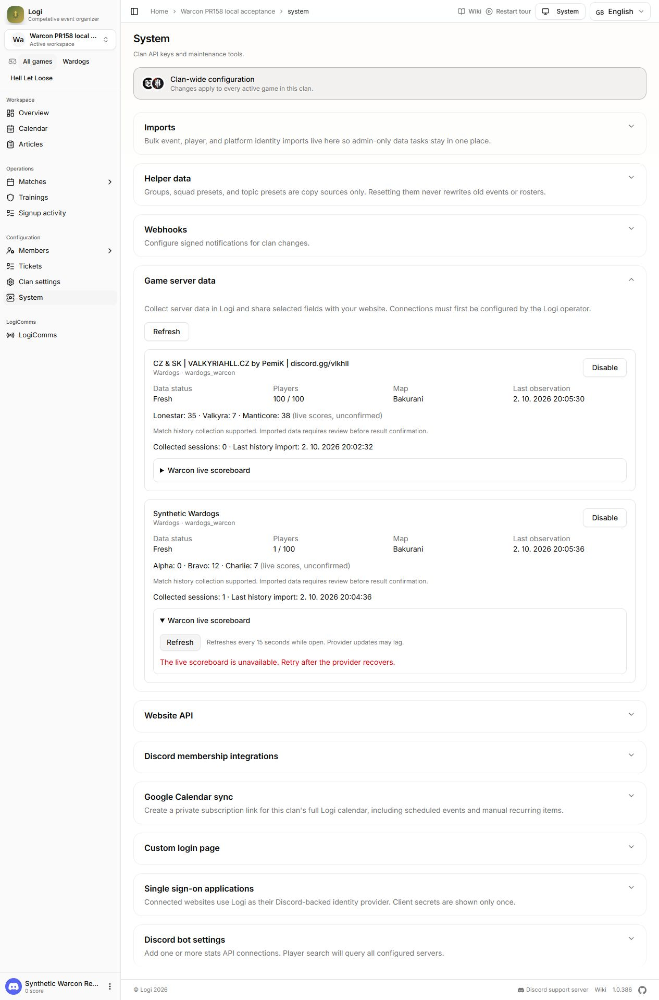

# Warcon proof package

This package records actual execution against runtime commit
`5c494e869429b97dfebb663253593d5ef5014353`. The preceding baseline was
`267c1b55583c9f4e048065d558e5b9e3d1c5ba76`. Checks ran before committing the working
tree; their original baseline metadata is retained in `checks.json`. The committed
runtime files match that tested tree. Later commits add evidence and documentation.

| Artifact | Meaning |
| --- | --- |
| `tests.txt`, `checks.json` | Complete named output: 592 passing tests, zero failures/skips; command exit codes and timings |
| `typecheck.txt`, `build.txt`, `lint.txt`, `convex-push.txt` | Actual command output; empty typecheck output means success only in conjunction with its exit code |
| `adapter.json` | Actual Warcon, actual typed adapter and pinned HTTPS transport; all fifteen views plus collector snapshot |
| `http-acceptance.json` | 33 local HTTP checks: actual provider and synthetic paths, grants, revocation, tenant isolation, cache and administrator route |
| `collector-acceptance.json` | Real local collector scheduler/persistence: one synthetic completed session; zero actual completed sessions |
| `consumer-smoke.json` | Seventeen passing reads through the committed GET-only consumer smoke script |
| `ui-readback.json` | Browser observations, automatic polling, error clearing, resume and explicit API grant |
| `scoreboard-synthetic.jpg` | Full actual browser page: real aggregate snapshot above, synthetic player table below |
| `scoreboard-disabled.jpg` | Actual browser error state after local connection disable and manual scoreboard refresh; player table is absent |
| `scoreboard-resumed.jpg` | Actual browser after local dashboard resume; the synthetic player row is restored |
| `cleanup.json` | Both local connections disabled, four owned processes stopped, five acceptance ports no longer listening |
| `publication-scan.json` | Exact-value checks against supplied/runtime secrets and 100 observed real Steam IDs in the runtime/documentation commit; not a complete security scanner |
| `source-manifest.json` | Git blob identities for changed runtime files and runtime paths used by the verifier |
| `manifest.json`, `verify.mjs` | SHA-256 artifact inventory and reproducible integrity/source-equivalence check |

Run `node docs/integrations/website/v0.11/evidence/2026-10-02-warcon/verify.mjs`
from the checkout. It checks artifact hashes and current runtime source against
the recorded commit. Text hashes normalize CRLF to LF for portable checkout;
JPEG hashes use exact bytes. Published logs redact local paths/known secrets and
normalize trailing whitespace; original private logs are retained. The manifest is not independently signed and the
verifier does not rerun live tests. It is an integrity/provenance aid, not external
attestation. No production credentials, cookies, player lists or raw provider
responses are included.

The real provider had 100 live players in the HTTP run, one ongoing match, no
completed matches, and `configured:true` with zero kill events. Completed match
mapping/persistence and a nonempty kill feed use explicitly synthetic responses.
The browser reviewer is a synthetic session, not an OAuth proof. No production
Convex, Discord interaction, provider mutation, hosted SSO or consuming website
deployment was tested in this increment. See [verification](../../verification.md)
for the review and remaining acceptance.

