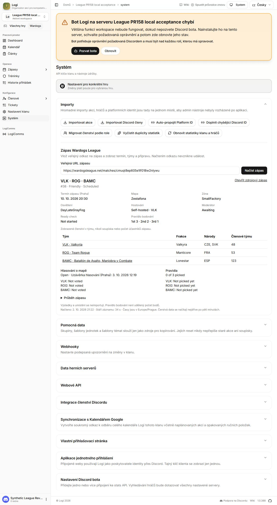
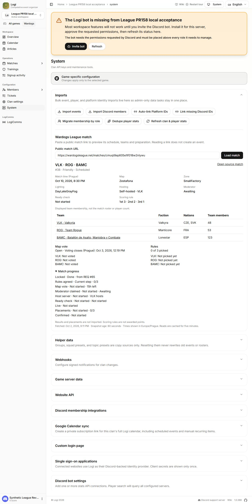
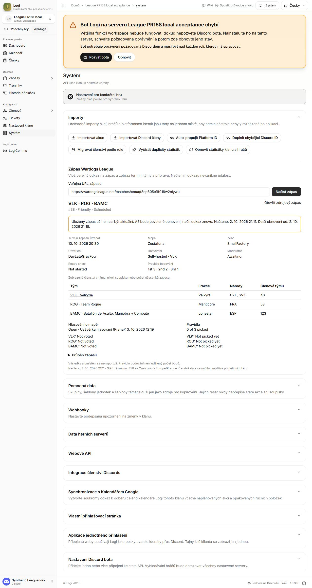

# Wardogs League evidence · October 2, 2026

Tested runtime: `47fe06ead719d584848c57b8d9d680af4cd9687b`.
The source manifest binds the tested working tree to that commit. Subsequent
delivery commits contain evidence/documentation only. `baseRevision` in raw
check metadata is the parent checkout before the working tree was committed.

| Evidence | Meaning |
| --- | --- |
| `reference-meta.json`, `adapter.json` | Anonymous reference response provenance and normalized result from the actual guarded HTTPS adapter |
| `http-acceptance.json`, `live-http.json` | 16 checks through the production Next build, fresh local Convex and actual public League |
| `stale-http.json` | Synthetic 429 completion injected into the local cache after actual five-minute expiry; old real snapshot retained, another ID blocked |
| `recovery-http.json` | Actual page re-fetch after cooldown; freshness restored, timestamp advanced, OpenAPI 1.8.0 served |
| `tests.txt`, `checks.json` | 619 passing tests and check exit codes, durations and installed runtime versions |
| `build.txt`, `typecheck.txt`, `lint.txt`, `format.txt`, `convex-push.txt`, `lock.txt` | Production build/typecheck, changed-file lint, format, official local codegen and Bun lock validation |
| `browser.json`, screenshots below | Actual DOM and screenshots of the local built dashboard; synthetic reviewer, real public match data |
| `cleanup.json` | Owned loopback services stopped; no listeners remain on their test ports |
| `source-manifest.json`, `manifest.json`, `verify.mjs` | Git blob identities and SHA-256 artifact integrity checks |

The raw 145,419-byte HTML response remains outside Git. Its public semantic main
content is the checked-in parser fixture; scripts/RSC and presentation markup
were removed. No provider key, Discord token, session cookie or private database
is included. The synthetic reviewer session is **not OAuth acceptance**.

The installed local Next/Convex versions are recorded explicitly in `checks.json`.
Text captures normalize line endings, local repository paths and trailing whitespace;
screenshots are unmodified browser output.
The Bun frozen-lock check validates the committed lock, not a fresh Bun install
or a second runtime test. Existing dependency audit advisories and lint limits
are described in [verification](../../verification.md).

Run the integrity check from the repository root:

```sh
node docs/integrations/website/v0.12/evidence/2026-10-02-league/verify.mjs
```

This verifies stored proof and source identity; it does not repeat a provider
request. Later runtime changes require a new checkpoint. To inspect this one
after subsequent work, check out its pinned runtime and evidence delivery commits.

## Screenshots

Actual full Czech preview after real refresh and recovery:



Full English page with preparation steps expanded:



Full Czech page showing preserved data after the explicitly synthetic rate limit:



The bot-missing banner belongs to the synthetic local workspace. No Discord bot
connection is needed for this public preview.
