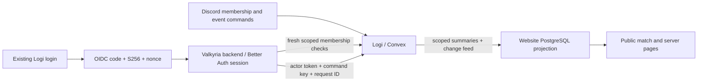

# Central login and connected website operations

Logi supplies the identity, current guild-role evidence and operational event data
used by the paired Valkyria website integration. The website keeps its own backend,
encrypted session and CMS. An existing Logi login is reused through an OIDC redirect;
browser cookies are never shared between unrelated domains.

## Implemented boundaries

| Capability | Behavior |
| --- | --- |
| Central login | RS256/JWKS, exact callback/client/issuer, S256 and nonce; durable central-session binding |
| Revocation | Central logout, session expiry, identity changes and app revocation invalidate protected use; no background logout push to an idle browser is advertised |
| Roles | Separate current membership reads, explicit role allowlists and game scope; login does not grant admin access |
| Website writes | Native match create, eligible update and pre-meeting cancellation; both service policy and the current user are required |
| Conflicts/retries | Expected revision prevents overwrites; one durable receipt per intentional command; uncertain replies retain the original request ID |
| Data return | Native event changes flow through existing summaries/change records into the website's bounded projection worker |
| Public output | Explicit source/game publication and individual server approval; absent scores stay unknown |

See the [SSO provider contract](../sso-provider-contract.md),
[event command contract and setup](../event-commands.md),
[public SSO guide](../../../../content/configuration/single-sign-on.mdx), and
[event guide](../../../../content/operations/events.mdx).
The paired consumer contract and operator runbook live in `ValkyriaWDG/www` under
`docs/integrations/logi/`.

## Review order

1. Domain SSO policy and durable dashboard-session/token stores: exact immutable
   subject, client, central session, server clock and atomic single-use redemption.
2. HTTP adapters: closed DTOs, configured issuer/JWKS, POST-only exact-origin logout.
3. Native event command use case and Convex transaction: current policy/key/user/role
   evidence is checked again even when replaying a receipt; event/change/receipt
   persistence is atomic.
4. Consumer: maintained Better Auth callback, per-session encrypted actor token,
   final durable user/account/session checks, per-game roles, command journal and
   projection lease/checkpoint transactions.
5. Operational configuration and local acceptance evidence. Features default off.

## Scope and activation

This is source and local acceptance work. Hosted callback registration, actual
Discord OAuth and role delivery, production schema rollout, signing-key setup,
timer installation and public-domain acceptance remain separate activation steps.
Production Convex and real Discord were not used for these new qualification runs.

Native Discord/dashboard event creation already targets the same event store.
The website consumes that store; this change does not introduce a second writable
website match master. Existing website matches remain an editorial archive. No
roster/sign-up/attendance writes, result editing, server control, live-player-name
export or Discord command redesign is included in this consumer slice.

Read the [acceptance evidence](evidence/README.md) for observed results and limits.
