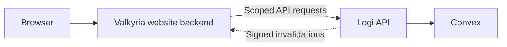

# Read-only website integration handoff 0.3.0

Proposed 2026-09-28. This is the first integration milestone, built on API
version 1.1.0. It adds backend-enforced read-only keys and a synthetic consumer
acceptance pack. It does **not** add a production website synchronizer or claim
hosted acceptance. The previously retrieved hosted OpenAPI advertised 1.0.0.

This handoff follows the [website-owned contract 0.2](https://github.com/ValkyriaWDG/www/blob/feat/hll-platform-handoff/docs/integrations/logi/contract.md).
The normalized model names retain that contract's meaning. The new version
specifies actual key provisioning, supported routes, exclusions and fixtures;
normalized models are not new Logi HTTP response DTOs.
Their proposed TypeScript shapes are in [contract.ts](./contract.ts).

## Ownership and identity

The website retains its own backend. That backend consumes Logi as the
authoritative service for shared HLL/Wardogs operational data, through Logi's
supported API. Logi/Convex owns events, signups, rosters, results and the domain
behavior behind those records. The website backend owns CMS publication,
translations, public-member consent, website sessions and explicit website
administrative grants, plus its API client, cache and derived read models.



This is the target integration boundary; consumer synchronization remains
follow-up work. Website copies of Logi-owned data are derived projections with
source provenance. Logi remains their authoritative writer. Website-owned CMS,
consent and authorization records remain in the website backend. No second Logi
instance or direct website access to internal Convex credentials is needed.

Use `(source, sourceInstanceId, guildId, gameId, kind, externalId)` as the
composite external reference. IDs remain opaque strings. The source instance
identifier is operator configuration, not an invented API field. Validate guild
and game configuration independently; games need not share a guild or key.
Never join members by nickname, display name or approximate matching.

| Website route | Website/database game | Logi game |
| --- | --- | --- |
| `/{locale}/hll` | `hell-let-loose` | `hell_let_loose` |
| `/{locale}/wardogs` | `wardogs` | `wardogs` |

The website has one CMS and identity/session on its canonical origin, Czech
primary and English secondary. A shared session does not grant both games'
administration. Hub aggregation must preserve each explicit game reference.

## Extending Logi for website requirements

New data requirements can be implemented upstream in Logi. A capability marked
missing in this handoff is a candidate for Logi development; the current API
surface does not limit the eventual integration. For each requirement:

1. Establish its authoritative owner. Shared operational data, game-provider
   adapters and reusable domain behavior belong in Logi. Website presentation,
   editorial workflows and site-specific policies belong in the website backend.
2. Add the necessary Logi domain behavior, Convex persistence and supported API
   contract together. Cover tenant/game isolation, scoped permissions, pagination
   and deletion/invalidation semantics as applicable.
3. Deliver versioned DTOs, synthetic fixtures, tests and wiki/OpenAPI updates so
   the website backend can consume the feature. Keep upstream behavior configurable
   without Valkyria-specific IDs or a separate operational data implementation.
4. Connect the website backend to that contract and keep its derived projections
   current. Browser-facing responses pass through the website's publication,
   consent and authorization policy.

This first milestone gives the website backend read-only access. Future website
commands can be exposed through Logi with explicit actor authorization,
game-scoped permissions and auditing; the initial service key does not authorize
those commands. The implementation scope of this contribution remains Logi and
its handoff to the separately owned website workstream.

## Issue a restricted key

A workspace administrator uses the existing session-authenticated endpoint:

```http
POST /api/servers/{serverId}/api-keys
Content-Type: application/json

{
  "name": "Website event reader",
  "readAccess": {
    "resources": ["events", "matches"],
    "gameIds": ["hell_let_loose", "wardogs"]
  }
}
```

`serverId` is the selected dashboard workspace identifier. Normal dashboard
administrator authorization applies. The response is `201 { "key": "..." }`;
the full secret is returned only at creation. Keep it server-side. The existing
list endpoint reports `readAccess`, prefix and revocation state, never a hash or
full key. Revoke with `DELETE /api/servers/{serverId}/api-keys?keyId={keyId}`.
The UI creation form still creates a legacy key; restricted provisioning is
available through this authenticated endpoint in this backend milestone.

`readAccess` is an object with exactly two nonempty, duplicate-free arrays.
Allowed resources are `events`, `groups`, `rosters`, `assignments`, `stratmaps`
and `matches`. Allowed games are `hell_let_loose`, `hell_let_loose_vietnam` and
`wardogs`. Null, empty, unknown or duplicate entries are rejected. Grant only
what the integration consumes; rosters, assignments and stratmaps contain
operational/private data and are unnecessary for a basic event listing.

| Request with a restricted key | Behavior |
| --- | --- |
| `GET /api/v1/clan/events?game=wardogs` | Allowed only if both resource and game are granted |
| Explicit repeated/comma-separated games | Every selected game must be granted |
| Missing game on a collection, or `game=all` | `403 insufficient_scope` |
| Granted resource detail | Persisted game and tenant checked; outside either returns `404` |
| `GET /clan/matches/{eventId}` | ID is the Logi event ID, not the matchStats ID or CRCON session ID |
| Metadata, settings, users, calendar, presets, performance history | `403`; these are intentionally not granted by this initial policy |
| Every write | `403`, including attempts to replay a legacy key's cached idempotent response |
| Revoked/invalid key | `401` at HTTP authentication; backend rechecks each operation |

Successful restricted reads use `Cache-Control: no-store`. Revocation prevents
future authorized reads; it cannot erase already downloaded data. Consumer
retention, permission expiry and withdrawal handling remain mandatory.

Enforcement lives in Convex resource reads and the shared mutation boundary,
with HTTP checks for useful errors. A caller cannot recover write authority by
bypassing the GET wrapper. The API's `x-logi-read-access` OpenAPI extension
states each operation's support; `null` means legacy keys only. Anonymous
public endpoints retain their existing public visibility.

Key management is deliberately excluded from `/api/v1`: allowing bearer keys
to issue broader credentials would defeat this boundary. This is the documented
API-parity exception. No new dashboard/Discord presentation is introduced.

## Safe projections

Clan responses are **private operational records**, even for a read-only key.
Never send them directly to a browser or spread their fields into public JSON.
Select fields explicitly. Every normalized projection includes `ref`,
`observedAt`, nullable `sourceUpdatedAt`, `freshness` (`fresh`, `stale`,
`unavailable`), and `publication` (`approved`, `unreviewed`, `withdrawn`).
Only current approved publication/consent permits public rendering.

| Model | Mapping and safe fields | Gaps / exclusions |
| --- | --- | --- |
| `EventSummary` | `events.id`, explicit game; reviewed `name` as untranslated title; `kind`, `status`; UTC registration/game schedule | Exclude `serverPassword`, notes, tactical maps, signup identities, channel/role IDs. Description and links require separate publication review. |
| `MatchSummary` | Event reference plus independently mapped external match/session; nullable scores, map/opponents/rounds only when actually supplied; provenance | Result state is `unknown`, `provisional`, `confirmed` or `corrected`. An import or `concluded` status alone does not prove human confirmation; upstream currently lacks the complete confirmation/audit contract. |
| `PublicMember` | Website-owned allowlisted profile with current publication consent and explicit game affiliations; internal opaque reference only | Restricted keys deliberately exclude raw `users`; do not publish Discord/Steam IDs, notes or operational grants. A production consent projection is follow-up work. |
| `ServerSnapshot` | Approved server display name; `online`, `offline` or `unknown`; nullable map/player count/capacity; observation time | No game-server snapshot endpoint is added. Timeout is unknown/stale, never zero players. HLL imports and Logi platform-status embeds do not prove Wardogs controls. |
| `IntegrationHealth` | Collector's last attempt, last completed sweep, age, error category, nullable backlog count and configured capabilities | Collector state is not hosted bot/Discord health. Unknown values remain null. |

Fixtures in [fixtures.json](./fixtures.json) distinguish synthetic wire excerpts
from proposed normalized output. They contain no real roster, usable credential
or real tenant configuration. Web routes and publication behavior must be tested
by the consuming website against this version before switching from fixtures.

## Synchronization acceptance contract

1. Pin configured HTTPS origins. Keep credentials in server-only storage. Reject
   arbitrary upstream URLs; impose response-size, timeout, page and run limits.
2. Persist a sweep identity containing source/guild/game/resource, filters, sort,
   fixed `updatedSince` and start time. Keep its resumable cursor separate from
   the last completed watermark. Empty `data` with `nextCursor` is not completion.
3. Commit page upserts and next cursor atomically. On failure resume the same
   sweep; on an invalid/stale cursor abandon it and restart from the old completed
   watermark. Never advance that watermark from a successful page's maximum
   update time. Advance only after the entire sweep commits, using the sweep
   start boundary with overlap on the next run. Preserve timestamp ties.
4. Collections are not snapshot-isolated across requests. Creation-order cursors
   and mutable update-index cursors are not monotonic change feeds. Use periodic
   full reconciliation, overlap and idempotent upserts; do not claim a race-free
   deletion snapshot. Incremental absence, a partial sweep and outages prove no
   deletion. Mark candidates only after a successful full sweep, then confirm
   by authoritative lookup/repeated full sweep under a current valid key.
5. Treat `401/403` as authority/configuration failures, not deletion or endless
   retries. Retry timeouts, `408`, `429` and `5xx` with bounded exponential backoff,
   jitter and bounded `Retry-After`. A failed page leaves the completed watermark
   unchanged. An outage changes freshness to stale/unavailable, not zero.
6. Verify webhook HMAC against exact raw bytes using the configured secret and
   `X-Logi-Timestamp + "." + rawBody`; validate a bounded timestamp age and future
   skew, event type and configured guild. **The unsigned `X-Logi-Delivery` header
   is not a deduplication authority.** Use the signed envelope ID plus source and
   guild; reject header/body mismatch. The secret must not be a service API key.
7. In one durable transaction, deduplicate that identity and enqueue an
   invalidation/refetch job. Acknowledge only after commit. On restart, retries
   still deduplicate. Workers refetch with the scoped key; webhook bodies are
   hints, not public projections. Out-of-order messages cannot roll back newer
   records. Keep periodic reconciliation because not every mutation path emits
   the same webhook coverage.
8. Consent withdrawal immediately suppresses the website profile and purges
   public caches/media according to website retention policy. Membership or role
   removal invalidates grants; neither waits for the next content import. Unknown
   or expired permission/consent state fails closed. Private synchronization does
   not itself authorize public publication.

This milestone proves backend pagination, isolation and scope/revocation
behavior. The production consumer's durable inbox, resumable sweeps, deletion
reconciliation and consent revocation remain explicitly unverified. The shared
acceptance scenarios make those next implementation steps reproducible.

## Authentication and authorization handoff

Keep production Logi SSO disabled until a separate private provider acceptance
and deployed-version review is complete. No SSO change is included in this PR.
Client registration, state, PKCE, nonce, issuer, audience, signature, expiry and
logout/revocation must pass independently before enabling it.

`member/guest` is a membership label, not a website administrator claim or a
current Discord role list. Website administration requires explicit grant,
matching game scope and recent trusted membership/role evidence. Recommended
consumer policy: privileged requests require evidence no older than 60 seconds;
unknown/stale evidence denies access and enqueues refresh. Departure or role
revocation invalidates all affected grants and sessions. Provider acceptance
must establish a trustworthy source for that evidence. A tenant service key
does not authorize an end user's write or game-server control.

## Compatibility and rollout

The schema field is optional. Existing records and callers omitting `readAccess`
retain full legacy access; no data migration or automatic key upgrade occurs.
Deploy the compatible Convex schema/functions **before** the web runtime,
then provision a new restricted key, verify denial cases in the intended tenant,
switch the consumer, and revoke its old write-capable credential. Deployment and
tenant setup are separate operator actions, not part of this contribution.
Rollback must disable/revoke restricted credentials before running an older
backend that does not enforce this policy; a silent backend downgrade is unsafe.

There is no bearer-key policy-edit endpoint: rotate to a newly reviewed policy
and revoke the previous key. No secrets, guild IDs or deployment settings are
hardcoded. The endpoint supplies permission metadata for future UI controls.

## Milestone acceptance and evidence

- **AC1:** Existing full-access keys remain compatible; restricted policies are
  validated, stored, listed and enforced in backend reads/writes.
- **AC2:** Tenant/game/resource denial, revocation after authentication, cached
  write replay denial, parent-scoped rosters and empty-page continuation are
  exercised by `src/infrastructure/convex/public-api-key-access.test.ts`.
- **AC3:** HTTP scope errors/no-store and every clan operation's OpenAPI permission
  metadata are exercised by adjacent route/authentication tests.
- **AC4:** Versioned handoff, synthetic fixtures, capability matrix and complete
  follow-up issue drafts are reviewable without tenant credentials.
- **AC5:** Validation reports the exact tested commit, command outcomes and
  baseline failures. Backend-only screenshots: N/A; functional proof is the
  actual Convex handlers and HTTP/OpenAPI tests with isolated persistence.

See [capabilities.md](./capabilities.md), [validation.md](./validation.md), and
[issue-drafts.md](./issue-drafts.md). These are local issue drafts because upstream
Issues were disabled when checked. No issue numbers have been allocated.
