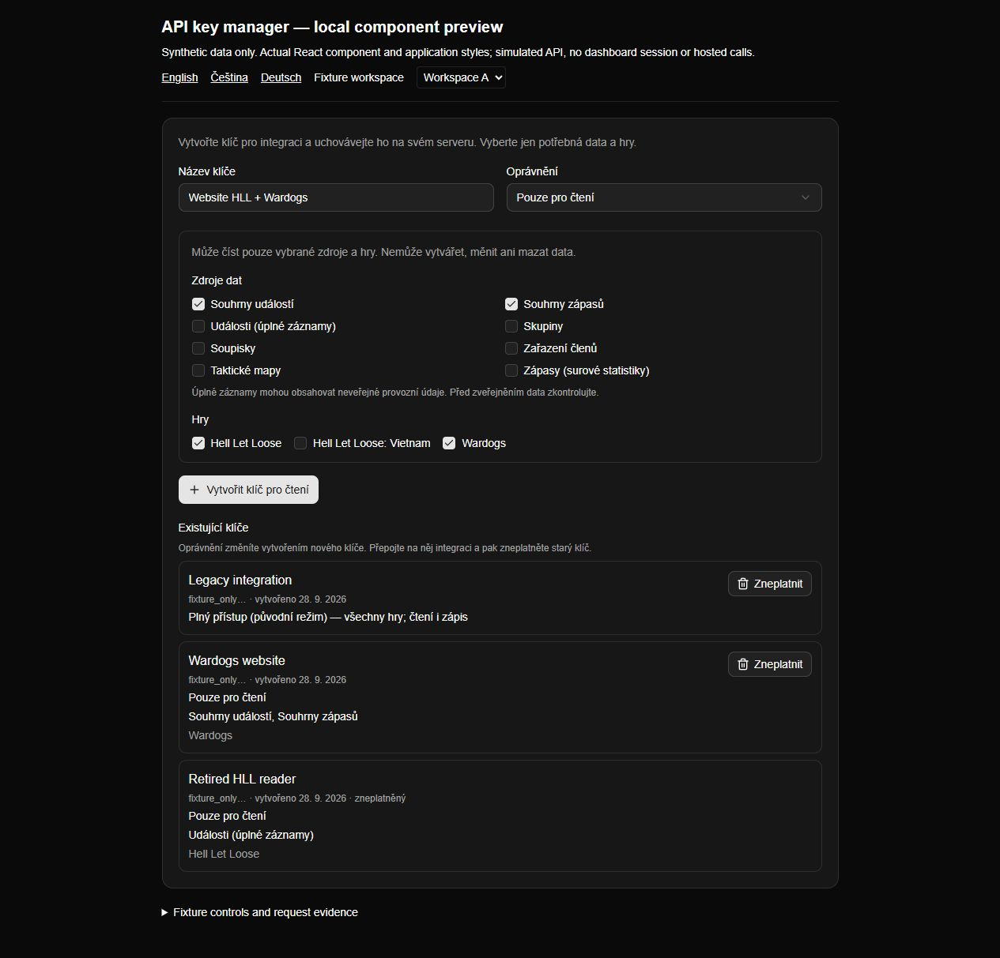
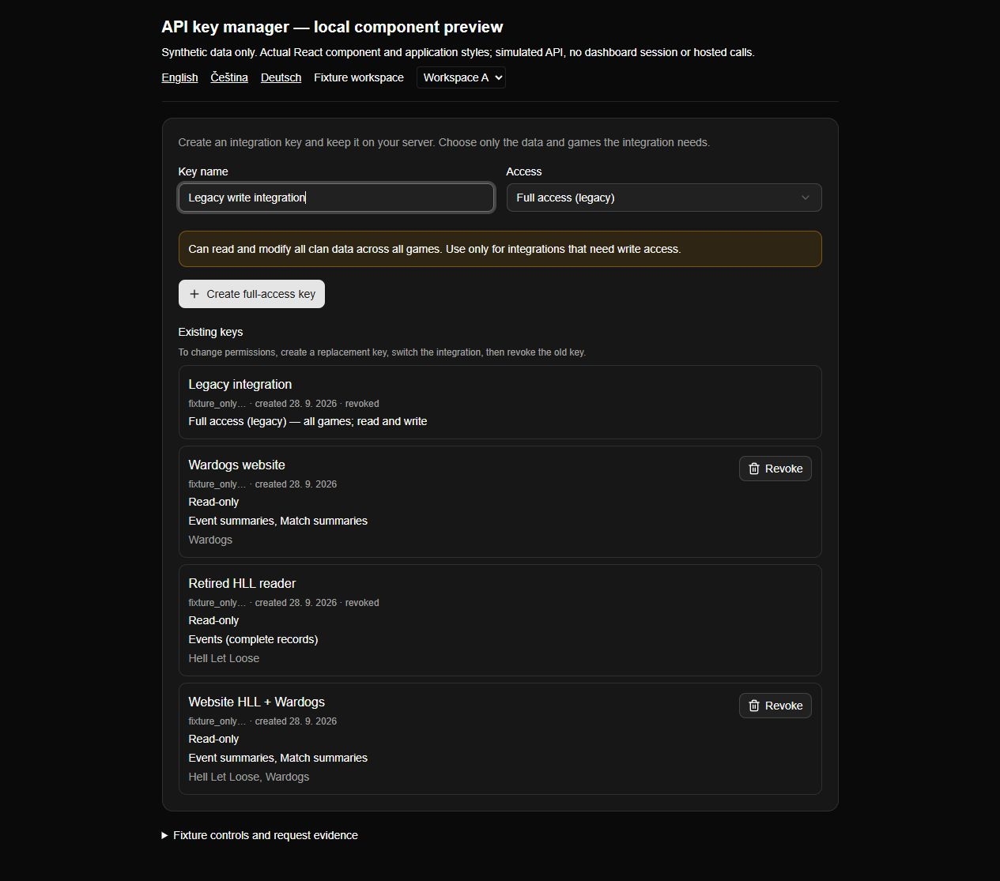
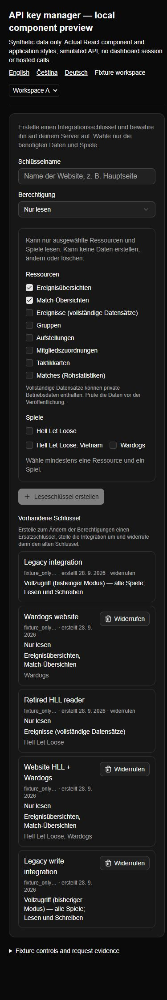

# Restricted-key administrator UI evidence

Validated on 2026-09-28. This UI follow-up retains API 1.2.0 and handoff 0.4.0:
no wire schema, persistence schema or bearer-key management capability is added.
The PR description pins the tested revision.

## Reproduce the local component preview

From the repository root with the project's existing dependencies installed:

```sh
node --import tsx scripts/preview-api-key-manager.mjs
```

Open `http://127.0.0.1:4318/?locale=cs` in a browser. The preview imports the actual
`ApiKeyManager`, shared UI controls, dictionaries and application stylesheet. It
uses esbuild from the installed tsx toolchain and the project's PostCSS/Tailwind
packages. It adds no dependency or production route. Its HTTP server binds only
to loopback and keeps synthetic keys in memory; restarting resets the fixtures.
It does not read environment credentials, start Logi/Convex/Discord or contact
the hosted instance. All displayed keys have deliberately unusable fixture values.

The preview offers language links, two fixture workspaces and expandable controls
for failing the next API request and displaying the actual request log. It does
not emulate dashboard authentication; the real management endpoint still requires
an administrator session, and backend scope tests remain separate evidence.
Stop with Ctrl+C or, in PowerShell:

```powershell
Invoke-RestMethod -Method Post -Uri 'http://127.0.0.1:4318/__fixture/stop'
```

## Observed browser checks

| Scenario | Observed result |
| --- | --- |
| Default form | Read-only mode, only event/match summaries selected, no games selected |
| Name without a game; games without any resources | Creation stays disabled; no empty policy is submitted |
| Select HLL and Wardogs, then create | POST contains only the name and `readAccess` with exactly the two summary resources and selected games |
| Full-access mode | Explicit read/write explanation; POST omits `readAccess` only in this mode; the new row is labeled legacy full access |
| Reveal, copy and hide | Creation reveals a synthetic key once, copy reports success and Hide removes it; list responses contain only prefixes |
| Change workspace while a key is visible | Revealed key/form state disappears; the new workspace loads only its own rows |
| Revoke previous legacy key after replacement creation | DELETE targets that key; the row becomes revoked and its Revoke action disappears |
| Simulated creation failure (503) | Localized error, preserved form input, no success/revealed key or newly created row |
| Simulated list failure (503), then Retry | Error is distinguished from an empty list; Retry loads the current workspace |
| English, Czech and German | Localized controls and permission summaries are visible; localized initial rendering also has three automated tests |
| Narrow viewport (390 × 844 override) | Read-only and legacy forms have no horizontal overflow; document content/client widths both measured 375 CSS px with the scrollbar |

The request trace verified a scoped creation body of:

```json
{
  "name": "Website HLL + Wardogs",
  "readAccess": {
    "resources": ["event-summaries", "match-summaries"],
    "gameIds": ["hell_let_loose", "wardogs"]
  }
}
```

This proves UI selection and transport wiring with simulated responses. It does
not prove a deployed session, production credential provisioning, hosted
revocation or an actual website switch. The existing Convex/HTTP tests cover
authority and scope enforcement independently. The UI adds no permission-edit or
secret-reveal endpoint; policy changes still use replacement and revocation.

## Captioned screenshots

Actual local component screenshots, **simulated API data**, captured in the Codex
browser. The surrounding fixture banner is intentionally visible. These are not
captures of the hosted dashboard or a real tenant.






