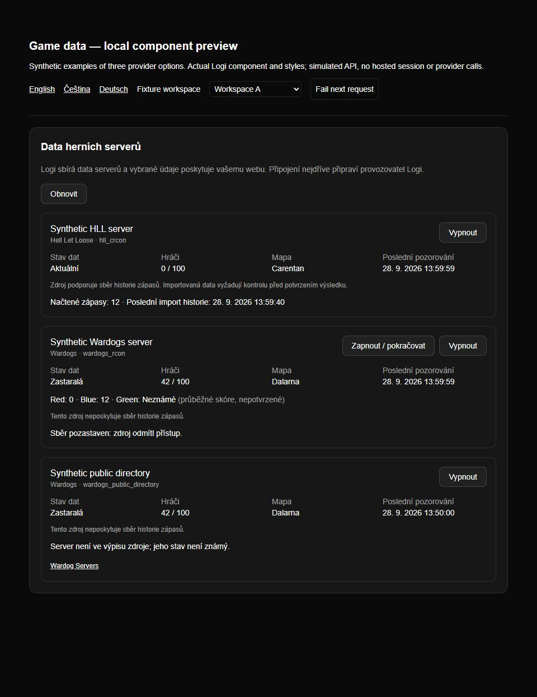
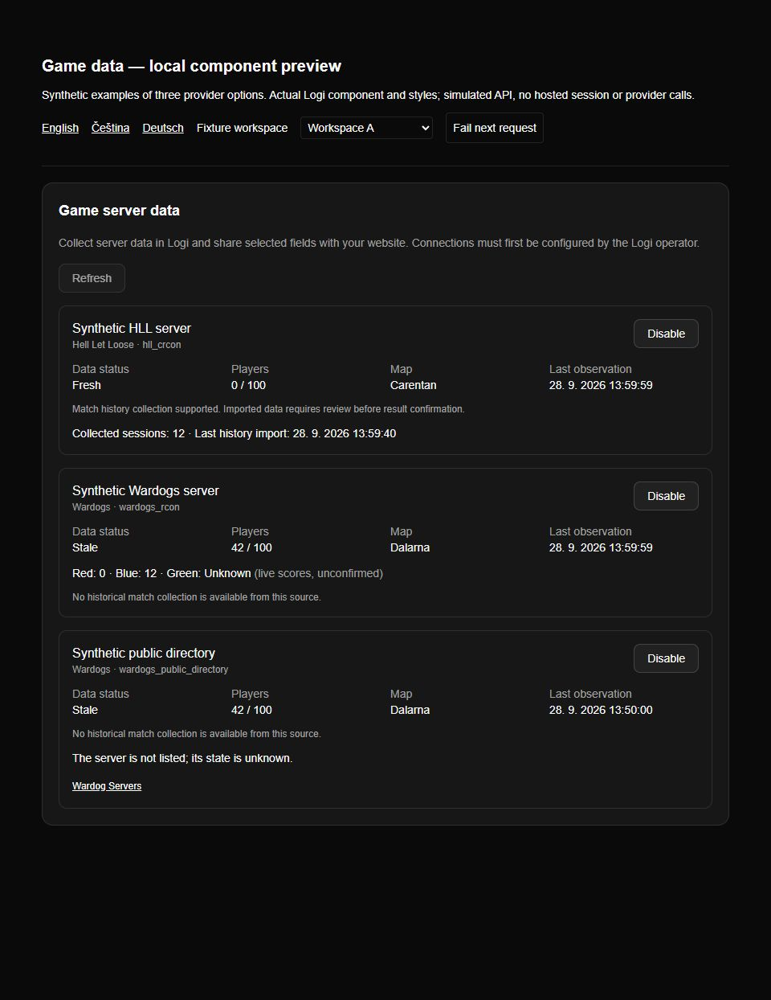
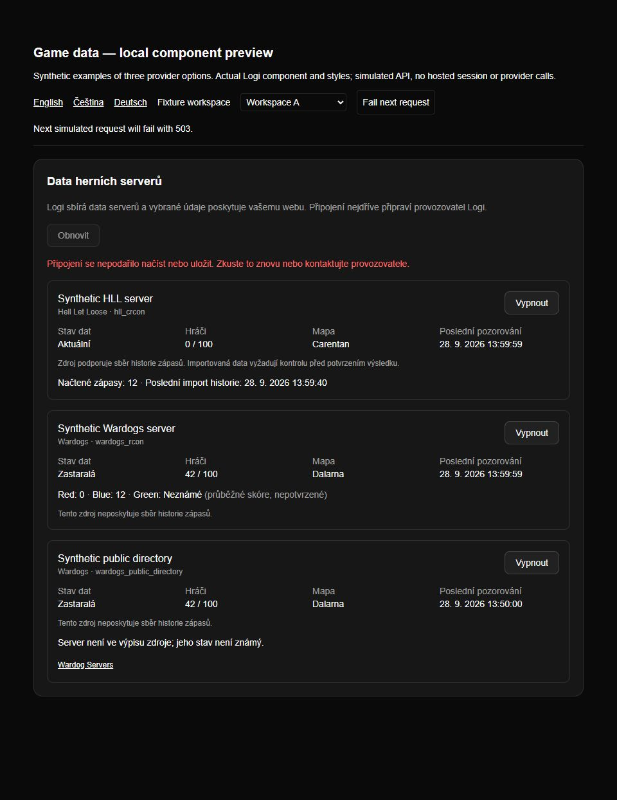
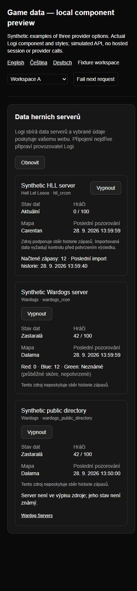

# Game data UI validation

Actual `GameDataConnections` React component, production dictionaries and styles,
served by a loopback fixture on 2026-09-28. Data/API responses are synthetic;
this is not a hosted dashboard, login or game-server acceptance run.

Reproduce with `node --import tsx scripts/preview-game-data.mjs`, then open
`http://127.0.0.1:4319/?locale=cs`. Restart the preview to reset its in-memory data.
The three cards demonstrate provider alternatives, not three deployed servers.

Verified using browser interaction and resulting DOM state:

- Czech/English rendering; zero HLL players; three Wardogs scores including zero
  and unknown; directory attribution, history count and last import time.
- Resume a paused Wardogs source: the paused error/resume button disappears.
- Disable/re-enable HLL: disabled state and available actions change correctly.
- Simulated 503 on refresh: a localized alert appears; retry removes it while
  preserving the last loaded cards through the error.
- Workspace B has no configured sources and clears the previous workspace's data.
- 390 × 844 viewport: cards/buttons wrap, all fields remain readable and document
  width stays within the viewport. Viewport override restored afterward.
- Keyboard activation worked. The in-app browser click driver did not activate
  two attempted buttons; Enter on the same semantic controls succeeded. Mouse
  interaction therefore is not claimed as separately verified.

## Czech, paused source and missing directory record

## English, after resume

## Retryable refresh failure

## Narrow Czech layout

