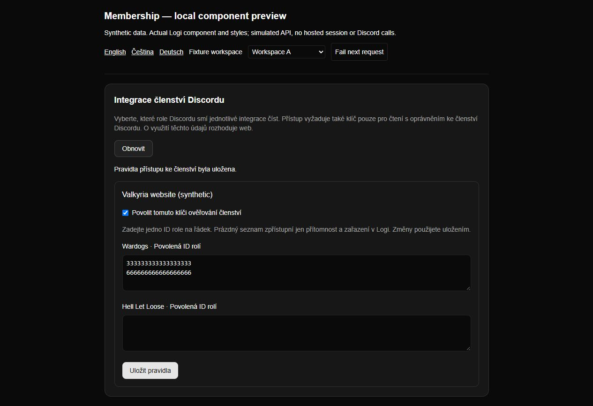
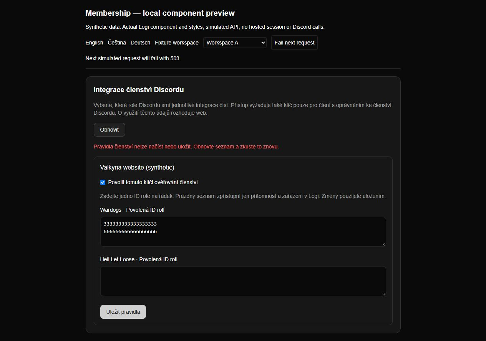
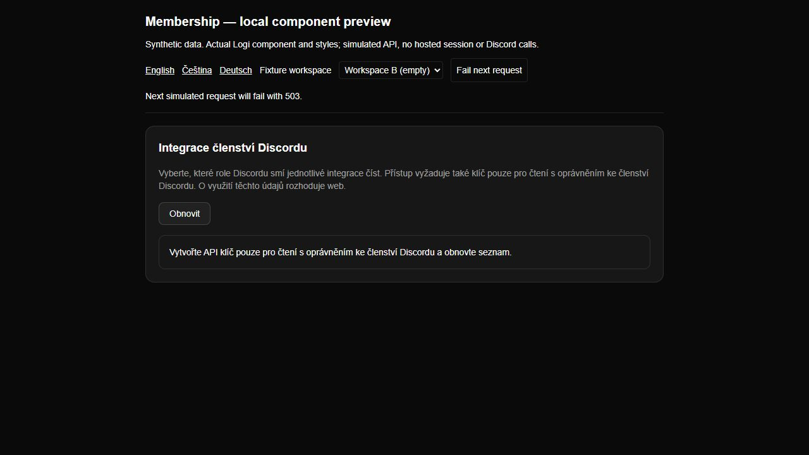
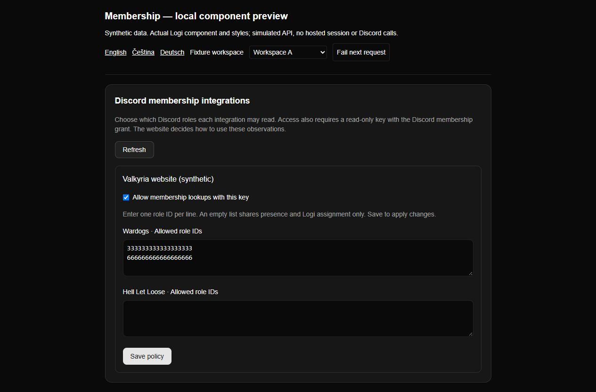
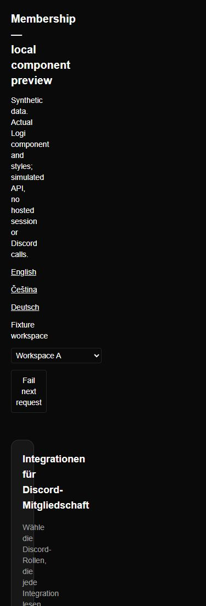

# Membership policy UI evidence

Actual `MembershipIntegrationSettings` component and Logi CSS, rendered in a
loopback-only development harness using **synthetic** IDs and a simulated API.
These screenshots do not show a hosted session, real key, real Discord action or
deployment. Reproduce with `node --import tsx scripts/preview-membership.mjs`
and open `http://127.0.0.1:4320/?locale=cs`.

Verified: enabling a policy, two role IDs, saving and reloading the returned
version, simulated 503 and retry, changing to an empty workspace without retaining
the former key, EN/CS/DE text and 390 × 844 responsive viewport. The mobile DOM's
scroll width and viewport width both measured 390 pixels. The preview process and
tab were closed after capture. Session authorization is covered by handler tests,
not this browser harness.

Czech policy after a successful simulated save.

Simulated 503; retry successfully saved the same draft.

Changing workspace removes the previous workspace's key and settings.

English labels using the same real component.

German text and inputs at a 390-pixel viewport; no horizontal overflow.
