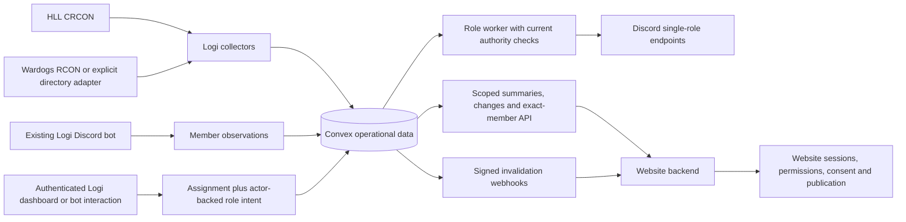
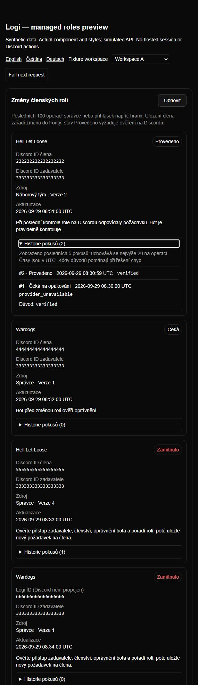

# PR #158 — integration architecture, review map and proof

Date: 2026-09-29. All work remains in [one PR](https://github.com/Ninjonik/logi/pull/158),
as requested. This guide covers the cumulative delivery, including scoped keys,
HLL/Wardogs data, synchronization, membership observations and managed Discord roles.
The PR description pins the exact tested commit and final diff totals.

## What the system does

**Logi is the operational data backend. The website retains its own backend.**
Logi owns operational events/assignments, configured game-data collectors, Discord
observations and authorized role operations. The website owns login sessions,
access decisions, CMS content, consent, publication and its durable local read models.
An API key identifies a consumer, not a human actor, and OAuth identity alone does
not confer membership or administrator permission.

| Area                      | Implemented behavior                                                                                                                        | Explicit limit / remaining owner                                                                                              |
| ------------------------- | ------------------------------------------------------------------------------------------------------------------------------------------- | ----------------------------------------------------------------------------------------------------------------------------- |
| Scoped keys and summaries | Resource/game restrictions, operator create/revoke UI, closed event/match projections                                                       | No automatic extra grants; private participants/raw telemetry stay private                                                    |
| HLL D1/D2                 | Configured CRCON status collection, normalized private session history, checkpoints/leases and health                                       | Actual CRCON version, credentials, network and long-running ingestion require live acceptance                                 |
| Wardogs D1/D3             | Capability-aware RCON adapter; separately selected public-directory adapter                                                                 | Directory data is identified as directory data; unavailable capabilities are not invented; live server acceptance remains     |
| Synchronization W2        | Transactional revisions, scoped changes/records, signed cursors, retention resets and bounded webhook retries                               | Website bootstrap/inbox/idempotent consumption, crash recovery and publication W1/W3/W4 are not implemented in its repository |
| Membership I1             | Exact Discord-subject lookup, explicit key grant plus role allowlist, freshness/unknown semantics, REST/Gateway/reconciliation fencing      | Website I2 must enforce age and deny protected actions on unknown/stale observations                                          |
| Discord roles I3          | Atomic intent, trusted actor provenance, current authority/link checks, per-member lease, retries, periodic verification and operator audit | No website role-command API, kick/ban/server control, imported grants or automatic rollback of partial denied work            |
| OAuth / optional SSO      | Existing website OAuth boundary preserved; standards-based integration plan                                                                 | Website sessions/callbacks/logout and private hosted OIDC qualification remain separate acceptance                            |
| Verified identity I5      | Plan and identity boundaries documented                                                                                                     | Steam proof/link lifecycle is not implemented; nickname/numeric identifiers are not identity evidence                         |
| Reviewed results D4       | Raw/provisional data retains its uncertainty                                                                                                | Human confirmation, correction/retraction and verified player attribution remain planned                                      |

## How to review the large diff

The earlier **17,119-line** snapshot at `c71da56` was **16,360 additions and 759
deletions across 158 files**. It combined several milestones rather than one feature:
approximately 8,000 implementation lines, 5,500 test/fixture lines and 3,600 documentation
lines; only 43 changed lines were generated artifacts. Those are historical totals,
not the final I3 totals. The final PR is larger because it includes the role queue,
regression fixes and its documentation/proof. There is no dependency upgrade or
vendored package explaining the size.

Review in these boundaries inside the same PR:

| Slice                              | Start with                        | Then inspect behavior and proof                                                                                                                      |
| ---------------------------------- | --------------------------------- | ---------------------------------------------------------------------------------------------------------------------------------------------------- |
| Key authority and public DTOs      | [0.4 contract](../v0.4/README.md) | `convex/apiKeyValidators.ts`, `convex/publicApi.ts`, `src/domain/api/`, public API key tests, key-manager screenshots                                |
| Provider contracts and collectors  | [0.5 contract](../v0.5/README.md) | `src/domain/game-data/`, `src/application/game-data/`, `src/infrastructure/game-data/`, `convex/gameData*.ts`, provider fixture tests                |
| Transactional changes and delivery | [0.6 contract](../v0.6/README.md) | `convex/integrationMutation.ts`, `integrationChanges.ts`, `integrationChangeLog.ts`, `webhookQueue.ts`, `webhookDispatcher.ts`; coverage/retry tests |
| Exact-member observations          | [0.7 contract](../v0.7/README.md) | `convex/memberObservations.ts`, `membership_shared.ts`, `src/application/membership/read-membership.ts`, Discord transport and departure/epoch tests |
| Managed roles                      | [0.8 contract](./README.md)       | Pure policy and use-case, Convex intent/lease, Discord adapter, bot scheduling and session-only audit, in that order                                 |
| Review fixes and remaining defects | [Final review](./review.md)       | Regression names, RED/GREEN results, one deferred historical audit label                                                                             |

Key role paths:

- [Pure ownership and authority](../../../../src/domain/membership/managed-roles.ts)
- [Workflow and provider ports](../../../../src/application/membership/reconcile-managed-roles.ts)
- [Transactional queue and completion proof](../../../../convex/memberRoleOperations.ts)
- [Bounded Discord transport](../../../../src/infrastructure/discord/managed-roles.ts)
- [Existing bot integration](../../../../discord-bot/src/sync/managed-member-roles.ts)
- [Closed operator response](../../../../src/domain/membership/role-operations.ts)
- [Actual operator component](../../../../src/components/app/member-role-operations.tsx)

Dependency direction remains entrypoint → adapter → application → domain. Convex
owns durable transactions; Discord/network calls stay outside them. New API behavior
has corresponding contract/OpenAPI/tests or an explicit unsafe-operation exclusion.
OpenAPI is **1.5.0**; I3 commands and its operator audit are deliberately session/bot
workflows, not additions to service-key authority.

## Trust, identity and failure behavior

1. Keys authorize only named resources and game scopes. Membership additionally
   needs an enabled per-key/game policy with an allowed role set. No member listing
   endpoint or website-admin flag is exposed.
2. Change feed revisions and atomic record reads allow the website to recover from
   webhook duplication or loss. Delivery is at least once; consumers still need a
   durable inbox, deduplication, reset/bootstrap handling and consent withdrawals.
3. Membership unknown is not nonmembership and never proves access. Website decisions
   enforce maximum observation age: 60 seconds for privileged writes and five minutes
   for protected reads, with stricter policy allowed. Those are bounded stale windows,
   not instantaneous revocation during outages.
4. Role authority comes from the original authenticated actor and current Discord
   evidence. Cached OAuth admin lists/true overrides cannot revive revoked authority.
   A manual access toggle requests a role; execution waits for Discord confirmation.
5. Assignment IDs and Discord IDs are separate. An explicit stored link and its user
   record are bound at enqueue and revalidated later. A numeric import alone cannot
   target Discord. Alias operations serialize on the same Discord member.
6. Roles have an explicit owner and allowlist. Per-game category roles cannot overlap
   group/admin roles; the shared clan role retains another game's valid demand.
   Single-role writes preserve unrelated roles.
7. A 45-second member lease and fences reject old completions. Each attempt observes
   actual provider state, checks hierarchy/current authority before writes, and needs
   a fresh complete role-set match before reporting applied. Retry is bounded; partial
   denied work needs operator inspection because Discord and Convex are not atomic.

See the versioned contracts for request/response schemas, headers, configuration,
timeouts, retention, source attribution and exact recovery semantics. Public wiki
pages explain user workflows; they do not replace the integration contracts.

## Compatibility and deployment handoff

No deployment was performed. For later authorized activation:

1. Record a target baseline and back up relevant configuration/data. Verify the
   intended guild/game scopes, API grants, source registry and Discord role ownership.
2. Deploy compatible Convex schema/functions and regenerate against the target.
   New keys/policies remain opt-in; old keys do not receive new grants. Do not infer
   Discord links or manufacture role intents for historical imports.
3. Coordinate web and bot versions. Restart for fenced member reconciliation and the
   managed-role worker; retire old immediate role writers before accepting staff actions.
   A bot-only rollback is not a safe mixed-version state.
4. Run isolated target acceptance: provider connectivity and reported capabilities,
   a disposable role, grant/revoke during a retry, leave/rejoin, link change, crash/restart,
   stale/unknown observations, and key/policy revocation during a request.
5. Have the website owner verify bootstrap/change reset, duplicate webhook ACK,
   durable restart recovery, authorization freshness and consent/publication withdrawal
   before enabling website-facing flows.

The I3 tables are new relative to the deployed pre-I3 schema. Independently deployed
pre-release role queues require the migration warning in [0.8 compatibility](./README.md#compatibility-and-activation).
Real Convex limits, scheduler behavior, sustained throughput and provider permissions
remain deployment acceptance items, not facts established by local fixtures.

## Proof and acceptance status

| Evidence                   | Result                                                                        | What it proves                                                                                     |
| -------------------------- | ----------------------------------------------------------------------------- | -------------------------------------------------------------------------------------------------- |
| I3 focused suite           | 35/35 pass                                                                    | Policy, atomic queue, link/authority regressions, transport/bot and operator HTTP behavior offline |
| Entire repository          | 472/473 pass                                                                  | No additional failure beyond the documented unchanged embed-column ordering test                   |
| Typecheck                  | Pass                                                                          | Current TypeScript interfaces and generated types agree locally                                    |
| OpenAPI generation         | No contract drift                                                             | Published service-key schema remains consistent; I3 is deliberately excluded                       |
| Direct changed-file ESLint | Existing 3 errors / 15 warnings disclosed                                     | New I3 source is clean; repository baseline is not all-green                                       |
| Production build           | Compilation and TypeScript pass; prerender blocked by absent synthetic Convex | Not a completed deployable-build proof                                                             |
| Automated final review     | 2 Important fixed with regressions; 1 Minor deferred                          | Source review plus a single TDD fix pass; not a maintainer approval                                |
| Actual component UI        | CS/EN/DE, keyboard audit, failure/retry, tenant switch, mobile width          | Real component/styles with synthetic responses; not a hosted authenticated session                 |

Full reproducible commands and exact baseline failures: [validation](./validation.md).
Review findings and coverage limits: [review](./review.md).
Decision costs: [delivery decisions](./delivery-decisions.md).

**Actual role audit, synthetic data:** successful verification, pending work, denied
work and an unlinked numeric Logi ID; expanded attempt history.

Other captured states and captions: [0.8 role UI](./ui-validation.md),
[0.7 membership policy UI](../v0.7/ui-validation.md),
[0.5 collector UI](../v0.5/ui-validation.md), [0.4 key UI](../v0.4/ui-validation.md).

## What remains

The Logi source milestone is ready for maintainer review with the stated limitations.
It does not complete the website product. Next owner work is W1/W3/W4 and I2 in the
website repository; next planned Logi features are I5 verified identity and D4 reviewed
results. Optional OIDC stays in private qualification. The historical audit-label
Minor and real target activation checks remain explicit. Plans and dependencies are
in the [roadmap](../roadmap/README.md); unchecked tasks have not been relabeled done.
