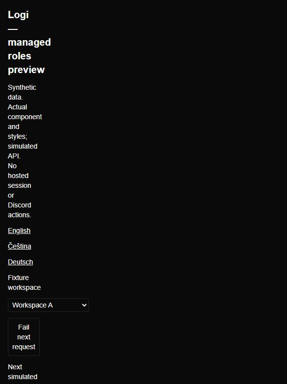
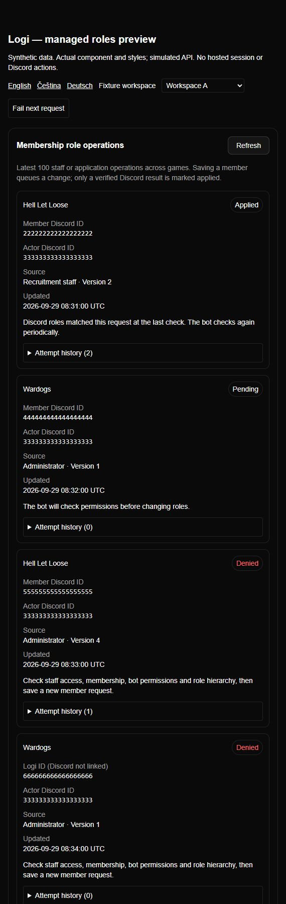
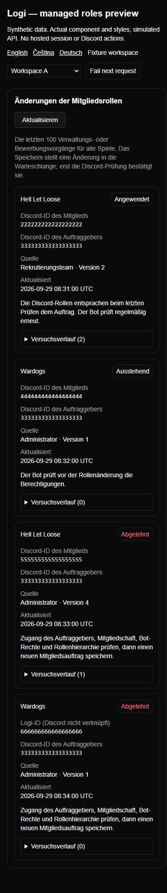

# Managed-role operator UI evidence

Actual `MemberRoleOperations` component and Logi CSS, rendered on loopback with
**synthetic** identifiers and a simulated API. No hosted login or Discord action.
Reproduce: `node --import tsx scripts/preview-managed-roles.mjs`, then
`http://127.0.0.1:4321/?locale=cs`. The harness validates the versioned fixtures.

Checked CS/EN/DE, expandable per-attempt audit (also using Enter), failed load
clearing old data, successful Refresh retry, and workspace switch to an empty
workspace without retained identities. At the configured 390 × 844 viewport,
document scroll and client widths were both 375 pixels (15-pixel scrollbar): no
horizontal overflow. The override was reset and test tab/server were closed.
Session authorization is verified by handler tests, not this isolated harness.

Czech: verified success after a transient failure, a pending Wardogs request,
a denied HLL request and an unlinked numeric Wardogs player. The linked imported
player displays its explicit Discord ID; the numeric unlinked player is labeled
as a Logi ID. Expanded history contains sanitized reasons and synthetic actors.
These screenshots were refreshed after the final identity/authority review fixes.

Simulated 503 clears the rows. Refresh subsequently restored the fixture records.

Switching to Workspace B removes every identifier from Workspace A.

English status labels, unlinked-identity distinction and recovery guidance.

German text wraps at mobile width; the audit remains operable by keyboard.
