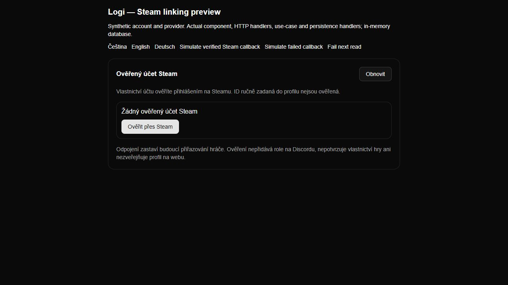
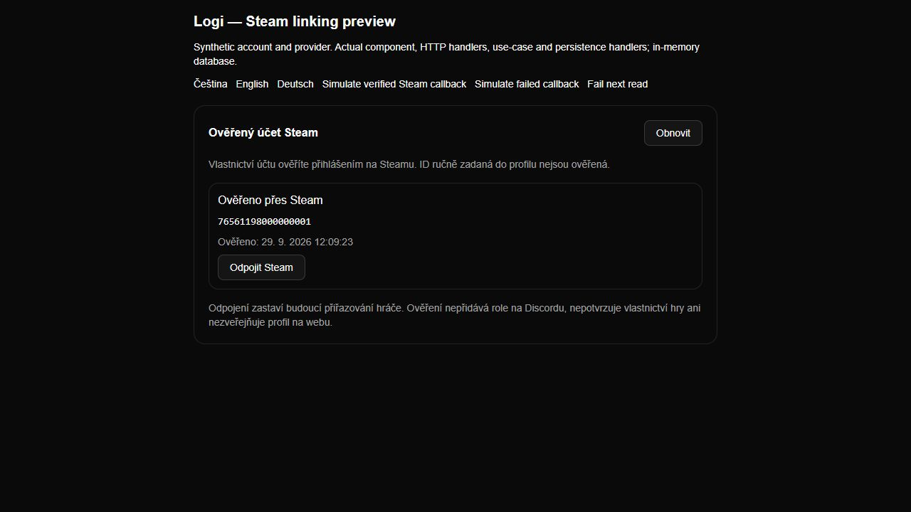
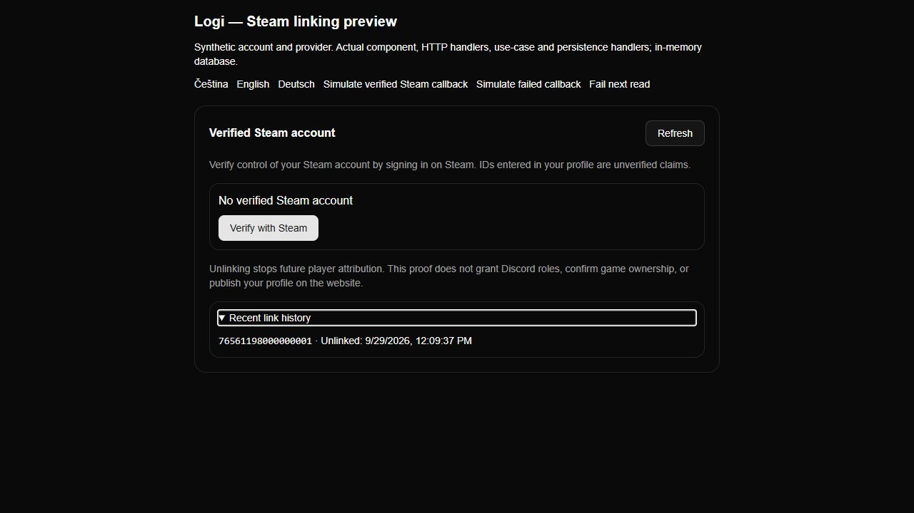
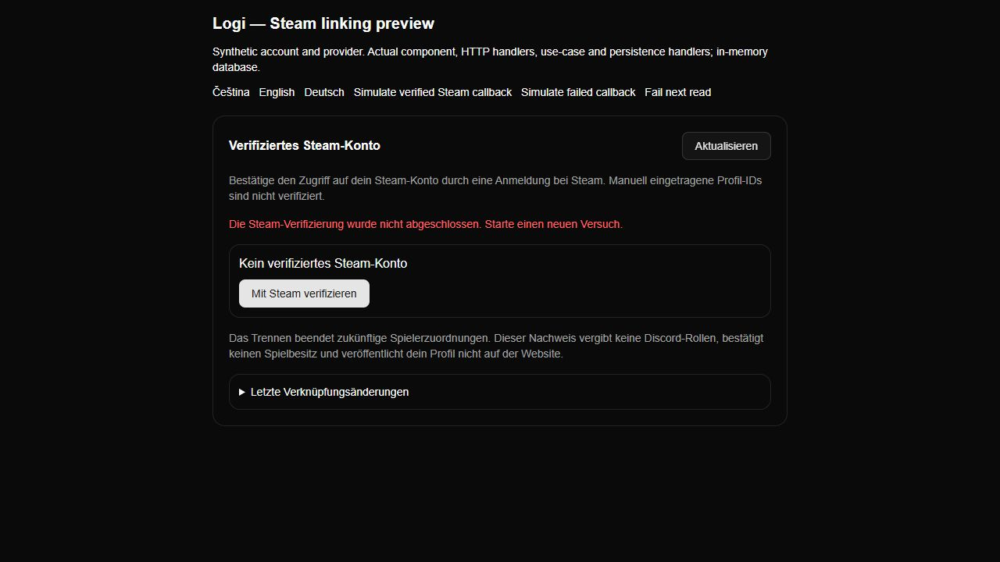
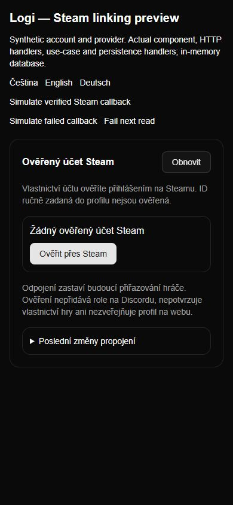

# Steam identity browser proof

The screenshots are from the actual account component and production styles at
loopback. `node --import tsx scripts/preview-platform-links.mjs` uses the actual
HTTP handler factory, application use-case, reviewed OpenID library and Convex
handlers against an in-memory database and synthetic Steam verification response.
The preview disables navigation to the real provider. It does not prove a hosted
cookie session, real signature validity or production database durability.

Verified on 2026-09-29: unverified account; simulated callback creates proof;
English unlink removes active proof and preserves audit; history opens by keyboard;
German failure status; a failed read clears data and Refresh recovers; 390×844
viewport has matching client/scroll widths of 390 pixels. Viewport was reset and
the temporary tab/server closed after testing.

